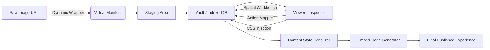

# Feature Integration Pipeline

This document outlines how the proposed "Interaction & Publishing" features integrate into the existing IIIF Field Archive Studio workflow. It maps new capabilities to the core architectural phases: **Ingest**, **Curation**, **State Management**, and **Export**.

---

## 1. Ingest Phase (The Staging Area)

**Feature:** **Dynamic Canvas Wrapper for Single Image Ingest**

*   **Integration Point:** `ExternalImportDialog.tsx` & `services/remoteLoader.ts`.
*   **Workflow:**
    1.  User opens "Import External IIIF" dialog.
    2.  User pastes a direct image URL (e.g., `https://site.com/image.jpg`) instead of a Manifest URL.
    3.  **Pipeline Hook:** The `remoteLoader` service detects the non-JSON content type.
    4.  **Transformation:** Instead of failing, it invokes a new `VirtualManifestFactory`.
    5.  **Result:** A fully-formed IIIF Manifest (Version 3.0) is generated in memory, wrapping the image as a Painting Annotation on a Canvas sized to the image dimensions.
    6.  **Handoff:** This virtual manifest is passed to `ingestTree` just like a real file import, allowing the user to edit metadata immediately in the Staging Area.

---

## 2. Curation Phase (The Studio & Inspector)

**Feature:** **Spatial Annotation Workbench**
**Feature:** **Interaction Action Mapper**
**Feature:** **Customizable CSS/Theme Injection**

*   **Integration Point:** `Viewer.tsx`, `Inspector.tsx`, and `PolygonAnnotationTool.tsx`.
*   **Workflow:**
    1.  **Creation:** In the `Viewer`, the user activates the annotation tool. The tool now offers "Ellipse" alongside Polygon/Rect.
    2.  **Definition:** Upon completing the shape, the **Inspector** panel opens automatically (replacing the simple text prompt).
    3.  **Action Logic:** A new "Interaction" tab in the Inspector allows the user to define behavior:
        *   *Link:* Enter a URL (`purpose: linking`).
        *   *Popup:* Enter HTML content (`motivation: describing`).
    4.  **Styling:** A new "Appearance" tab allows picking stroke color and opacity.
    5.  **Pipeline Hook:** These settings are saved as specific properties (`service`, `style`, `purpose`) within the Web Annotation JSON in the Vault.

---

## 3. State Management (Vault & Service Worker)

**Feature:** **Content State Serializer**

*   **Integration Point:** `services/contentState.ts`, `hooks/useIIIFEntity`, `App.tsx`.
*   **Workflow:**
    1.  **Capture:** As the user pans/zooms in the `Viewer`, the viewport coordinates (`xywh`) are tracked in React state.
    2.  **Serialization:** When "Share" is clicked, `contentStateService` encodes the current Canvas ID + Viewport Coordinates into a base64url token.
    3.  **Persistence:** This token is appended to the URL (`?iiif-content=...`).
    4.  **Restoration:** On load, `App.tsx` parses this token and directs the Viewer to zoom specifically to that region, overriding the default "fit to screen" behavior.

---

## 4. Export & Publishing Phase

**Feature:** **One-Click Embed Code Generator**

*   **Integration Point:** `ExportDialog.tsx` & `ShareButton.tsx`.
*   **Workflow:**
    1.  **Trigger:** User selects "Embed" in the Share/Export menu.
    2.  **Pipeline Hook:** The system constructs a specific URL pattern using the **Content State** generated in step 3.
    3.  **Generation:** It outputs an HTML snippet:
        ```html
        <iframe src="https://viewer.field-studio.org/?iiif-content={base64_token}" ...></iframe>
        ```
    4.  **Runtime:** The hosted viewer (or the static export viewer) reads the token, fetches the Manifest (or uses the embedded one), and renders the *exact* interactive experience defined in the Curation phase, including the custom CSS styles and click actions.

---

## Summary of Data Flow


