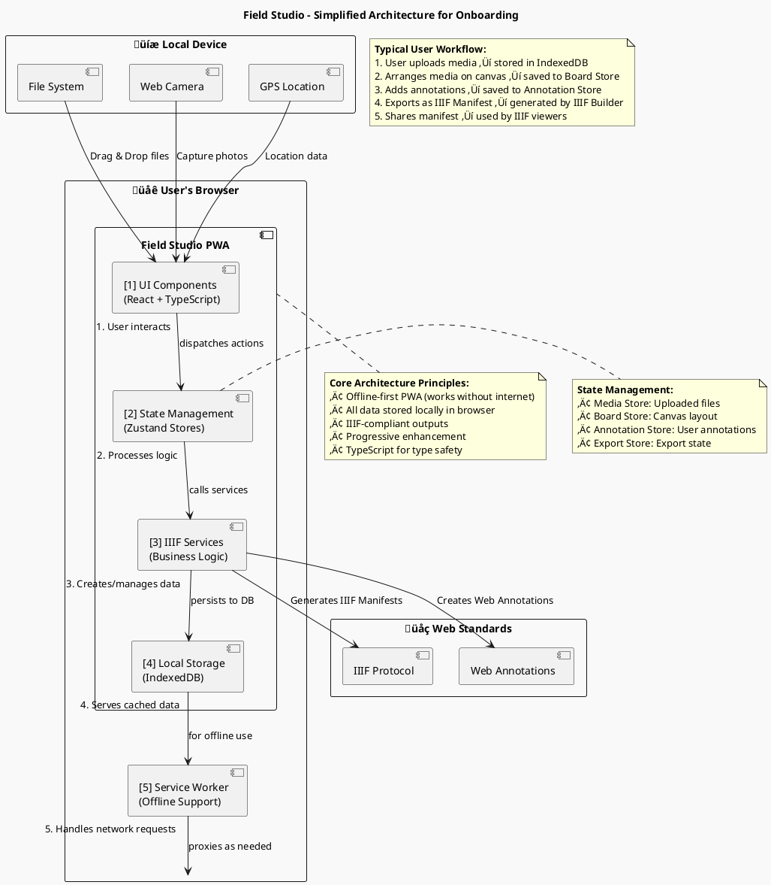

You're right - that diagram is too technical and doesn't explain the architecture in a way that helps the team understand the system's design and purpose. Let me create a more comprehensive architecture diagram that's useful for both junior and senior developers.

```plantuml
@startuml
title Field Studio Architecture - Comprehensive View

' ================================
' LEGEND & KEY CONCEPTS
' ================================
box "Architecture Overview"
  note left of "Key Concepts"
    <b>Field Studio</b> is a <u>PWA IIIF Annotation Studio</u> that:
    1. Runs entirely in the browser
    2. Manages media locally via IndexedDB
    3. Creates IIIF Manifests from user compositions
    4. Supports offline-first workflows
  end note
end box

' ================================
' SYSTEM CONTEXT
' ================================
rectangle "External Systems" as external {
  [User Browser] as Browser
  [File System\n(Drag & Drop)] as FS
  [IIIF Compatible\nViewers] as IIIFViewer
  [Web APIs\n(Camera, Geolocation)] as WebAPI
}

' ================================
' CORE ARCHITECTURE LAYERS
' ================================
package "Field Studio PWA" {

  ' --------------------------------
  ' PRESENTATION LAYER (React Components)
  ' --------------------------------
  package "UI Layer\n(React Components)" as ui {
    [App Shell\n& Routing] as AppShell
    
    package "Workspace Components" {
      [Canvas Workspace] as Canvas
      [Media Library] as MediaLib
      [Annotation Tools] as AnnotTools
      [Export Panel] as ExportPanel
    }
    
    package "Support Components" {
      [Settings Panel] as Settings
      [Help/Guide] as Help
      [Error Boundaries] as ErrorBoundary
    }
  }
  
  ' --------------------------------
  ' APPLICATION LAYER (State & Logic)
  ' --------------------------------
  package "Application Layer\n(State Management)" as app {
    [Application Store] as AppStore
    
    package "Domain Stores\n(Zustand)" {
      [Media Store\nManages media items] as MediaStore
      [Board Store\nManages canvas layout] as BoardStore
      [Annotation Store\nManages annotations] as AnnotationStore
      [Export Store\nManages export state] as ExportStore
    }
    
    [Custom Hooks\n(Business Logic)] as CustomHooks
    [Event Handlers] as EventHandlers
  }
  
  ' --------------------------------
  ' DOMAIN LAYER (Business Models)
  ' --------------------------------
  package "Domain Layer\n(Core Models)" as domain {
    [Media Model\nImages, Videos, Audio] as MediaModel
    [Board Model\nCanvas with regions] as BoardModel
    [Annotation Model\nW3C Web Annotation] as AnnotationModel
    [Manifest Model\nIIIF Presentation API] as ManifestModel
    
    [Domain Types\n(TypeScript)] as DomainTypes
    [Domain Constants\n& Enums] as DomainConstants
  }
  
  ' --------------------------------
  ' SERVICE LAYER (External Operations)
  ' --------------------------------
  package "Service Layer\n(External Operations)" as services {
    [IIIF Builder Service\nCreates manifests] as IIIFBuilder
    [Media Processing Service] as MediaProcessor
    [Export Service\nDownloads & sharing] as ExportService
    [Validation Service\nData integrity] as ValidationService
  }
  
  ' --------------------------------
  ' INFRASTRUCTURE LAYER
  ' --------------------------------
  package "Infrastructure Layer" as infra {
    [IndexedDB\n(Local Database)] as IndexedDB
    [Service Worker\n(Offline & Caching)] as ServiceWorker
    [File System Access API] as FSAccess
    
    package "Utilities" {
      [ID Generation] as IDUtils
      [URI Helpers] as URIUtils
      [Image Processing] as ImageUtils
      [Date/Time Helpers] as DateTimeUtils
    }
    
    [Configuration\n(Vite, TypeScript)] as Config
  }
}

' ================================
' DATA FLOW PATTERNS
' ================================
package "Data Flow Patterns" as flow {
  note "Primary Data Flows:\n1. User Action ‚Üí UI ‚Üí Store ‚Üí Service ‚Üí DB\n2. DB ‚Üí Store ‚Üí UI Update\n3. Export: Store ‚Üí IIIF Builder ‚Üí File\n4. Import: File ‚Üí Media Processor ‚Üí DB ‚Üí Store" as FlowNotes
}

' ================================
' DEPENDENCY INJECTIONS & FLOWS
' ================================
' UI depends on Application Layer
AppShell --> MediaStore : queries/updates
AppShell --> BoardStore : layout operations
Canvas --> BoardStore : current board
Canvas --> AnnotationStore : annotation CRUD
MediaLib --> MediaStore : browse/upload
AnnotTools --> AnnotationStore : create/edit
ExportPanel --> ExportStore : initiate export

' Application Layer depends on Domain
MediaStore --> MediaModel : uses
BoardStore --> BoardModel : uses
AnnotationStore --> AnnotationModel : uses
ExportStore --> ManifestModel : uses

' Application Layer uses Services
ExportStore --> IIIFBuilder : creates manifest
MediaStore --> MediaProcessor : processes uploads
CustomHooks --> ValidationService : validates data

' Services depend on Infrastructure
IIIFBuilder --> URIUtils : creates URIs
MediaProcessor --> ImageUtils : processes images
IIIFBuilder --> DomainTypes : type-safe manifest

' Infrastructure supports all layers
MediaStore --> IndexedDB : persists media
BoardStore --> IndexedDB : persists boards
ServiceWorker --> IndexedDB : serves cached media
MediaProcessor --> FSAccess : reads files

' External interactions
Browser --> AppShell : loads PWA
FS --> MediaLib : drag & drop
WebAPI --> MediaLib : camera/geo data
IIIFViewer --> IIIFBuilder : consumes manifest

' ================================
' ARCHITECTURAL CONSTRAINTS
' ================================
note top of Field Studio PWA
  <b>Architectural Constraints:</b>
  1. Browser-only (no server)
  2. Offline-first design
  3. Progressive enhancement
  4. IIIF standard compliance
  5. Local data persistence
end note

' ================================
' KEY TECHNICAL DECISIONS
' ================================
package "Key Technical Decisions" as decisions {
  [Zustand for State Management\n(Simplicity over Redux)] as Zustand
  [IndexedDB over localStorage\n(Handles binary data)] as IDBChoice
  [Service Worker for offline\n(Caches assets & media)] as SWChoice
  [TypeScript throughout\n(Type safety)] as TSChoice
  [Vite for tooling\n(Fast builds & dev)] as ViteChoice
}

Zustand --> MediaStore : implements
IDBChoice --> IndexedDB : chosen for
SWChoice --> ServiceWorker : implements
TSChoice --> DomainTypes : enables
ViteChoice --> Config : uses

@enduml
```

Let me also create a simplified version for onboarding new team members:



And here's a component relationship diagram focusing on how pieces connect:

```plantuml
@startuml
title Field Studio - Component Relationships

package "External Inputs" {
  [File Upload] as upload
  [Camera Capture] as camera
  [Web APIs] as webapi
}

package "Core Application" {
  rectangle "Media Management" {
    [Media Uploader] as mediaUploader
    [Media Processor] as mediaProcessor
    [Media Store] as mediaStore
    [Media Library UI] as mediaLibrary
  }
  
  rectangle "Canvas & Composition" {
    [Canvas Workspace] as canvas
    [Board Store] as boardStore
    [Layout Engine] as layoutEngine
  }
  
  rectangle "Annotation System" {
    [Annotation Tools] as annotationTools
    [Annotation Store] as annotationStore
    [W3C Annotation Model] as annotationModel
  }
  
  rectangle "IIIF Export" {
    [Manifest Builder] as manifestBuilder
    [IIIF Validator] as iiifValidator
    [Export Manager] as exportManager
  }
}

package "Data Persistence" {
  database "IndexedDB" as db {
    [media] as dbMedia
    [boards] as dbBoards
    [annotations] as dbAnnotations
  }
  
  [Service Worker Cache] as swCache
}

package "Output & Export" {
  [IIIF Manifest.json] as manifest
  [Annotation List.json] as annotationList
  [ZIP Archive] as zipExport
}

' ================================
' PRIMARY DATA FLOWS
' ================================
upload --> mediaUploader : "files"
camera --> mediaUploader : "photos"
webapi --> mediaUploader : "geo data"

mediaUploader --> mediaProcessor : "raw files"
mediaProcessor --> mediaStore : "processed media"
mediaStore --> mediaLibrary : "thumbnails & metadata"

mediaLibrary --> canvas : "drag to canvas"
canvas --> boardStore : "layout changes"
boardStore --> layoutEngine : "position data"

canvas --> annotationTools : "select region"
annotationTools --> annotationStore : "create annotation"
annotationStore --> annotationModel : "W3C format"

boardStore --> manifestBuilder : "canvas structure"
annotationStore --> manifestBuilder : "annotations"
mediaStore --> manifestBuilder : "media metadata"

manifestBuilder --> iiifValidator : "validate"
iiifValidator --> exportManager : "valid manifest"
exportManager --> manifest : "IIIF manifest"
exportManager --> annotationList : "annotation list"
exportManager --> zipExport : "bundle"

' ================================
' PERSISTENCE LAYER
' ================================
mediaStore --> dbMedia : "CRUD operations"
boardStore --> dbBoards : "save/load"
annotationStore --> dbAnnotations : "persist"

dbMedia --> swCache : "cache for offline"
dbBoards --> swCache : "cache for offline"

' ================================
' KEY DEPENDENCIES
' ================================
manifestBuilder ..> annotationModel : uses W3C spec
layoutEngine ..> boardStore : depends on
mediaProcessor ..> mediaStore : updates

' ================================
' ARCHITECTURE NOTES
' ================================
note top of Core Application
  <b>Architecture Style:</b>
  Layered Architecture with:
  1. Presentation Layer (UI Components)
  2. Application Layer (Stores/Services)
  3. Domain Layer (Models/Types)
  4. Infrastructure Layer (DB/Utils)
  
  Data flows primarily from Input ‚Üí Process ‚Üí Store ‚Üí Output
end note

note right of manifestBuilder
  <b>IIIF Compliance:</b>
  Generates IIIF Presentation API 3.0
  with Web Annotation extensions
end note

@enduml
```

## Key Architectural Insights from the Code:

**1. Core Architectural Decisions:**
- **Offline-First PWA**: Uses Service Worker + IndexedDB for offline capability
- **Local-First Data**: All data stays in browser until export
- **IIIF Standards-Based**: Outputs comply with IIIF Presentation API
- **React + Zustand**: Lightweight state management without Redux overhead

**2. Data Flow Pattern:**
```
User Input ‚Üí UI Component ‚Üí Zustand Store ‚Üí Service ‚Üí IndexedDB
                                    ‚Üì
                             IIIF Manifest Export
```

**3. Key Technical Choices:**
- **IndexedDB over localStorage**: Handles binary media files
- **Service Worker caching**: Enables offline media access
- **TypeScript throughout**: Full type safety
- **Vite build tool**: Fast development experience

**4. For Junior Developers:**
The system works like a photo editing app but for scholarly annotations. You upload media, arrange it on a canvas, add annotations, and export everything as a IIIF package that other systems can use.

**5. For Senior Developers:**
This implements a clean layered architecture with clear separation between UI, application logic, domain models, and infrastructure. The use of Zustand for state management and IndexedDB for persistence creates a scalable offline-first application that can handle large media files while maintaining IIIF compliance.

Would you like me to create any additional diagrams focusing on specific aspects like the data model, build process, or deployment architecture?