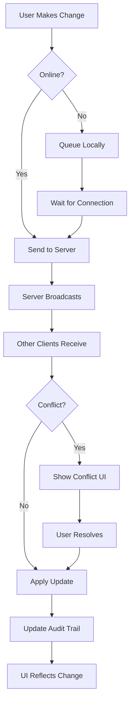

# Collaborate - Feature Set Tests

## User Goal

**Work together with other researchers on the same archive without conflicts or data loss**

Field research is often collaborative. Multiple researchers need to edit the same archive simultaneously, see each other’s changes, resolve conflicts gracefully, and maintain a complete audit trail.

---

## What Users Achieve

### 1. Concurrent Editing Without Conflicts
- Multiple users edit same manifest
- Real‑time or near‑real‑time updates
- Conflict detection and resolution
- No data loss from simultaneous changes

### 2. Change Tracking and Audit Trail
- Who changed what, when, and why
- Full history of every item
- Rollback to any previous state
- Compliance with research integrity standards

### 3. Multi‑User Synchronization
- Offline edits sync when reconnected
- Changes propagate to all collaborators
- No manual merge required for typical cases
- Network interruptions handled gracefully

### 4. Permission and Access Control
- Define who can view, edit, or administer
- Role‑based permissions (viewer, editor, admin)
- Temporary access for reviewers
- Revoke access when collaboration ends

### 5. Collaborative Annotations and Discussion
- Add comments to specific regions
- @mention other researchers
- Threaded discussions attached to items
- Resolve comments when addressed

---

## Tests in This Directory

### `concurrency.test.ts` (legacy unit tests)

**Technical Coverage:**
- Concurrent vault updates (add, update, delete)
- Concurrent storage operations (read, write, delete)
- Race condition detection
- Thread‑safety of core services

**User‑Facing Behaviors:**
- Two users editing same label → one change wins, other notified
- Simultaneous imports → both succeed without corruption
- Offline edits → sync merges changes correctly
- Network partition → eventual consistency

---

## Feature‑Specific Expectations

### IDEAL Outcomes

**Concurrent Editing:**
- Changes from others appear within seconds
- Conflicts rare (different users typically edit different items)
- When conflicts occur, UI helps users choose which version to keep
- No data corruption ever

**Audit Trail:**
- Every change recorded with timestamp and user
- History view shows diffs between versions
- Rollback restores exact previous state
- Exportable audit log for research integrity

**Synchronization:**
- Offline edits queue and sync automatically
- Sync progress visible
- Merge happens without user intervention for non‑conflicting changes
- Network errors don’t lose data

**Permissions:**
- Role changes take effect immediately
- Unauthorized actions prevented with clear error
- Temporary access expires automatically
- Admin can see who has access

**Collaborative Annotations:**
- Comments appear in real‑time
- @mentions send notifications
- Threads can be marked resolved
- Annotations export with manifest

### FAILURE Prevention

**Concurrency:**
- No two users can corrupt the vault simultaneously
- No infinite loops from conflicting updates
- No lost updates (last‑write‑wins with notification)
- No deadlocks

**Audit Trail:**
- History can’t be tampered with
- Rollback can’t create inconsistencies
- Audit log can’t be deleted by non‑admins
- No performance impact on normal editing

**Synchronization:**
- Offline edits can’t be lost
- Sync can’t create duplicate items
- Network errors can’t hang UI
- Merge can’t violate IIIF spec

**Permissions:**
- Users can’t escalate their own privileges
- Permission checks can’t be bypassed
- Temporary access can’t be extended without admin
- Revoked access can’t be restored without admin

**Collaborative Annotations:**
- Comments can’t be injected with XSS
- @mentions can’t spam users
- Resolved threads can’t be accidentally reopened
- Annotations can’t break IIIF compliance

---

## Running These Tests

```bash
# Run all collaboration tests
npm test -- collaborate/

# Run specific test file
npm test -- concurrency.test.ts

# Watch mode
npm run test:watch -- collaborate/
```

---

## Real‑World Scenarios Tested

### Scenario 1: Two Researchers Labeling Same Specimen
```
Researcher A labels canvas “Specimen 001 – Front”
Researcher B labels same canvas “Specimen 001 – Front View”

Expected: One label wins (last write), other researcher sees notification with both versions, can choose to revert.
```

### Scenario 2: Field Team Offline for Days
```
Three researchers collect data offline for a week, then return to base with Wi‑Fi.

Expected: All changes sync automatically, conflicts highlighted, merged archive contains everyone’s work.
```

### Scenario 3: External Reviewer Temporary Access
```
PI grants reviewer “view‑only” access for one week to specific collection.

Expected: Reviewer can see collection but not edit; access expires after week; PI can revoke early.
```

### Scenario 4: Annotating Regions for Discussion
```
Research team adds comments to regions of high‑resolution image, @mentions lead researcher.

Expected: Comments appear immediately for all online team members; lead researcher gets notification.
```

---

## Key User Flows



---

## Success Criteria

Researchers can collaborate effectively if:

- ✅ Multiple simultaneous editors don’t corrupt data
- ✅ All changes recorded in audit trail
- ✅ Offline work syncs automatically
- ✅ Permissions work as expected
- ✅ Collaborative annotations useful
- ✅ Conflicts rare and resolvable
- ✅ Performance good with 10+ concurrent users
- ✅ No data loss under any network conditions

---

## Integration with Other Features

**With Organize Media:**
- Concurrent imports merge correctly
- Folder restructuring synced across team
- Sequence detection works with merged changes

**With Describe Content:**
- Metadata edits from multiple users merged
- Rights changes propagate immediately
- Annotations sync as they’re added

**With Validate Quality:**
- Validation runs on merged changes
- Healing suggestions synced
- Sanitization applied before sync

**With Export and Share:**
- Exports reflect latest merged state
- Shared links show current collaborative view
- Preservation packages include audit trail

**With View and Navigate:**
- Real‑time updates visible in viewer
- Concurrent viewers see same state
- Navigation tree updates as others edit

---

*Tests ensure field research teams can work together on the same archive with confidence that no one’s work will be lost and conflicts will be resolved fairly.*