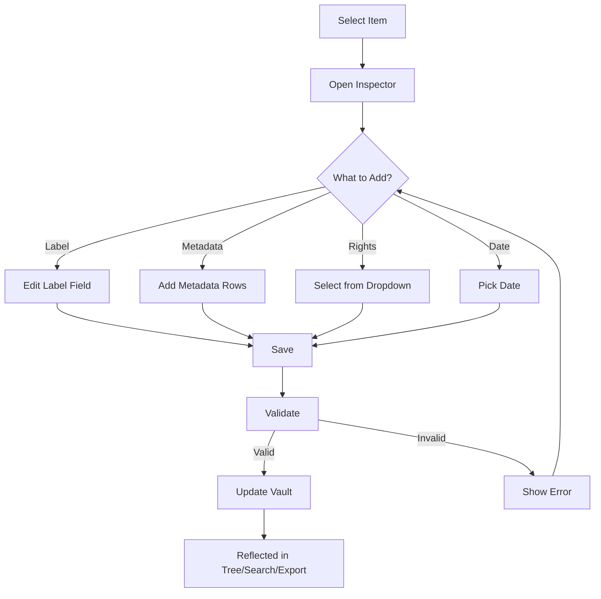

# Describe Content - Feature Set Tests

## User Goal

**Add context and metadata to make research discoverable and meaningful**

Field researchers need to add descriptive information so that months or years later, they (and others) can understand what the content is, when it was captured, where, and by whom.

---

## What Users Achieve

### 1. Add Descriptive Labels
- Give meaningful names to items
- Use multiple languages if needed
- Labels appear in breadcrumbs, trees, search results
- Labels export with IIIF manifest

### 2. Record Metadata
- **Date Captured:** When photo was taken
- **Location:** Where research was conducted
- **Researcher:** Who collected the data
- **Description:** What the content shows
- **Keywords:** Tags for searching

### 3. Set Rights and Attributions
- Choose Creative Commons license
- Add required attribution statements
- Ensure legal compliance
- Rights visible in all viewers

### 4. Add Annotations and Notes
- Highlight regions of interest
- Add commentary and analysis
- Link related items
- Annotations survive export

### 5. Extract Metadata Automatically
- Read EXIF from photos (camera, date, settings)
- Extract GPS coordinates from geotagged images
- Parse timestamps from filenames
- Apply CSV metadata in batch

---

## Tests in This Directory

### `labels-and-metadata.test.ts` (16 tests) ✓

**User Interactions Tested:**
- ✅ Edit label in Inspector → Reflected everywhere
- ✅ Add metadata rows → Searchable and exportable
- ✅ Select rights from dropdown → Rights URI validated
- ✅ Toggle behaviors → Conflicts prevented
- ✅ Set viewing direction → Page navigation validated
- ✅ Pick date with date picker → Temporal navigation enabled
- ✅ Multiple updates → Compose without conflicts

**What's Tested:**
- Labels update in real-time
- Metadata persists through round-trips
- Rights URIs follow IIIF spec
- Behavior conflicts detected
- navDate enables timeline view

### `exif-extraction.test.ts` (Planned)

**User Interactions to Test:**
- Import photo with EXIF → Metadata auto-populated
- Import geotagged image → GPS shown on map
- Batch extract from folder → All photos processed
- Missing EXIF → Graceful handling

### `annotations.test.ts` (Planned)

**User Interactions to Test:**
- Draw annotation → Visible in viewer
- Add text note → Saved with canvas
- Link to related item → Navigation works
- Export with annotations → Annotations preserved

---

## Feature-Specific Expectations

### IDEAL Outcomes

**Labels:**
- Changes reflect immediately in UI
- Multi-language labels supported
- Labels searchable
- Labels export correctly

**Metadata:**
- All fields editable
- Metadata survives round-trips
- CSV import/export works
- Searchable across all fields

**Rights:**
- Rights URI validated against spec
- Warnings for non-standard rights
- Rights visible in viewers
- Attribution statements required

**Auto-Extraction:**
- EXIF read automatically on import
- GPS coordinates mapped
- Timestamps become navDate
- No user intervention needed

### FAILURE Prevention

**Labels:**
- Empty labels prevented (or default generated)
- Invalid language maps rejected
- Label structure validated

**Metadata:**
- Metadata not lost during updates
- Invalid metadata structure caught
- Corruption prevented

**Rights:**
- Invalid URIs warned/rejected
- Missing attributions flagged
- Copyright violations prevented

**Auto-Extraction:**
- Missing EXIF handled gracefully
- Corrupted EXIF doesn't crash import
- Invalid GPS coordinates rejected

---

## Running These Tests

```bash
# Run all content description tests
npm test -- describe-content/

# Run specific test file
npm test -- labels-and-metadata.test.ts

# Watch mode
npm run test:watch -- describe-content/
```

---

## Real-World Scenarios Tested

### Scenario 1: Photo Archive Documentation
```
User imports 100 field photos and:
- Adds location metadata
- Sets Creative Commons license
- Extracts dates from EXIF
- Adds researcher attribution

Expected: All photos searchable by location/date/researcher
```

### Scenario 2: Batch Metadata Application
```
User has CSV with:
- Filename
- Description
- Keywords
- Date
- Location

Imports photos, applies CSV → All metadata merged
```

### Scenario 3: Multi-Language Collection
```
User creates bilingual labels (English/Hindi):
- Main labels in both languages
- Descriptions translated
- Metadata localized

Expected: Language switcher works, export includes all languages
```

---

## Key User Flows



---

## Success Criteria

Users can successfully describe their content if:

- ✅ Labels update instantly
- ✅ Metadata editable in Inspector
- ✅ EXIF extracted automatically
- ✅ Rights/attribution enforced
- ✅ Multi-language supported
- ✅ Metadata searchable
- ✅ Everything exports correctly
- ✅ Batch operations available

---

*Tests ensure field researchers can add rich context to make their archives discoverable and meaningful*
