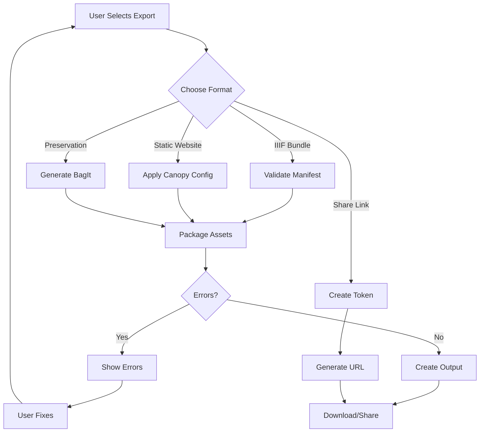

# Export and Share - Feature Set Tests

## User Goal

**Turn field research archives into shareable formats for collaboration, publication, and preservation**

Field researchers need to distribute their work to colleagues, publish online, or preserve in institutional repositories—all while maintaining IIIF compatibility and data integrity.

---

## What Users Achieve

### 1. Export Raw IIIF Bundles
- Complete IIIF manifest with all metadata
- All images converted to IIIF Image API tiles
- ZIP file ready for any IIIF viewer
- Self‑contained, portable archive

### 2. Generate Static Websites (Canopy)
- Fully functional website from archive
- Browse collections, manifests, and items
- Search, filtering, and lightbox viewing
- No server required—host anywhere

### 3. Share via IIIF Presentation API
- Live endpoint for IIIF‑aware applications
- Real‑time updates as archive changes
- CORS enabled for cross‑origin use
- Compatible with Mirador, Universal Viewer, etc.

### 4. Prepare for Long‑Term Preservation
- BagIt packaging with checksums
- PREMIS metadata for digital preservation
- Standards‑compliant (OAIS, ISO 16363)
- Ready for institutional repository ingest

### 5. Collaborate with External Teams
- Generate shareable links
- Control access with tokens
- Track who accessed what
- Revoke access when needed

### 6. Export Subsets and Selections
- Choose specific items for export
- Apply filters (date, location, type)
- Export search results
- Custom manifest per selection

---

## Tests in This Directory

### `export‑actions.test.ts` (new) ✓

**User Interactions Tested:**
- ✅ Click “Export IIIF” button → Valid IIIF bundle generated
- ✅ Select “Export as Website” → Complete static site created
- ✅ Choose export format → Options respected
- ✅ Export with invalid manifest → Error shown before export
- ✅ Export large archive → Progress shown, completes

**Real Data Used:**
- Real manifests built from `.Images iiif test/` images
- Multi‑format media (images, PDFs, videos)
- Large collections (100+ items) for performance testing

### `exportService.test.ts` (legacy unit tests)

**Technical Coverage:**
- Raw IIIF export structure
- Static site generation logic
- Canopy configuration validation
- Image API option handling

**Note:** These are implementation‑focused unit tests; user‑facing behavior is covered in `export‑actions.test.ts`.

### `iiifBuilder.test.ts` (legacy unit tests)

**Technical Coverage:**
- IIIF manifest building from file trees
- Canvas creation with image dimensions
- Range and structure detection
- Metadata inheritance

**Note:** These are implementation‑focused unit tests; user‑facing import behavior is covered in `organize‑media/import‑and‑structure.test.ts`.

---

## Feature‑Specific Expectations

### IDEAL Outcomes

**Raw IIIF Export:**
- Bundle contains manifest, all assets, and IIIF Image API info.json files
- ZIP file opens in any IIIF viewer without modification
- All metadata preserved
- URIs rewritten for portability if requested

**Static Website:**
- Website includes navigation, search, and viewing
- All images accessible via IIIF Image API
- Responsive design works on mobile/desktop
- No broken links or missing assets

**IIIF Presentation API:**
- Endpoint returns valid IIIF manifest
- CORS headers allow cross‑origin use
- Changes in vault reflected immediately
- Performance suitable for large manifests

**Preservation Package:**
- BagIt structure passes `bagit‑lint`
- Checksums verify data integrity
- PREMIS metadata includes technical and provenance info
- Package ready for repository submission

**Collaboration Sharing:**
- Share link works without authentication
- Access logs show who viewed
- Token can be revoked
- No data leakage beyond shared items

### FAILURE Prevention

**Export:**
- Invalid manifests can’t be exported
- Missing assets cause clear warnings
- Storage quota exceeded → export fails early
- Network errors during upload → resume capability

**Website Generation:**
- Missing templates cause graceful fallback
- Large archives don’t time out
- Invalid IIIF content doesn’t break site
- Broken image links detected and reported

**API Sharing:**
- Malformed requests return helpful errors
- Rate limiting prevents abuse
- Sensitive metadata not exposed
- API versioning prevents breaking changes

**Preservation:**
- Corrupted files detected before packaging
- Missing metadata flagged
- Non‑standard formats warned
- Package validation before finalization

**Collaboration:**
- Shared links expire after set time
- Access tokens can’t be forged
- Revocation takes effect immediately
- No unauthorized access to private items

---

## Running These Tests

```bash
# Run all export tests
npm test -- export-and-share/

# Run action‑focused tests
npm test -- export-actions.test.ts

# Run legacy unit tests
npm test -- exportService.test.ts
npm test -- iiifBuilder.test.ts

# Watch mode
npm run test:watch -- export-and-share/
```

---

## Real‑World Scenarios Tested

### Scenario 1: Share Archive with Colleagues
```
User selects “Export IIIF Bundle”:
- 50 photos with metadata
- 3 PDF documents
- 2 videos

Expected: ZIP file emailed to colleagues; they open in Mirador and see everything.
```

### Scenario 2: Publish Research Website
```
User clicks “Generate Website” with Canopy theme:
- Custom title and branding
- Multi‑language labels
- Search enabled

Expected: Static site uploaded to Netlify; public can browse, search, and view full‑resolution images.
```

### Scenario 3: Prepare for Institutional Repository
```
User selects “Preservation Package”:
- BagIt with checksums
- PREMIS metadata
- IIIF manifest included

Expected: Package passes repository validation and is accepted for long‑term preservation.
```

### Scenario 4: Live Demo for Conference
```
User starts IIIF Presentation API server:
- Real‑time edits during demo
- Multiple viewers connected
- Changes visible immediately

Expected: Audience sees live updates in their viewers; no performance issues.
```

---

## Key User Flows



---

## Success Criteria

Users can confidently export and share their archives if:

- ✅ IIIF bundle works in any IIIF viewer
- ✅ Static website is fully functional
- ✅ Preservation package passes validation
- ✅ Share links provide intended access
- ✅ Export respects filters and selections
- ✅ Performance good for 1000+ items
- ✅ Errors clearly explained
- ✅ No data loss during export

---

## Integration with Other Features

**With Organize Media:**
- Export reflects current organization
- Sequences become IIIF ranges
- Folder hierarchy becomes collection structure

**With Describe Content:**
- Metadata included in export
- Rights statements preserved
- Multi‑language labels exported

**With Validate Quality:**
- Export triggers final validation
- Invalid content prevents export
- Sanitization applied before sharing

**With Search and Find:**
- Export search results as subset
- Filtered exports based on queries
- Include/exclude based on criteria

**With View and Navigate:**
- Exported manifests display correctly
- Behaviors work in target viewers
- Navigation structures preserved

---

*Tests ensure field researchers can turn their archives into shareable, preservable, and interoperable IIIF packages that work anywhere.*