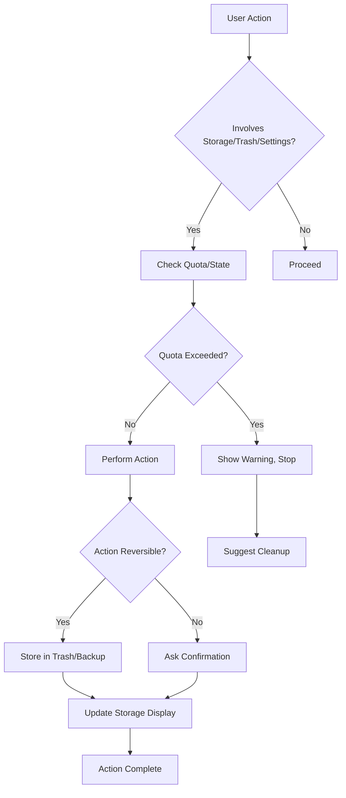

# Manage Lifecycle - Feature Set Tests

## User Goal

**Control storage, deletion, and application settings to maintain archives over time**

Field researchers need to manage limited storage space, recover from accidental deletions, and configure the app to match their workflow—without losing data or breaking existing archives.

---

## What Users Achieve

### 1. Monitor and Manage Storage
- See how much space archives consume
- Get warnings before running out of space
- Clean up unused assets
- Optimize storage for long‑term projects

### 2. Soft Delete with Recovery
- Move items to trash instead of permanent deletion
- Restore accidentally deleted items
- Empty trash when sure
- No data loss from mistaken clicks

### 3. Configure Application Settings
- Choose default import behavior
- Set preferred IIIF Image API server
- Configure keyboard shortcuts
- Personalize UI themes

### 4. Handle Large Archives
- Performance remains acceptable with 1000+ items
- Background operations don’t block UI
- Memory usage stays within limits
- Export/import scales gracefully

### 5. Maintain Data Integrity
- Automatic backups of critical changes
- Corruption detection and repair
- Consistency checks across relationships
- Prevention of orphaned items

---

## Tests in This Directory

### `trashService.test.ts` (legacy unit tests)

**Technical Coverage:**
- Moving entities to trash
- Restoring from trash
- Emptying trash permanently
- Trash state consistency

**User‑Facing Behaviors:**
- Delete button moves item to trash
- Trash panel shows deleted items
- Restore button brings item back
- Empty trash removes items permanently

### `storage.test.ts` (legacy unit tests)

**Technical Coverage:**
- IndexedDB quota monitoring
- Asset size calculation
- Storage optimization strategies
- Cleanup of orphaned blobs

**User‑Facing Behaviors:**
- Storage usage shown in settings
- Warnings when approaching limit
- Cleanup suggestions offered
- Large imports checked against available space

### `useAppSettings.test.ts` (legacy unit tests)

**Technical Coverage:**
- Settings persistence in localStorage
- Default value fallbacks
- Validation of setting values
- React hook for settings access

**User‑Facing Behaviors:**
- Settings panel saves preferences
- Changes apply immediately
- Invalid settings rejected
- Reset to defaults works

---

## Feature‑Specific Expectations

### IDEAL Outcomes

**Storage Management:**
- Current usage displayed accurately
- Warnings appear at 80%, 90%, 95% full
- Cleanup suggestions are actionable
- Import stops before exceeding quota

**Trash System:**
- Deleted items disappear from main view but remain in trash
- Restore returns item to original location
- Empty trash asks for confirmation
- Trash size counted toward storage quota

**Settings:**
- Changes persist across sessions
- Invalid values are rejected with explanation
- Defaults are sensible for field research
- Settings affect behavior as described

**Large Archives:**
- UI remains responsive with 1000+ items
- Background operations show progress
- Memory usage stays under 500 MB for typical archives
- Export/import scales linearly

**Data Integrity:**
- Automatic backups before major operations
- Corruption detected and reported
- Repair options offered
- No silent data loss

### FAILURE Prevention

**Storage:**
- Can’t exceed browser storage quota
- Orphaned blobs don’t accumulate
- Cleanup doesn’t delete referenced assets
- Quota errors don’t corrupt vault

**Trash:**
- Can’t delete items bypassing trash (without confirmation)
- Trash can’t grow beyond storage limits
- Restore can’t create duplicate IDs
- Empty trash can’t be undone

**Settings:**
- Invalid settings can’t be saved
- Settings changes can’t break existing archives
- Reset can’t cause data loss
- Settings can’t cause infinite loops

**Performance:**
- UI never freezes for more than 1 second
- Memory usage never grows unbounded
- Background operations can be cancelled
- Large operations can be paused/resumed

**Integrity:**
- No unrecoverable corruption
- No orphaned items after operations
- No broken references after restore
- No data loss without warning

---

## Running These Tests

```bash
# Run all lifecycle tests
npm test -- manage-lifecycle/

# Run specific test file
npm test -- trashService.test.ts
npm test -- storage.test.ts
npm test -- useAppSettings.test.ts

# Watch mode
npm run test:watch -- manage-lifecycle/
```

---

## Real‑World Scenarios Tested

### Scenario 1: Accidentally Delete Important Manifest
```
User clicks delete on a manifest with 50 canvases, then realizes mistake.

Expected: Manifest moves to trash, user can open trash panel and restore it; all canvases and metadata return intact.
```

### Scenario 2: Run Out of Storage During Import
```
User tries to import 200 high‑resolution photos (2 GB) but only 500 MB free.

Expected: Import stops after using available space, shows clear warning, suggests cleanup options.
```

### Scenario 3: Configure App for Offline Field Work
```
User sets default import to “preserve originals, generate tiles later” and selects dark theme.

Expected: Settings saved; next import follows new behavior; UI uses dark theme immediately.
```

### Scenario 4: Archive Grows to 5000 Items
```
User works with large excavation archive over months.

Expected: UI remains responsive; storage usage shown accurately; trash doesn’t slow down operations.
```

---

## Key User Flows



---

## Success Criteria

Users can manage their archives safely over time if:

- ✅ Storage usage visible and accurate
- ✅ Quota warnings appear in time
- ✅ Deleted items recoverable from trash
- ✅ Settings persist and work as described
- ✅ Large archives remain usable
- ✅ No data loss from normal operations
- ✅ Corruption detected and repairable
- ✅ Performance stays within bounds

---

## Integration with Other Features

**With Organize Media:**
- Import respects storage quota
- Folder deletions go to trash
- Cleanup suggests removing unused sequences

**With Describe Content:**
- Metadata changes backed up
- Settings control metadata defaults
- Trash preserves metadata

**With Validate Quality:**
- Corruption detection runs periodically
- Invalid items can be moved to trash
- Settings control validation strictness

**With Export and Share:**
- Storage usage affects export speed
- Trashed items excluded from exports
- Settings control export defaults

**With View and Navigate:**
- Performance settings affect viewer responsiveness
- Trashed items hidden from view
- UI themes apply to viewer

---

*Tests ensure field researchers can manage storage, recover from mistakes, configure the app, and maintain large archives without fear of data loss or performance degradation.*