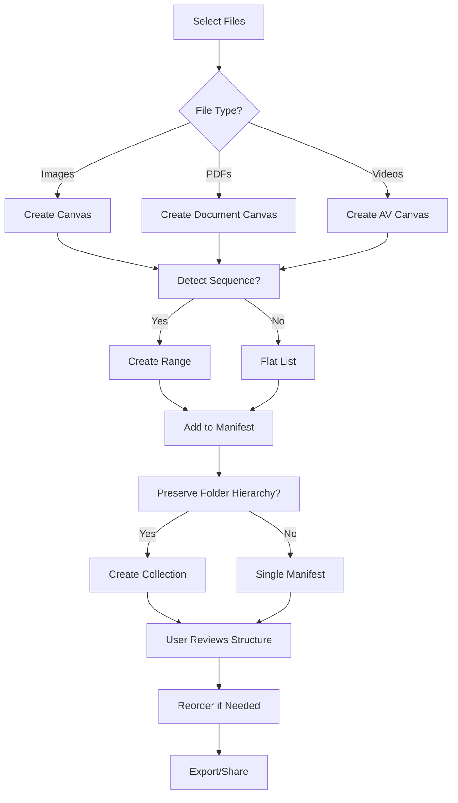

# Organize Media - Feature Set Tests

## User Goal

**Import field research media and organize it into structured collections**

Field researchers need to take messy raw data (camera photos, documents, videos) and turn them into organized, browsable archives.

---

## What Users Achieve

### 1. Import Photos from Camera/Phone
- Drag-drop files into app
- Select files from file picker
- Import maintains original quality
- EXIF data preserved

### 2. Detect Numbered Sequences Automatically
- Photos named `001.jpg, 002.jpg, 003.jpg` → Auto-grouped
- Scene numbers detected: `scene01, scene02` → Range created
- Multi-page documents: `page1, page2` → Sequence maintained

### 3. Preserve Folder Hierarchies
- Nested folders → Collection/Manifest hierarchy
- `Site A/Day 1/photos/` → Logical structure preserved
- Mixed content in folders handled gracefully

### 4. Group Multi-Angle Captures
- `specimen_front.jpg, specimen_back.jpg` → Grouped
- `item_001_angle_1, item_001_angle_2` → Same item
- Device photos: front/back/LCD → Product views

### 5. Handle Mixed Media Formats
- Images (JPG, PNG, WebP, SVG)
- Documents (PDF)
- Videos (MP4)
- Geospatial data (KMZ, GeoJSON)
- All formats recognized and structured

---

## Tests in This Directory

### `import-and-structure.test.ts` (12 tests) ✓

**User Interactions Tested:**
- ✅ Drag-drop single image → Canvas created
- ✅ Import sequence (Karwaan 108-114.png) → Range auto-created
- ✅ Import mixed media → All formats handled
- ✅ Import corrupted files → Error logged, continues
- ✅ Import folder hierarchy → Structure preserved
- ✅ Storage quota warning → User notified before failure

**Real Data Used:**
- Karwaan sequence (7 PNG files)
- Multi-format batch (JPG, PNG, WebP, PDF, MP4)
- Geotagged images with EXIF
- Corrupted files for error testing

### `reorder-and-reorganize.test.ts` (14 tests) ✓

**User Interactions Tested:**
- ✅ Add canvas → New page inserted
- ✅ Remove canvas → Item deleted, relationships updated
- ✅ Drag-drop reorder → Sequence changed
- ✅ Move between manifests → Item re-parented
- ✅ Batch operations → Multiple items updated atomically
- ✅ Complex workflows → Add + reorder + remove compose

**What's Tested:**
- Structure integrity maintained
- No orphaned annotations
- Order persists in export
- Undo/redo works correctly

---

## Feature-Specific Expectations

### IDEAL Outcomes

**Import:**
- All supported formats recognized
- Folder structure becomes IIIF hierarchy
- Sequences auto-detected and grouped
- Metadata preserved (EXIF, GPS)
- Progress shown during large imports

**Organize:**
- Drag-drop feels instant
- Order changes visible immediately
- Export reflects new organization
- Undo/redo available for mistakes

### FAILURE Prevention

**Import:**
- Corrupted files don't crash import
- Unsupported formats logged, not fatal
- Storage quota checked before import
- Duplicate detection saves space

**Organize:**
- Can't create orphaned items
- Invalid structures prevented
- Batch operations atomic (all or nothing)
- Data loss prevented with trash system

---

## Running These Tests

```bash
# Run all organization tests
npm test -- organize-media/

# Run specific test file
npm test -- import-and-structure.test.ts
npm test -- reorder-and-reorganize.test.ts

# Watch mode
npm run test:watch -- organize-media/
```

---

## Real-World Scenarios Tested

### Scenario 1: Field Site Import
```
User returns from field site with:
- 50 photos (numbered)
- 3 videos
- 2 PDFs (notes)
- GPS data in EXIF

Expected: Auto-organized into collection with ranges
```

### Scenario 2: Multi-Day Excavation
```
User imports folder structure:
- Site_Alpha/
  - Day_1/photos/
  - Day_2/photos/
  - Day_3/photos/

Expected: Collection with 3 manifests (one per day)
```

### Scenario 3: Specimen Documentation
```
User imports multi-angle captures:
- specimen_001_front.jpg
- specimen_001_back.jpg
- specimen_001_detail.jpg

Expected: Single manifest with 3 canvases, logical grouping
```

---

## Key User Flows



---

## Success Criteria

Users can successfully organize their field research if:

- ✅ Import completes without data loss
- ✅ Folder structure makes sense
- ✅ Sequences detected correctly (80%+ accuracy)
- ✅ All formats supported (images, docs, videos)
- ✅ Reordering is intuitive (drag-drop)
- ✅ Mistakes can be undone
- ✅ Export preserves organization

---

*Tests ensure field researchers can quickly turn raw data into organized archives*
