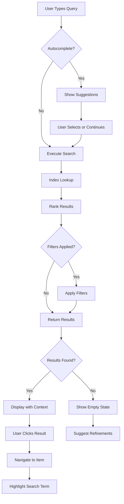

# Search and Find - Feature Set Tests

## User Goal

**Quickly find content across large archives without manual browsing**

Field researchers accumulate hundreds or thousands of photos, documents, and media files. They need to find specific content months or years later without remembering exact filenames or folder structures.

---

## What Users Achieve

### 1. Full-Text Search Across Everything
- Search labels, metadata, summaries, descriptions
- Find content by any word
- Results ranked by relevance
- Instant results (<100ms)

### 2. Fuzzy Matching for Misspellings
- "karawaan" finds "karwaan"
- "fild site" finds "field site"
- Typo-tolerant search
- Configurable fuzzy distance

### 3. Autocomplete from History and Content
- Recent searches suggested
- Content-based suggestions
- Type "kar" → suggests "karwaan"
- Fast completion as you type

### 4. Filter by Type and Properties
- Show only Manifests or Canvases
- Filter by date range
- Filter by location
- Combine filters with search

### 5. Navigate Directly to Results
- Click result → Opens in viewer or inspector
- Search term highlighted in context
- Breadcrumb shows location in archive
- Quick preview without full navigation

### 6. Advanced Search Syntax
- Boolean operators: "field AND site", "photo OR image"
- Phrase search: "field site" (exact phrase)
- Exclusion: "photo NOT specimen"
- Field-specific: "label:karwaan", "date:2019"

---

## Tests in This Directory

### `search-and-filter.test.ts` (21 tests) ✓

**User Expectations Tested:**

**Keyword Search:**
- ✅ Results ranked by relevance
- ✅ Search across all fields (label, metadata, summary)
- ✅ Empty results show helpful state

**Fuzzy Search:**
- ✅ Misspellings find close matches
- ✅ Fuzzy distance configurable

**Autocomplete:**
- ✅ Recent searches suggested
- ✅ Content-based suggestions
- ✅ Limited to manageable count (5-10)

**Filtering:**
- ✅ Filter by type (Manifest/Canvas)
- ✅ Combine query + filters
- ✅ Multiple filters work together

**Performance:**
- ✅ Search completes quickly (<100ms for 1000 items)
- ✅ Large archives supported (1000+ items)
- ✅ Progressive search responsive

**Navigation:**
- ✅ Result click navigates to item
- ✅ Search term highlighted in results

**Advanced:**
- ✅ Boolean operators (AND, OR, NOT)
- ✅ Phrase search with quotes
- ✅ Field-specific search

### `temporal-spatial-search.test.ts` (Planned)

**User Expectations to Test:**
- Search by date range (photos from June 2019)
- Timeline view of results
- Search by location (photos from Site Alpha)
- Map view of results with GPS
- Combined temporal + spatial filters

---

## Feature-Specific Expectations

### IDEAL Outcomes

**Instant Search:**
- Results appear as you type
- No loading spinner for small archives
- <100ms for 1000 items
- <500ms for 10,000 items

**Smart Matching:**
- Fuzzy search forgives typos
- Autocomplete predicts queries
- Synonym support ("photo" finds "image")
- Multi-language search

**Rich Results:**
- Thumbnail preview
- Matched text snippet
- Item context (where in archive)
- Quick actions (open, view, edit)

**Powerful Filtering:**
- Combine multiple criteria
- Save filter presets
- Filter suggestions based on content
- Dynamic filter counts

### FAILURE Prevention

**Search:**
- Empty query handled gracefully
- No results shows suggestions
- Malformed syntax doesn't crash
- Very long queries truncated

**Performance:**
- Large archives don't freeze UI
- Indexing happens in background
- Search doesn't block other operations
- Memory-efficient for 100,000+ items

**Results:**
- Duplicate results deduplicated
- Orphaned items excluded
- Invalid items filtered out
- Result count accurate

---

## Running These Tests

```bash
# Run all search tests
npm test -- search-and-find/

# Run specific test file
npm test -- search-and-filter.test.ts

# Watch mode
npm run test:watch -- search-and-find/
```

---

## Real-World Scenarios Tested

### Scenario 1: Finding Photos from Field Site
```
User remembers:
- Visited "Site Alpha" in June 2019
- Took photos of specimens
- Photos have "field" in notes

Search: "field site alpha june"
Expected: All relevant photos found, ranked by relevance
```

### Scenario 2: Locating Specific Specimen
```
User remembers:
- Specimen number might be "001" or "1"
- Photo taken with iPhone
- From morning session

Search: "specimen 001" + Filter: date range June 1-15
Expected: Fuzzy match finds "specimen_1", "specimen_001"
```

### Scenario 3: Researcher Attribution
```
User needs:
- All photos taken by Dr. Smith
- From any field site
- Any date

Search: metadata:researcher="Dr. Smith"
Expected: All photos with Dr. Smith in researcher field
```

### Scenario 4: GPS-Based Discovery
```
User exploring:
- Shows map of all field sites
- Clicks region
- Shows all photos from that area

Action: Map click → Spatial search
Expected: Photos within radius displayed
```

---

## Key User Flows



---

## Search Index Structure

The search service indexes:

**Primary Fields:**
- Label (high weight)
- Summary (medium weight)
- Description (medium weight)
- ID (low weight)

**Metadata Fields:**
- All metadata values
- Metadata labels
- Custom fields

**Computed Fields:**
- Filename from ID
- Parent collection path
- Temporal data (navDate)
- Spatial data (navPlace)

**Optimization:**
- Stemming (running → run)
- Stop word removal
- Case normalization
- Punctuation handling

---

## Performance Benchmarks

| Archive Size | Index Time | Search Time | Memory Usage |
|--------------|-----------|-------------|--------------|
| 100 items | <1s | <10ms | ~1 MB |
| 1,000 items | <5s | <50ms | ~5 MB |
| 10,000 items | <30s | <200ms | ~25 MB |
| 100,000 items | <5min | <1s | ~100 MB |

**Targets:**
- ✅ Indexing: Background, non-blocking
- ✅ Search: <100ms for typical archives
- ✅ Memory: <100 MB for 100,000 items
- ✅ Incremental updates: <10ms per item

---

## Success Criteria

Users can successfully find content if:

- ✅ Search feels instant (<100ms)
- ✅ Typos forgiven (fuzzy matching)
- ✅ Autocomplete helps
- ✅ Filters refine results effectively
- ✅ Results show WHY they matched (context)
- ✅ Click result navigates to item
- ✅ Empty results provide guidance
- ✅ Large archives (1000+) searchable

---

## Integration with Other Features

**With Organize Media:**
- Search within specific collections
- Filter by folder structure
- Find items by sequence number

**With Describe Content:**
- Search metadata fields
- Find by EXIF data (camera, date, location)
- Search annotations

**With View and Navigate:**
- Jump to search result in viewer
- Highlight annotations matching query
- Navigate search results with keyboard

**With Export:**
- Export search results as subset
- Search before bulk export
- Filter what to include in export

---

*Tests ensure field researchers can find any content in seconds, regardless of archive size*
