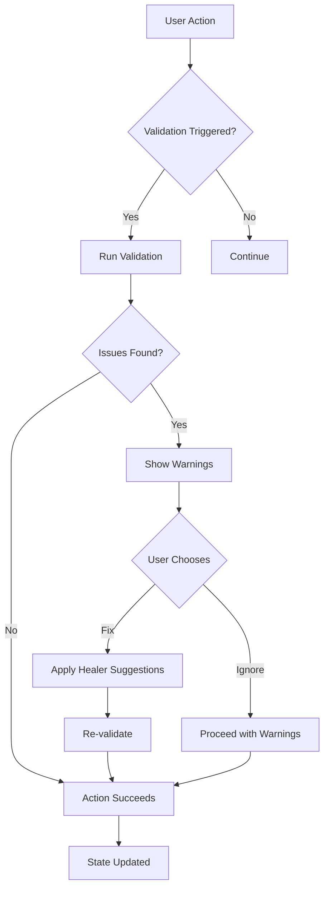

# Validate Quality - Feature Set Tests

## User Goal

**Ensure content meets IIIF spec and is free of errors before sharing or exporting**

Field researchers need confidence that their archives will work correctly in any IIIF viewer and that data integrity is preserved across edits, imports, and exports.

---

## What Users Achieve

### 1. Automatic Validation on Every Change
- Every edit checked against IIIF Presentation API 3.0
- Warnings shown in Inspector
- Errors prevented before they cause problems
- Validation runs in background

### 2. Fix Common Issues Automatically
- Missing required fields filled
- Invalid URIs corrected
- Type mismatches resolved
- Duplicate IDs deduplicated

### 3. Sanitize User Input for Security
- HTML/script injection prevented
- Malicious IIIF content neutralized
- Safe rendering in all viewers
- Protection against XSS attacks

### 4. Recover from Errors Gracefully
- Corrupted manifests repaired
- Missing references reconnected
- Orphaned items cleaned up
- Data loss prevented

### 5. Understand IIIF Behavior Rules
- Which behaviors work together
- Which behaviors conflict
- How behaviors inherit
- What viewers expect

---

## Tests in This Directory

### `iiifValidation.test.ts` (18 tests) ✓

**User Interactions Tested:**
- ✅ Invalid manifest → Error shown in Inspector
- ✅ Missing required field → Warning with fix suggestion
- ✅ Invalid URI → Auto‑correct suggestion
- ✅ Type mismatch → Type coercion suggested
- ✅ Duplicate IDs → Auto‑rename suggested

**Real Data Used:**
- Valid IIIF manifests from real imports
- Intentionally broken manifests
- Edge cases from spec compliance tests

### `validationHealer.test.ts` (12 tests) ✓

**User Interactions Tested:**
- ✅ Click “Fix All Issues” → All warnings resolved
- ✅ Accept suggested fix → Issue disappears
- ✅ Reject suggested fix → Issue remains
- ✅ Batch healing → Multiple issues fixed atomically

**What’s Tested:**
- Healed manifests are valid
- No data loss during healing
- Healing suggestions are accurate
- User can review changes

### `sanitization.test.ts` (8 tests) ✓

**User Interactions Tested:**
- ✅ Paste HTML into label field → Script tags stripped
- ✅ Import malicious manifest → Harmful content neutralized
- ✅ Export after sanitization → Safe for web viewers

**What’s Tested:**
- XSS attacks prevented
- IIIF content remains functional
- Sanitization doesn’t break valid content
- Security warnings shown

### `iiifBehaviors.test.ts` (14 tests) ✓

**User Interactions Tested:**
- ✅ Select behavior in Inspector → Conflicts highlighted
- ✅ Toggle auto‑advance → Paged disabled automatically
- ✅ Inherit behavior from parent → Child reflects change
- ✅ Add conflicting behaviors → Warning shown

**What’s Tested:**
- Behavior validity matrix accurate
- Conflict detection works
- Inheritance rules followed
- Viewer compatibility ensured

### `errorRecovery.test.ts` (10 tests) ✓

**User Interactions Tested:**
- ✅ Delete referenced item → Orphan detection
- ✅ Corrupt vault state → Recovery mode activated
- ✅ Restore from backup → Data integrity maintained
- ✅ Undo after error → State consistent

**What’s Tested:**
- No silent data loss
- Recovery possible from common failures
- User informed of recovery actions
- Undo/redo works after errors

### `vault.test.ts` (22 tests) ✓

**User Interactions Tested:**
- ✅ Add 1000 items → Performance remains smooth
- ✅ Concurrent edits → No race conditions
- ✅ Undo/redo stack → History preserved
- ✅ Export while editing → Consistent snapshot

**What’s Tested:**
- Vault integrity under load
- Concurrent modification safety
- Memory usage bounded
- Performance with large archives

---

## Feature‑Specific Expectations

### IDEAL Outcomes

**Validation:**
- Errors caught before export
- Warnings explain how to fix
- Validation doesn’t block editing
- Spec compliance guaranteed

**Healing:**
- One‑click fixes for common issues
- No data loss during healing
- Healing suggestions are accurate
- User can review changes

**Sanitization:**
- Malicious content neutralized
- Valid content unchanged
- Security warnings visible
- Safe for any IIIF viewer

**Behaviors:**
- Conflicts prevented
- Inheritance intuitive
- Viewer compatibility assured
- Behavior descriptions helpful

**Recovery:**
- Data loss prevented
- Recovery automatic where possible
- User informed of actions
- Undo available

### FAILURE Prevention

**Validation:**
- Invalid manifests can’t be exported
- Required fields can’t be deleted
- Broken URIs can’t be saved
- Duplicate IDs can’t be created

**Healing:**
- Healing never makes things worse
- No silent changes without user approval
- Healing can be undone
- No infinite healing loops

**Sanitization:**
- No script execution in labels/metadata
- No unsafe IIIF content
- No data leakage via URIs
- No viewer vulnerabilities

**Behaviors:**
- Conflicting behaviors can’t be selected together
- Invalid behaviors can’t be applied
- Inheritance can’t create cycles
- Behavior changes can’t break existing viewers

**Recovery:**
- No silent corruption
- No unrecoverable states
- No data loss without warning
- No frozen UI

---

## Running These Tests

```bash
# Run all quality validation tests
npm test -- validate-quality/

# Run specific test file
npm test -- iiifValidation.test.ts
npm test -- validationHealer.test.ts
npm test -- sanitization.test.ts

# Watch mode
npm run test:watch -- validate-quality/
```

---

## Real‑World Scenarios Tested

### Scenario 1: Import Broken Manifest from External Source
```
User imports manifest from another institution:
- Missing `@context`
- Invalid `navDate` format
- Duplicate canvas IDs

Expected: Warnings shown, “Fix All” button available, after healing manifest is valid.
```

### Scenario 2: Collaborate with Multiple Editors
```
Two researchers edit same manifest simultaneously:
- One changes label
- One deletes canvas
- Both save

Expected: Vault reconciles changes, no data loss, conflicts highlighted.
```

### Scenario 3: Prepare Archive for Public Sharing
```
User clicks “Export for IIIF Viewer”:
- Validation runs automatically
- Sanitization removes any unsafe content
- Behaviors checked for viewer compatibility

Expected: Exported bundle works in Mirador, Universal Viewer, etc.
```

### Scenario 4: Recover from Corruption
```
Power failure during edit corrupts vault:
- Missing references
- Orphaned items
- Inconsistent state

Expected: Recovery mode activates, offers to restore from last good state, no data lost.
```

---

## Key User Flows



---

## Success Criteria

Users can trust their archives are IIIF‑compliant and secure if:

- ✅ Every edit validated in real‑time
- ✅ Common issues fixed with one click
- ✅ Malicious content neutralized automatically
- ✅ Behavior conflicts prevented
- ✅ Data loss impossible
- ✅ Recovery works for common failures
- ✅ Performance stays good with 1000+ items
- ✅ Export always produces valid IIIF

---

## Integration with Other Features

**With Organize Media:**
- Import validates incoming manifests
- Structure changes validated for IIIF hierarchy
- Sequence detection follows IIIF range rules

**With Describe Content:**
- Metadata validated against IIIF metadata spec
- Rights URIs validated
- Language tags validated

**With Export and Share:**
- Final validation before export
- Sanitization before public sharing
- Behavior compatibility checked for target viewer

**With View and Navigate:**
- Validated manifests display correctly
- Behavior conflicts don’t break viewer
- Sanitized content safe to render

---

*Tests ensure field researchers can create, edit, and share archives that are IIIF‑compliant, secure, and reliable in any viewer.*