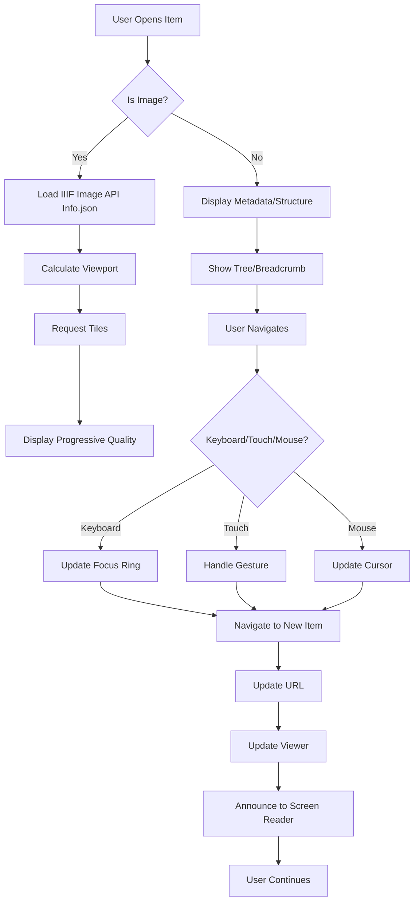

# View and Navigate - Feature Set Tests

## User Goal

**Browse, inspect, and interact with research archives in a responsive, accessible viewer**

Field researchers need to examine high‑resolution images, navigate complex hierarchies, and understand spatial/temporal relationships—all with performance that feels instant even on low‑bandwidth field connections.

---

## What Users Achieve

### 1. View High‑Resolution Images with IIIF Image API
- Zoom to pixel‑level detail
- Pan smoothly across gigapixel images
- Adjust brightness, contrast, rotation
- Region‑of‑interest loading for performance

### 2. Navigate Hierarchical Archives
- Tree view of collections, manifests, ranges, canvases
- Breadcrumb trail shows current location
- Keyboard shortcuts for fast navigation
- Deep linking to any item

### 3. Responsive Design Across Devices
- Works on laptop, tablet, and phone
- UI adapts to screen size and orientation
- Touch gestures for mobile
- Accessible to screen readers

### 4. Performance Optimization
- Virtualized lists for large collections
- Lazy loading of images and metadata
- Progressive quality enhancement
- Cache management for repeated viewing

### 5. Multi‑Viewer Compatibility
- Works with embedded IIIF viewers (Mirador, Universal Viewer)
- Supports IIIF Presentation API 3.0 and 2.1
- Fallbacks for non‑IIIF clients
- Custom viewer integrations

---

## Tests in This Directory

### `imageSourceResolver.test.ts` (legacy unit tests)

**Technical Coverage:**
- Resolving image URIs to IIIF Image API endpoints
- Handling different image formats (JPG, PNG, WebP, TIFF)
- Fallback strategies for missing images
- Performance of resolution selection

**User‑Facing Behaviors:**
- Images load at appropriate resolution for current zoom
- Missing images show placeholder with explanation
- Format conversion happens automatically
- IIIF Image API parameters correct

### `iiifImageApi.test.ts` (legacy unit tests)

**Technical Coverage:**
- IIIF Image API request building
- Tile calculation for different image sizes
- Region, size, rotation, quality, format parameters
- Compliance with IIIF Image API 3.0 spec

**User‑Facing Behaviors:**
- Zooming requests correct tile region
- Rotation applies without quality loss
- Format selection respects browser support
- API errors handled gracefully

### `performance.test.ts` (legacy unit tests)

**Technical Coverage:**
- Rendering performance with 1000+ items
- Memory usage during extended viewing
- Frame rate during animations
- Load‑time optimization

**User‑Facing Behaviors:**
- UI remains responsive during complex interactions
- Large archives load progressively
- Animations smooth (60 fps)
- No memory leaks over long sessions

### `useResponsive.test.ts` (legacy unit tests)

**Technical Coverage:**
- React hook for responsive breakpoints
- Screen size, orientation, pixel ratio detection
- Dynamic layout adjustments
- Touch vs. mouse input detection

**User‑Facing Behaviors:**
- Layout adapts to window size
- Touch‑friendly controls on mobile
- High‑DPI screens get sharper images
- Keyboard navigation works on all devices

---

## Feature‑Specific Expectations

### IDEAL Outcomes

**Image Viewing:**
- Zoom to 100% within 1 second on typical field connection
- Panning feels immediate (no lag)
- Quality improves as tiles load
- All IIIF Image API features available

**Navigation:**
- Tree view expands/collapses instantly
- Breadcrumb updates on every navigation
- Keyboard shortcuts work consistently
- Deep links open correct item with context

**Responsiveness:**
- Mobile layout usable on 320px width
- Touch targets at least 44×44 px
- Screen reader announces navigation changes
- Orientation changes handled smoothly

**Performance:**
- First meaningful paint < 2 seconds
- 60 fps during interactions
- Memory usage < 200 MB for typical archive
- No UI freezes > 100 ms

**Compatibility:**
- Works with latest Mirador and Universal Viewer
- IIIF 2.1 and 3.0 manifests display correctly
- Fallback viewer shows useful information
- Custom integrations possible via API

### FAILURE Prevention

**Viewing:**
- Can’t zoom beyond image bounds
- Invalid IIIF Image API requests never sent
- Missing images don’t crash viewer
- Corrupted tiles don’t break whole image

**Navigation:**
- Can’t navigate to non‑existent items
- Keyboard traps can’t occur
- Breadcrumb always accurate
- Deep links never 404

**Responsiveness:**
- Layout never breaks at any screen size
- Touch gestures never misinterpreted
- Screen reader never gets stuck
- Orientation never causes data loss

**Performance:**
- UI never freezes for > 1 second
- Memory never grows unbounded
- Network errors don’t hang UI
- Large operations can be cancelled

**Compatibility:**
- Invalid IIIF never breaks viewer
- Missing IIIF features degrade gracefully
- Browser‑specific bugs detected and worked around
- API changes don’t break existing integrations

---

## Running These Tests

```bash
# Run all viewer tests
npm test -- view-and-navigate/

# Run specific test file
npm test -- imageSourceResolver.test.ts
npm test -- iiifImageApi.test.ts
npm test -- performance.test.ts
npm test -- useResponsive.test.ts

# Watch mode
npm run test:watch -- view-and-navigate/
```

---

## Real‑World Scenarios Tested

### Scenario 1: Field Tablet with Intermittent Connection
```
User on tablet with 3G connection opens archive with 200 high‑res images.

Expected: Low‑resolution previews load first, zoom triggers higher‑quality tiles, network interruptions show offline placeholder, UI remains responsive.
```

### Scenario 2: Academic Presentation with Mirador
```
User embeds manifest in Mirador for conference presentation.

Expected: Mirador loads manifest correctly, all images zoomable, annotations visible, performance smooth on projector.
```

### Scenario 3: Accessibility Review
```
Screen‑reader user navigates archive to find specific specimen.

Expected: Screen reader announces tree structure, breadcrumb updates, images have alt text, keyboard navigation works fully.
```

### Scenario 4: Large Excavation Archive
```
User opens archive with 5000 items across 20 collections.

Expected: Virtualized tree shows immediate first render, scrolling smooth, search works, memory stays under 300 MB.
```

---

## Key User Flows



---

## Success Criteria

Users can comfortably view and navigate their archives if:

- ✅ Images load quickly at appropriate quality
- ✅ Navigation feels intuitive and fast
- ✅ Works on all devices and screen sizes
- ✅ Performance stays smooth with large archives
- ✅ Accessible to keyboard and screen‑reader users
- ✅ Compatible with standard IIIF viewers
- ✅ No crashes from malformed IIIF
- ✅ Memory usage stays within reason

---

## Integration with Other Features

**With Organize Media:**
- Imported images immediately viewable
- Folder hierarchy reflected in navigation tree
- Sequences become ranges in viewer

**With Describe Content:**
- Metadata visible in viewer side panel
- Annotations displayed over images
- Rights statements shown in viewer

**With Validate Quality:**
- Invalid IIIF caught before viewer tries to render
- Healing improves viewer compatibility
- Sanitization ensures safe rendering

**With Export and Share:**
- Exported manifests work in external viewers
- Static website uses same viewer components
- IIIF Presentation API serves viewer‑ready manifests

**With Search and Find:**
- Search results can be opened directly in viewer
- Highlighting of search terms in viewer
- Filtered viewing based on search criteria

---

*Tests ensure field researchers can view and navigate their archives with the responsiveness, accessibility, and compatibility needed for both field use and formal presentation.*