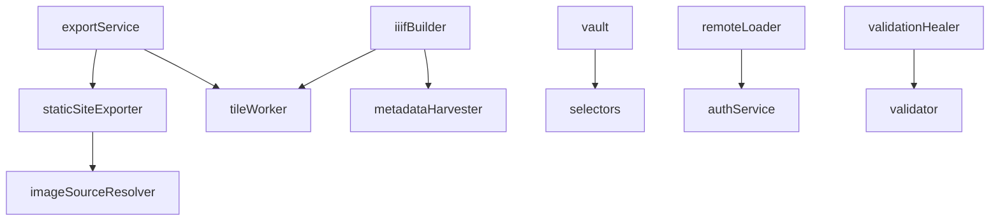

# Field Studio: Services Catalog

Complete catalog of all services in the application. This document combines documented services from Utility.md with previously undocumented services.

---

## Service Architecture

All services follow the **Singleton Pattern** - single instances exported for global access:

```typescript
// Direct import anywhere in the codebase
import { exportService } from './services/exportService';

// Use without instantiation
const archive = await exportService.exportArchive(root, options, onProgress);
```

---

## Documented Services (16)

### Core Export & Build

| Service | File | Size | Purpose |
|---------|------|------|---------|
| `exportService` | [`services/exportService.ts`](../../services/exportService.ts) | 58KB | Archive export with image optimization |
| `staticSiteExporter` | [`services/staticSiteExporter.ts`](../../services/staticSiteExporter.ts) | 31KB | Jekyll/WAX site generation |
| `iiifBuilder` | [`services/iiifBuilder.ts`](../../services/iiifBuilder.ts) | 21KB | Transform files to IIIF structures |

### Data Management

| Service | File | Size | Purpose |
|---------|------|------|---------|
| `vault` | [`services/vault.ts`](../../services/vault.ts) | 1134 lines | Normalized state management |
| `csvImporterService` | [`services/csvImporter.ts`](../../services/csvImporter.ts) | 19KB | CSV metadata round-trip |
| `provenanceService` | [`services/provenanceService.ts`](../../services/provenanceService.ts) | 22KB | Edit history and audit trails |
| `fileIntegrity` | [`services/fileIntegrity.ts`](../../services/fileIntegrity.ts) | 12KB | Duplicate detection, hashing |

### Search & Discovery

| Service | File | Size | Purpose |
|---------|------|------|---------|
| `searchService` | [`services/searchService.ts`](../../services/searchService.ts) | 18KB | Full-text search indexing |
| `contentStateService` | [`services/contentState.ts`](../../services/contentState.ts) | 13KB | IIIF Content State encoding |

### Audio/Video

| Service | File | Size | Purpose |
|---------|------|------|---------|
| `avService` | [`services/avService.ts`](../../services/avService.ts) | 14KB | Audio/video canvas handling |

### Validation & Healing

| Service | File | Size | Purpose |
|---------|------|------|---------|
| `validator` | [`services/validator.ts`](../../services/validator.ts) | - | IIIF validation |
| `validationHealer` | [`services/validationHealer.ts`](../../services/validationHealer.ts) | 6KB | Auto-fix validation issues |

### Staging & Templates

| Service | File | Size | Purpose |
|---------|------|------|---------|
| `stagingService` | [`services/stagingService.ts`](../../services/stagingService.ts) | 13KB | Two-pane ingest workbench |
| `metadataTemplateService` | [`services/metadataTemplateService.ts`](../../services/metadataTemplateService.ts) | 7KB | CSV template generation |

### Compatibility

| Service | File | Size | Purpose |
|---------|------|------|---------|
| `viewerCompatibility` | [`services/viewerCompatibility.ts`](../../services/viewerCompatibility.ts) | 17KB | Viewer compatibility checks |

---

## Undocumented Services (9)

### Authentication

#### `authService.ts`

OAuth/OIDC authentication for remote IIIF resources.

```typescript
// Key functions
authenticate(provider: string): Promise<AuthResult>
getAccessToken(): string | null
isAuthenticated(): boolean
logout(): void
```

**Purpose:** Enables accessing protected IIIF resources that require authentication.

---

### Field Registry

#### `fieldRegistry.ts`

Custom metadata field registration system.

```typescript
// Key types
interface FieldDefinition {
  key: string;
  label: string;
  description: string;
  dataType: 'string' | 'number' | 'date' | 'uri' | 'geo';
  validation?: ValidationRule[];
  vocabularies?: string[];
}

// Key functions
registerField(definition: FieldDefinition): void
getRegisteredFields(): FieldDefinition[]
getField(key: string): FieldDefinition | undefined
validateFieldValue(key: string, value: any): ValidationResult
```

**Purpose:** Allows runtime registration of custom metadata fields beyond IIIF standard properties.

---

### Guidance Service

#### `guidanceService.ts`

User help system with contextual guidance.

```typescript
// Key types
interface GuidanceContext {
  component: string;
  action?: string;
  userLevel?: 'beginner' | 'intermediate' | 'advanced';
}

// Key functions
getHelp(context: GuidanceContext): HelpContent
showTooltip(element: HTMLElement, content: string): void
showTour(steps: TourStep[]): void
dismissGuidance(id: string): void
```

**Purpose:** Provides contextual help and onboarding guidance throughout the application.

---

### Image Source Resolver (Service)

#### `services/imageSourceResolver.ts`

Server-side image resolution for hierarchical structures.

```typescript
// Key functions (server context)
resolveImageSource(item: IIIFItem): ResolvedImage
getDerivativeSizes(assetId: string): number[]
queueDerivativeGeneration(assetId: string, sizes: number[]): void
```

**Purpose:** Server-side counterpart to [`utils/imageSourceResolver.ts`](../../utils/imageSourceResolver.ts) for backend processing.

---

### Metadata Harvester

#### `metadataHarvester.ts`

EXIF/IPTC metadata extraction from uploaded files.

```typescript
// Key types
interface HarvestedMetadata {
  exif?: ExifData;
  iptc?: IptcData;
  xmp?: XmpData;
  iiif?: Partial<IIIFMetadata>;
}

// Key functions
harvestMetadata(file: File): Promise<HarvestedMetadata>
extractExif(file: File): Promise<ExifData>
extractIptc(file: File): Promise<IptcData>
mapToIIIF(harvested: HarvestedMetadata): Partial<IIIFMetadata>
```

**Purpose:** Extracts embedded metadata from images during ingest for automatic population of IIIF fields.

---

### navPlace Service

#### `navPlaceService.ts`

Geographic coordinate handling for IIIF `navPlace` extension.

```typescript
// Key types
interface GeoCoordinates {
  lat: number;
  lng: number;
}

interface NavPlaceFeature {
  type: 'Feature';
  geometry: GeoJSON.Geometry;
  properties: {
    label?: LanguageMap;
  };
}

// Key functions
parseCoordinates(value: string): GeoCoordinates | null
validateNavPlace(navPlace: any): boolean
createNavPlaceFeature(coords: GeoCoordinates, label?): NavPlaceFeature
extractFromMetadata(metadata: MetadataEntry[]): NavPlaceFeature[]
```

**Purpose:** Manages geographic annotations via the IIIF `navPlace` extension.

---

### Remote Loader

#### `remoteLoader.ts`

External manifest fetching with CORS handling.

```typescript
// Key types
interface LoadOptions {
  corsProxy?: string;
  timeout?: number;
  retries?: number;
  headers?: Record<string, string>;
}

// Key functions
loadManifest(url: string, options?: LoadOptions): Promise<IIIFManifest>
loadCollection(url: string, options?: LoadOptions): Promise<IIIFCollection>
fetchWithCORS(url: string, options?: LoadOptions): Promise<Response>
cacheManifest(id: string, manifest: IIIFManifest): void
getCachedManifest(id: string): IIIFManifest | null
```

**Purpose:** Fetches IIIF resources from external URLs with robust error handling and caching.

---

### Selectors

#### `services/selectors.ts`

Vault state selectors for efficient data access.

```typescript
// Key types
interface Selector<T> {
  (state: NormalizedState): T;
  memoized?: boolean;
}

// Key selectors
selectEntitiesByType: Selector<Record<EntityType, IIIFEntity[]>>
selectEntityById: (id: string) => Selector<IIIFEntity | null>
selectChildren: (parentId: string) => Selector<IIIFEntity[]>
selectRoot: Selector<IIIFEntity | null>
selectCollectionsContaining: (resourceId: string) => Selector<IIIFCollection[]>
selectValidationIssues: Selector<ValidationIssue[]>
```

**Purpose:** Provides memoized selectors for efficient Vault state access, preventing unnecessary re-renders.

---

### Tile Worker

#### `services/tileWorker.ts`

Web Worker pool for background tile generation.

```typescript
// Key classes
class TileWorkerPool {
  constructor(poolSize?: number);
  generateDerivatives(
    assetId: string,
    file: Blob,
    sizes?: number[]
  ): Promise<DerivativeResult>;
  terminate(): void;
}

// Key functions
getTileWorkerPool(): TileWorkerPool
generateDerivativeAsync(file: Blob, width: number): Promise<Blob | null>
```

**Purpose:** Offloads CPU-intensive image processing to Web Workers for responsive UI during ingest.

**Worker Protocol:**
```typescript
// Main -> Worker
{ type: 'generate', assetId, imageData, mimeType, sizes, quality }

// Worker -> Main
{ type: 'progress', assetId, currentSize, percent }
{ type: 'complete', assetId, derivatives, originalWidth, originalHeight }
{ type: 'error', assetId, message }
```

---

## Additional Services

### Actions

#### `services/actions.ts`

Action dispatcher with history tracking.

```typescript
interface Action {
  type: string;
  payload: any;
  inverse?: Action;  // For undo
}

class ActionDispatcher {
  dispatch(action: Action): boolean;
  undo(): boolean;
  redo(): boolean;
  subscribe(callback: (state) => void): () => void;
}

// Singleton instance
export const actionDispatcher = new ActionDispatcher();
```

---

### Activity Stream

#### `services/activityStream.ts`

IIIF Change Discovery API implementation.

```typescript
// Key types
interface Activity {
  type: 'Create' | 'Update' | 'Delete';
  object: IIIFItem;
  published: string;
}

// Key functions
recordActivity(type: ActivityType, object: IIIFItem): void
getActivityStream(): Activity[]
generateOrderedCollection(): OrderedCollection
```

---

### Archival Package

#### `services/archivalPackageService.ts`

BagIt package creation for preservation.

```typescript
// Key functions
createBagItPackage(root: IIIFItem): Promise<Blob>
generateManifests(root: IIIFItem): BagManifest
generateTagFiles(root: IIIFItem): TagFiles
validateBagIt(bag: Blob): ValidationResult
```

---

### Content Search

#### `services/contentSearchService.ts`

IIIF Content Search API implementation.

```typescript
// Key types
interface SearchResult {
  annotations: IIIFAnnotation[];
  hits: SearchHit[];
}

// Key functions
search(query: string, manifest: IIIFManifest): SearchResult
generateAnnotationList(results: SearchResult): AnnotationList
```

---

### Ingest Analyzer

#### `services/ingestAnalyzer.ts`

Folder structure analysis for IIIF type detection.

```typescript
// Key functions
analyzeForIngest(fileTree: FileTree, config?: IngestConfig): IngestAnalysis
getProposedManifests(analysis: IngestAnalysis): ProposedManifest[]
overrideNodeType(tree: FileTree, nodeId: string, type: string): FileTree
```

---

### Spec Bridge

#### `services/specBridge.ts`

IIIF Presentation API version bridging (2.x ↔ 3.0).

```typescript
// Key functions
upgradeToV3(manifest: IIIFV2Manifest): IIIFV3Manifest
downgradeToV2(manifest: IIIFV3Manifest): IIIFV2Manifest
isV2Manifest(manifest: any): boolean
isV3Manifest(manifest: any): boolean
```

---

### Storage

#### `services/storage.ts`

IndexedDB persistence layer.

```typescript
// Key functions
saveFile(identifier: string, blob: Blob): Promise<void>
getFile(identifier: string): Promise<Blob | null>
deleteFile(identifier: string): Promise<void>
hasFile(identifier: string): Promise<boolean>
saveDerivative(key: string, blob: Blob): Promise<void>
getDerivative(key: string): Promise<Blob | null>
saveVault(state: NormalizedState): Promise<void>
loadVault(): Promise<NormalizedState | null>
```

**IndexedDB Stores:**

| Store | Key | Value |
|-------|-----|-------|
| `files` | identifier | Blob |
| `derivatives` | `{id}_{size}` | Blob |
| `vault` | 'state' | JSON |

---

## Virtual Manifest Factory

#### `services/virtualManifestFactory.ts`

Creates manifests from disparate resources.

```typescript
// Key functions
createVirtualManifest(resources: Resource[], options?: FactoryOptions): IIIFManifest
probeMedia(file: File): Promise<MediaInfo>
constructSkeleton(id: string, type: string): IIIFSkeleton
```

---

## Summary Table

| Category | Documented | Undocumented | Total |
|----------|-----------|--------------|-------|
| Core | 16 | - | 16 |
| Auth | - | 1 | 1 |
| Fields | - | 1 | 1 |
| Guidance | - | 1 | 1 |
| Image | - | 2 | 2 |
| Geo | - | 1 | 1 |
| Network | - | 1 | 1 |
| State | - | 1 | 1 |
| Workers | - | 1 | 1 |
| **Total** | **16** | **9** | **25** |

---

## Service Dependencies


