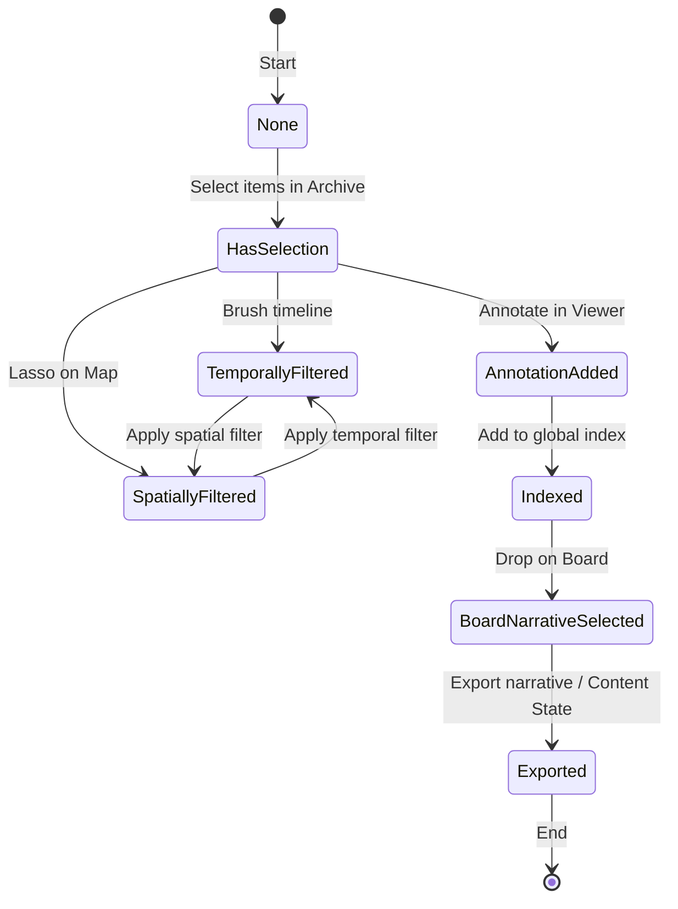
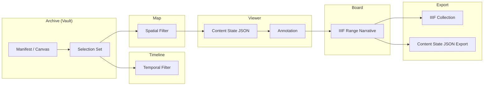
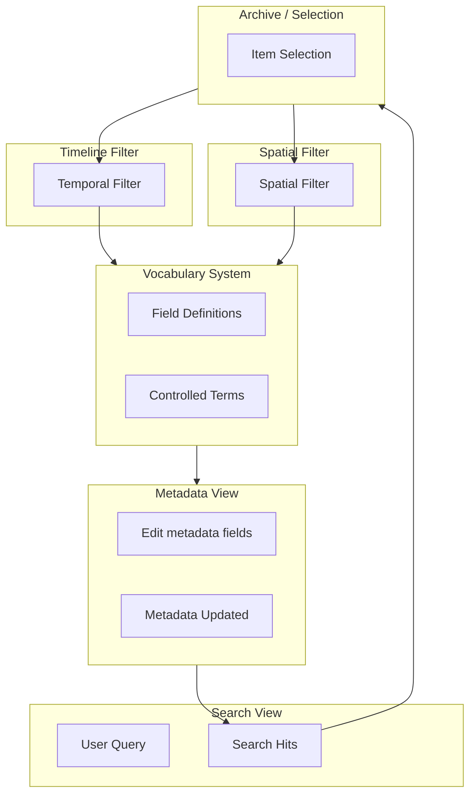

# **Field Studio Unified Ideal Design Spec**

**A Coherent Research Workbench — Seamless Views on a Single Canonical Data Fabric**

---

## **1. Core Philosophical Commitments (Thick Affordance)**

Field Studio is:

* **One canonical vault of IIIF entities.**
* **Many interoperable lenses on that vault.**
* **A place for *interpretation*, not just rendering.**
* **A system where *actions generate future data, not ephemeral events*.**

Every view makes things *more intelligible* — not just *visible*.
Selections, annotations, states, and views are all **preserved, shared, and replayable**.

Integration is not an afterthought — it’s the *defining product experience*.

---

## **2. Meta‑View Design Pattern**

Each view in the system is a **projection + transformation** of the same canonical dataset.

Views are not silos — they are:

* **Coordinate systems** on the vault
* **Filters + lenses** that project different aspects
* **Interpolation surfaces** that help users *traverse meaning*

Selections and view states become *portable objects*.

* *Selectable items translate across views:*
  Archive selected in Timeline → Map highlights those items
* *View state + filters persist across view switches* (proposal below)
* *Annotations, narratives, and board links are real metadata*
* *Deep links can be shared and reloaded via IIIF Content State standard* ([iiif.io][1])

**Content State** is the mechanism that makes any view shareable, bookmarkable, and serviceable across contexts. IIIF Content State is designed for precisely this purpose: sharing a particular view of a resource in a compatible client. ([iiif.io][1])

---

## **3. Unified Vault Architecture**

The vault is **not just storage** — it is the **semantic kernel**:

* Normalized entities (IIIF Manifest, Canvas, Range, Annotation, etc.)
* Referential indices (ownership, membership)
* Extensions & arbitrary metadata
* Trash & history
* Membership in **many contexts**
* Reactive read projections

This means:

* Every canvas, annotation, relationship, and board item is a **first‑class object**
* Every mutation is tracked, recordable, undoable
* Everything flows through actions, not ad‑hoc state writes

---

## **4. Canonical Global Services & ViewBus**

**4.1. ViewBus (Cross‑View State Fabric)**

To satisfy the research workbench vision:

* Each view should register reactive **ViewState** objects
* View states persist across mount/unmount
* Selections flow through a global bus

This kills the problem of “local transient stores losing selection/filters.”

**Affordance: “You can jump between views without losing context”**

Example ViewState slices:

| View     | What It Carries                  |
| -------- | -------------------------------- |
| Archive  | selection set, sort/filters      |
| Map      | zoom, layers, selected area      |
| Timeline | zoom, temporal focus             |
| Search   | query, facets, highlighted hits  |
| Viewer   | zoom/pan/rotation, layers        |
| Board    | spatial layout, active narrative |

This gives the feeling of **continuity** rather than switching.

---

## **5. Thick View Descriptions**

### **5.1 Archive — The Arrangement Table**

**Purpose:**
Make *structure visible* and *arrangement sensible* without imposing interpretation.

**Thick Affordances:**

* **Original order remains unbroken** — only *virtual collections* transform without destruction
* Selection is *physical* — momentum drag, lasso, scatter — not just checkboxes
* Orphans are visible and actionable
* Archive is the **structural baseline** for all other views

**Integration to Whole:**

* Archive selection feeds Timeline, Map, Search, Board
* Selections become collections for export and narrative generation
* Original order remains a yardstick for temporal and spatial interpolation

---

### **5.2 Viewer — The Light Table**

**Purpose:**
Forensic inspection and annotation with spatial precision.

**Thick Affordances:**

* Click‑to‑annotate (no “add mode”)
* Momentum navigation with zoom + rotation
* Annotation layers with opacity (no binary toggles)
* Deep zoom with tiling pipeline (via local image API)

**What the user *feels*:**
This view is *intimately connected* to the material — like a light table in a lab.

**Integration to Whole:**

* Annotations become search targets
* Viewer fragments export to Board as objects
* Content State export is canonical shareable data
* Annotations indexed into global search and metadata

This view turns *inspection into knowledge creation*.

---

### **5.3 Board — The Evidence Wall**

**Purpose:**
Spatial argumentation where *ideas become artifacts*.

**Thick Affordances:**

* Infinite canvas with semantic connections
* Labels + styles on links
* Narrative paths as structural sequences
* Spatial density communicates argumentative weight

This is where *sensemaking happens*:

* The board is not a diagram — it is a **narrative artifact**
* Connections encode interpretation *without enforcing ontology*

**Integration:**

* Board integrates Archive items, Viewer fragments, and Search results
* Exported narratives become **IIIF Ranges**
* Links become **AnnotationCollections** with `motivation` `"linking"`

---

### **5.4 Metadata Editor — The Filing Cabinet**

**Purpose:**
Precise semantic inscription, controlled vocabulary, relationship graphing.

**Thick Affordances:**

* Vocabulary‑driven dynamic forms
* Dirty visualization → silent debounced saves
* Fuzzy dates, relationship graphs, batch edit

This view refines *what things are* rather than how they *appear*.

**Integration:**

* Metadata shapes Timeline positions
* navPlace anchors on Map
* Controlled terms improve Search facets
* Relationship graphs shape board link suggestions

---

### **5.5 Search — The Index**

**Purpose:**
Universal discovery with real semantic hit highlighting.

**Thick Affordances:**

* Syntax queries: `date:1987`, `person:"Smith"`
* Facets drive real filter contexts
* Local semantic embeddings (privacy‑preserving)

**Integration:**

* Every search hit can feed Archive selection or Board drop
* Search score influences item prominence in Board or Timeline
* Search results can be exported as collections for sharing

---

### **5.6 Map — The Territory**

**Purpose:**
Place as *material › interpretation*. Real geography, not just dots.

**Thick Affordances:**

* Multiple layers (OSM, satellite, historical, indigenous)
* Fuzzy navPlace halos for approximate metadata
* Lasso selection to create collections
* Trajectory animation for movement

**Integration:**

* navPlace enhanced by metadata quality
* Map area selection ↔ Archive collections
* Timeline animation shows movement through place

---

### **5.7 Timeline — The Chronology**

**Purpose:**
Time with uncertainty; not just a line chart.

**Thick Affordances:**

* EDTF‑aware rendering with uncertain shapes
* Multi‑date focus switching
* Period bands for narrative epochs
* Temporal clusters for discovery

**Integration:**

* Timeline brush selects items across views
* Board narratives acquire temporal sequences
* Map trajectories animate over time

---

## **6. Cross‑Cutting Integrations**

### **6.1 Content State — Portable Views**

Every view can serialize its *essential state* into a IIIF Content State.
This enables:

* deep links into a view
* passing context between views
* sharing with other IIIF‑compatible tools

Content State is precisely the *interchange format* for view contexts. ([iiif.io][1])

---

### **6.2 Global Undo/Redo as Epistemic Reversal**

Undo is not UI undo — it’s **knowledge rollback**.

It should:

* undo vault mutations
* restore view states where appropriate
* preserve selection and context

This makes exploration *safe* and *trustworthy*.

---

### **6.3 Annotation as Knowledge**

Annotations are not ephemeral:

* They are indexed
* They are searchable
* They are semantic evidence

Annotations feed Board structures, Search hits, Narrative tracks, and Viewer layers.

---

## **7. Reality‑Aligned Refactor Plan**

### **7.1 Implement ViewBus**

* hoist view state into global reactive registry
* drop local reinits on mount

### **7.2 Canonical Annotation Pipeline**

* render annotation overlays in Viewer
* index into search
* enable filtering

### **7.3 navPlace Pipeline**

* ingest real navPlace metadata
* integrate geo graph

### **7.4 Timeline Fuzzy Dates**

* use robust EDTF parsing

### **7.5 Export & ContentState**

* UI triggers for export
* content state for share/tracking

---

## **8. Updated Success Metrics**

**Holistic & Cross‑View Measures**

| Measure                     | Target                              |
| --------------------------- | ----------------------------------- |
| Archive render              | <2s @ 10K items                     |
| Search hit latency          | <100ms @ 20K items                  |
| Annotation search coverage  | 100% indexed                        |
| Timeline fuzzy date support | all EDTF forms                      |
| View continuity             | selection preserved across switches |
| View state reproducibility  | stable content state                |
| Export fidelity             | export matches internal state       |

---

## **9. Aesthetic Tenet**

**Neobrutalist light** means:

* Every UI element *exposes structure*
* No secrets under layers
* Interfaces show material reality
* Text + grids + sharpness

Here’s a **visual UI interaction flow**, presented textually with clear stages and transitions, showing how *cross‑view context* and *selections* can propagate in Field Studio as a cohesive workbench. This builds on the idea that each view is a **lens on the same canonical vault**, and that *Content State* (IIIF Content State API 1.0) is the formal exportable format for a specific visual + data view of an object.([iiif.io][1])

---

# 📌 Field Studio — Cross‑View Interaction Flow


## **1. Start — Global Selection in Archive**

```
Archive View
  └── User selects items (multi‑select)
      ├── Visual selection highlight
      ├── Adds selection context to ViewState
      └── Populates global Selection Bus
```

**Effect:**

* Selection Bus broadcasts selection set
* Timeline, Map, Board, Search all *know what’s selected*

**Feel:**
You’ve “picked up” these items — the system remembers them.

---

## **2. Jump to Timeline — Time Projection**

```
Timeline View
  └── Timeline receives Selection Bus
        → highlights selected items by temporal band
  └── User brushes a date range or focuses an epoch
        → Temporal filter applied
        → Filter state saved in ViewState
```

**Integration:**

* Archive selection filters timeline bands
* Timeline filters can feed back to Archive (and Search)

**Feel:**
Time accentuates the selection — you see *when* things happen.

---

## **3. Go To Map — Spatial Projection**

```
Map View
  └── Map receives:
        • Selection set
        • Temporal filter (from Timeline)
  └── Map highlights spatial points
  └── User lasso‑selects a region
        → creates a new selection
          → adds region to Selection Bus
          → updates ViewState
```

**Integration:**

* Temporal filter narrows map clusters
* Map lasso selection refines Archive / Search selection
* navPlace metadata becomes spatial anchors

**Feel:**
You’ve tied time to place — space starts to make sense.

---

## **4. Open Viewer — Deep Inspection**

```
Viewer View
  └── User opens Canvas from selection
  └── Viewer receives:
        • Selected Canvas
        • Zoom / Region context
  └── User annotates region
        → Annotation enters Vault
        → Annotation indexed into Search
```

**Integration:**

* Content State fragment becomes shareable
* Annotation feeds:
  • Search results
  • Board graphing
  • Metadata relationships

**Feel:**
The artifact speaks back — annotations have texture.

---

## **5. Build Board Narrative — Spatial Argument**

```
Board View
  └── User drops:
        • Selected archive items
        • Selected map region
        • Viewer annotation fragments
  └── User draws links
  └── Narrative Path created
```

**Integration:**

* Links become IIIF Ranges
* Narrative path stored as structured metadata
* Board layout becomes exportable story

**Feel:**
You’ve constructed argument — it’s tangible.

---

## **6. Search Fall‑Through**

At any point, the user can open Search:

```
Search View
  └── Receives:
        • current selection
        • temporal / spatial filters
  └── Shows:
        • hits across labels
        • annotations
        • related metadata
  └── User can:
        • refine
        • add results to selection
        • export selection
```

**Integration:**

* Search results push to:
  • Archive
  • Board
  • Viewer
  • Timeline
  • Map

**Feel:**
Search is not isolated — it’s a *lens that multiplies context*.

---

## **7. Export & Content State**

```
Export
  ├── Content State Snapshot
  ├── IIIF Collection
  ├── Narrative (Ranges)
  └── CSV / Static Site
```

**Content State Export**
A JSON‑LD description of the *active view’s intended context*.
This can encode:

* Selected manifest/canvas
* Canvas region, zoom level
* Annotations
* Temporal windows
* Multiple targets

Example use cases (as per IIIF spec):

* Deep link into Canvas region
* Comparison view between objects
* Cross‑manifest references([iiif.io][1])

**Feel:**
Your visual + semantic context becomes *interchangeable data*.

---

## **Unified Flow Diagram (Text Map)**

```
 ┌────────── Archive (structure) ───────┐
 │  select items                        │
 │        ↓                             │
 │  ┌──────── Timeline (temporal) ─────┐│
 │  │ filters by selection             ││
 │  │      ↓                           ││
 │  │  ┌────── Map (spatial) ─────────┐││
 │  │  │ highlights & spatial filters│││
 │  │  │     ↓                        │││
 │  │  │  ┌── Viewer (forensics) ────┐│││
 │  │  │  │ annotate & zoom          ││││
 │  │  │  │      ↓                   ││││
 │  │  │  │  ┌── Board (argument) ───┐│││
 │  │  │  │  │ narrative + links     ││││
 │  │  │  │  └────────────┬──────────┘│││
 │  │  │  │               ↓           │││
 │  │  │  │           Search (index)  │││
 │  │  │  │              ↑            │││
 │  └──┬──┘              │            │││
 │     ↓                 │            │││
 │ Export (Content State, CSV, static)││
 └────────────────────────────────────┘│
```

**Key Behaviors:**

* Selections carry forward → persistent context
* Filters interop across time, space, and structure
* ViewState captures *intent*, not just UI state
* Export uses IIIF Content State semantics for portability([iiif.io][1])
---
Absolutely — here are **three Mermaid diagrams** based on your system and requests:

1. **A swimlane diagram showing view responsibilities by user action**
2. **A state diagram of selection/filter states**
3. **A variant that incorporates *IIIF terminology* (e.g., *Manifest*, *Canvas*, *Content State JSON*)**
4. **A variant that considers *decoupled controlled vocabularies* (vocabulary system varies independently of any view)**

These use **Mermaid syntax** and are suitable to paste into a renderer like mermaid.live or an editor that supports Mermaid diagrams.

---

## 1️⃣ Swimlane — View Responsibilities by User Action

```mermaid
flowchart TB
  %% Swimlane layout with subgraphs for views and user actions
  subgraph ARCH["Archive View"]
    A1[Select Items] --> A2[Apply Selection to Context Bus]
  end

  subgraph TIM["Timeline View"]
    T1[Receive Selection] --> T2[Brush Temporal Range]
    T2 --> T3[Emit Temporal Filter]
  end

  subgraph MAP["Map View"]
    M1[Receive Selection+Temporal Filter] --> M2[Lasso Spatial Select]
    M2 --> M3[Emit Spatial Filter]
  end

  subgraph VW["Viewer View"]
    V1[Load Selected Canvas] --> V2[Add Annotation]
    V2 --> V3[Index Annotation]
  end

  subgraph BRD["Board View"]
    B1[Drop Items + Regions] --> B2[Connect & Build Narrative]
    B2 --> B3[Export Narrative (Ranges)]
  end

  subgraph SRC["Search View"]
    S1[Search Query] --> S2[Show Hits Across Vault]
    S2 --> S3[Add Results to Selection]
  end

  A2 --> T1
  T3 --> M1
  M3 --> V1
  V3 --> SRC
  SRC --> A1
  SRC --> BRD
  T3 --> SRC
  M3 --> SRC
```

**What it shows:**

* Each view is a swimlane with *responsibilities*
* Interactions flow via the **global context bus** (selection, spatial, temporal, annotations)
* Search can feed back into Archive or Board selections

---

## 2️⃣ State Diagram — Selection & Filters

This models the *finite state machine* of selection and filters, where states change according to user actions or view context.



**What it shows:**

* Selection state evolves into filtered states based on timeline and map interactions
* Annotation addition transitions state into an indexed form, enabling narrative export

---

## 3️⃣ Variant with **IIIF Terminology**



**Annotated Points:**

* Selection originates from IIIF entities like *Manifest* and *Canvas*
* Viewer generates *Content State JSON* and *Annotation*
* Board produces *Range narratives*
* Export outputs *IIIF Collection* and *Content State JSON* for sharing **(IIIF spec for Content State sharing)**([IIIF][1])

---

## 4️⃣ Variant with **Decoupled Vocabulary System**

This treats *vocabulary* as a separate subsystem that informs metadata, search, and filters independently:



**What it shows:**

* Vocabulary definitions *inform Metadata editing*
* Metadata changes update search and selection
* Filters propagate back to Vocabulary context (facets, meaning grouping)
* Vocabulary system is decoupled yet *informs every view’s interpretation*

---

### 💡 Diagrammatic Notes

* Mermaid diagrams use simple textual syntax for states and transitions([Mermaid][2])
* State diagrams model *behavioral states* (e.g., selection → filtered → annotated)
* Flowcharts model *responsibility roles and context propagation*
