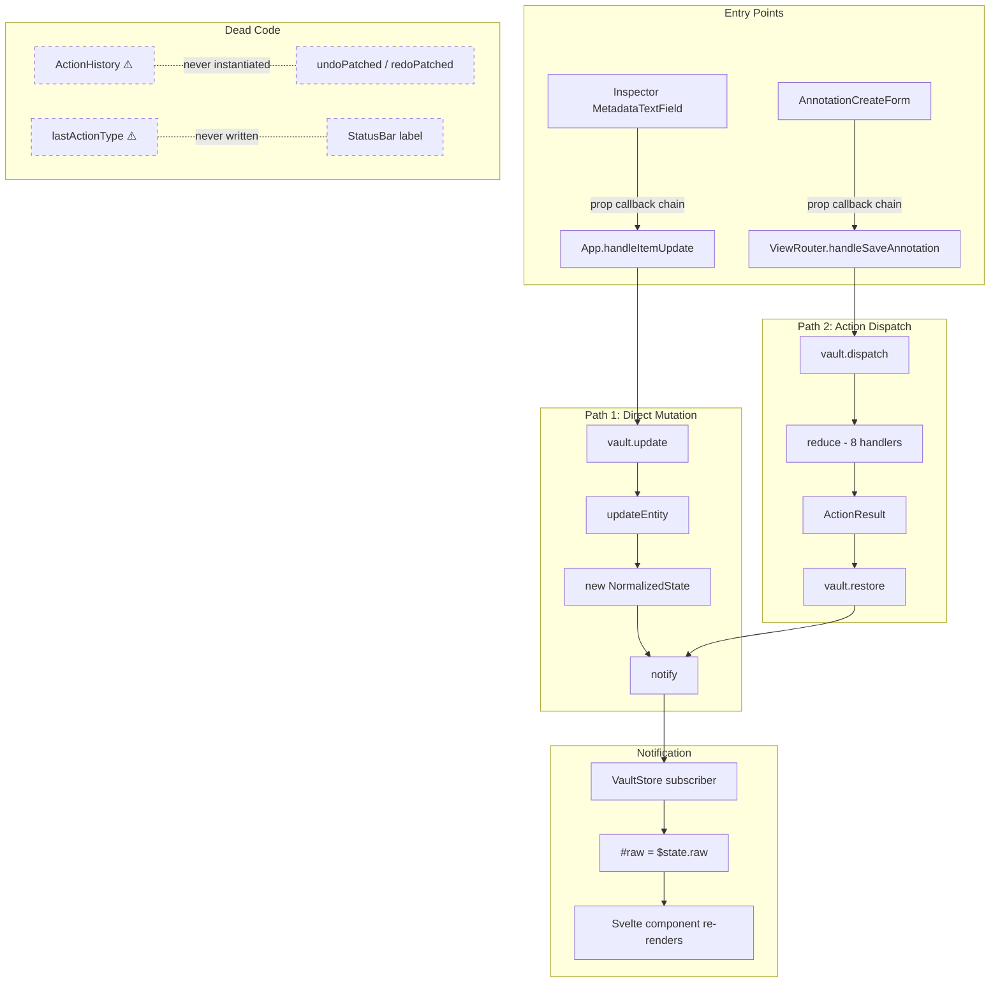
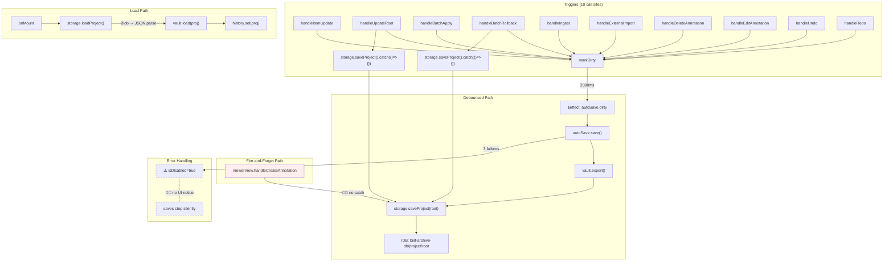
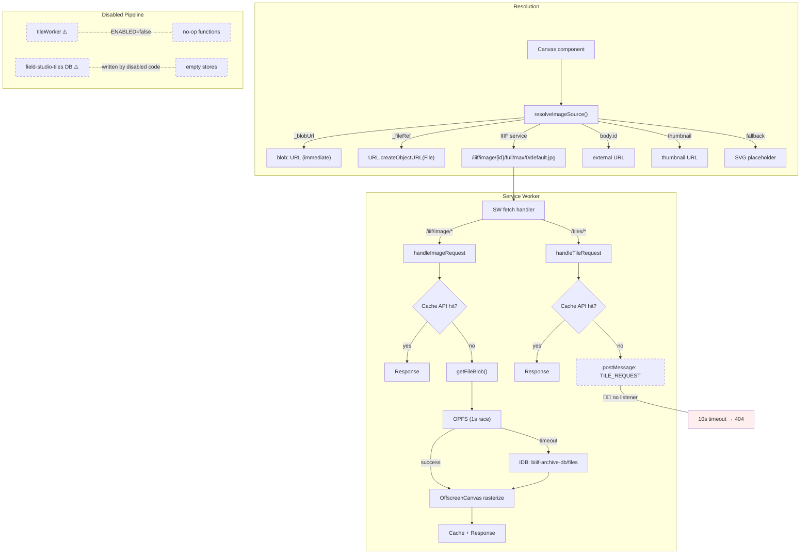
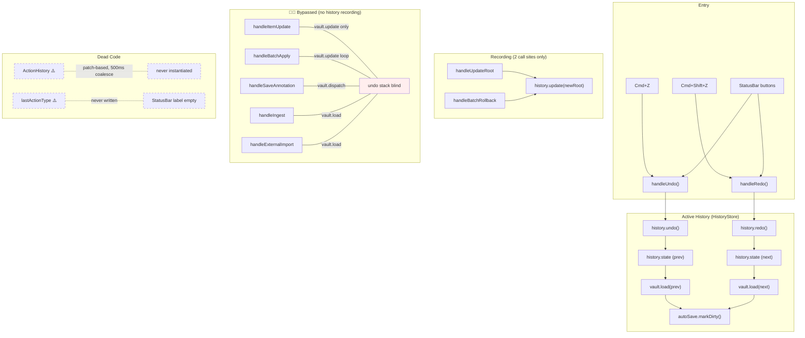
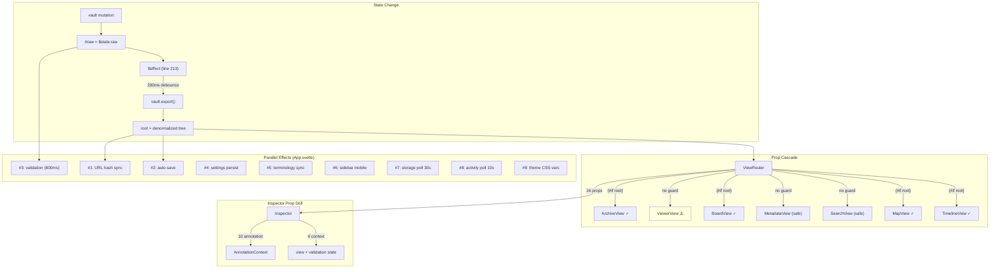
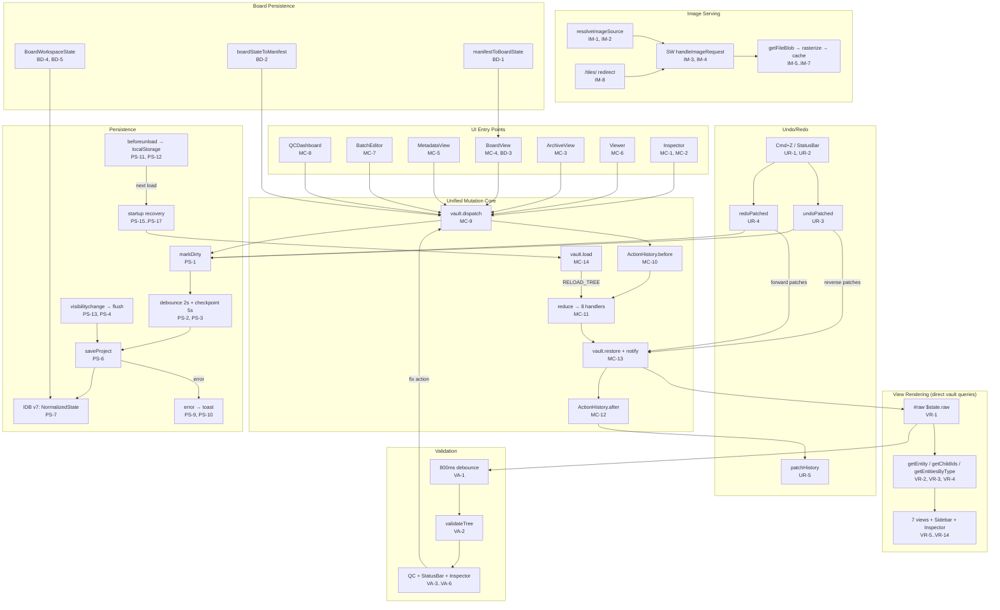

# Reverse Breadboard: Field Studio Wiring

What actually exists today — traced from live code, not from docs or intent.

---

## Subsystem 1: Vault Mutation Circuit

Two mutation paths exist. Both reach the same normalized state store but through different pipelines with different guarantees.

### Affordance Table

| ID | Type | Place | Name | Wires Out | Returns To |
|----|------|-------|------|-----------|------------|
| VM-1 | UI | Inspector | MetadataTextField.onchange | VM-2 (via prop callback chain) | — |
| VM-2 | Code | App.svelte:527 | handleItemUpdate() | VM-5 (vault.update), PS-1 (autoSave.markDirty) | — |
| VM-3 | UI | AnnotationCreateForm | onSaveAnnotation button | VM-4 (via prop callback chain) | — |
| VM-4 | Code | ViewRouter:400 | handleSaveAnnotation() | VM-6 (vault.dispatch ADD_ANNOTATION) | — |
| VM-5 | Code | vault.ts:80 | vault.update(id, updates) | VM-8 (updateEntity), VM-9 (notify) | — |
| VM-6 | Code | vault.svelte.ts:145 | vault.dispatch(action) | VM-7 (reduce), VM-10 (restore) | boolean |
| VM-7 | Code | actions/index.ts:61 | reduce(state, action) | 8 handler fns (metadata, canvas, annotation, movement, trash, range, linking, board) | ActionResult |
| VM-8 | Code | updates.ts:17 | updateEntity(state, id, updates) | — | NormalizedState |
| VM-9 | Code | vault.ts:203 | notify() | VM-11 (VaultStore subscriber) | — |
| VM-10 | Code | vault.ts:227 | restore(snapshot) | VM-9 (notify) | — |
| VM-11 | Code | vault.svelte.ts:53 | VaultStore subscriber → #raw | Svelte $state.raw reactivity | — |
| VM-12 | Code | actions/index.ts:84 | ~~⚠️ ActionHistory class~~ | ✅ **V1: Now wired into VaultStore.dispatch/undo/redo** | — |
| VM-13 | Code | App.svelte:191 | ~~⚠️ lastActionType~~ | ✅ **V1: Deleted (dead wire)** | — |

### Key Findings

**~~Path 1 (vault.update):~~** ✅ **Eliminated by V1.** All mutations now go through Path 2 (dispatch).

**Path 2 (vault.dispatch):** All mutations → vault.dispatch → reduce() (8 handlers) → ActionResult → vault.restore → notify → VaultStore #raw → Svelte reactivity. Has validation per-handler. ActionHistory records every dispatch for undo/redo.

**39 action types** across 8 handler files. All pass through the same reduce() linear scan.

**~~Dead code:~~** ✅ **Resolved by V1.** ActionHistory is now wired into VaultStore — instantiated as `#history = new ActionHistory(100)`, records every dispatch, provides `undo()`/`redo()`. HistoryStore deleted. lastActionType + ACTION_LABELS deleted.



---

## Subsystem 2: Persistence Circuit

### Affordance Table

| ID | Type | Place | Name | Wires Out | Returns To |
|----|------|-------|------|-----------|------------|
| PS-1 | Code | autoSave.svelte.ts:31 | markDirty() | PS-2 (debounce timer, 2000ms) | — |
| PS-2 | Code | autoSave.svelte.ts:35 | debounce timer (2000ms) | PS-3 ($effect trigger) | — |
| PS-3 | Code | App.svelte:355 | $effect watching autoSave.dirty | PS-4 (autoSave.save callback) | — |
| PS-4 | Code | autoSave.svelte.ts:42 | autoSave.save(doSave) | PS-5 (vault.export), PS-6 (storage.saveProject) | — |
| PS-5 | Code | vault.ts:59 | vault.export() → denormalize() | Returns IIIFItem tree | PS-4 |
| PS-6 | Code | storage.ts:95 | storage.saveProject(root) | PS-7 (JSON.stringify → Blob → IDB put) | — |
| PS-7 | Code | storage.ts:100 | IDB put('project', 'root') | biiif-archive-db v6 | — |
| PS-8 | Code | App.svelte:537 | handleUpdateRoot fire-and-forget | PS-6 (storage.saveProject).catch(() → {}) | — |
| PS-9 | Code | App.svelte:564 | handleBatchRollback fire-and-forget | PS-6 (storage.saveProject).catch(() → {}) | — |
| PS-10 | Code | ViewerView:369 | handleCreateAnnotation fire-and-forget | PS-6 ⛓️‍💥 no .catch(), no await | — |
| PS-11 | Code | App.svelte:482 | onMount load | PS-12 (storage.loadProject) | — |
| PS-12 | Code | storage.ts:115 | storage.loadProject() | IDB get → Blob → JSON.parse → IIIFItem | PS-13 |
| PS-13 | Code | App.svelte:484 | vault.load(proj) + history.set(proj) | VM-5, UR-2 | — |
| PS-14 | Code | autoSave.svelte.ts:44 | ⚠️ MAX_FAILURES=3 lockout | ⛓️‍💥 no UI notification on lockout | — |
| PS-15 | Code | — | ⚠️ changeDiscoveryService | ⛓️‍💥 referenced in design docs, not found in codebase | — |

### Key Findings

**Debounced path:** Any mutation → autoSave.markDirty() → 2000ms debounce → $effect fires → vault.export() denormalizes → storage.saveProject() JSON-stringifies full tree → Blob → IDB.put(biiif-archive-db, 'project', 'root').

**Dual save paths:** handleUpdateRoot and handleBatchRollback call BOTH markDirty() (debounced) AND storage.saveProject().catch(() => {}) (immediate fire-and-forget). The immediate path swallows errors silently.

**Unprotected save:** ViewerView.handleCreateAnnotation calls storage.saveProject() with no await, no .catch(), no error tracking. IDB failure loses the annotation silently.

**Lockout without notice:** After 3 consecutive save failures, autoSave.isDisabled becomes true. No UI indicator — user continues editing, believing saves are happening.

**Database:** `biiif-archive-db` v6, stores `project` and `files`. No gzip (TODO comment references React version). No migration logic for version skips.



---

## Subsystem 3: Image Serving Circuit

### Affordance Table

| ID | Type | Place | Name | Wires Out | Returns To |
|----|------|-------|------|-----------|------------|
| IM-1 | Code | imageSourceResolver.ts:288 | resolveImageSource(canvas) | Priority chain: _blobUrl → _fileRef → IIIF → body.id → thumbnail → placeholder | URL string |
| IM-2 | Code | virtualManifestFactory.ts:377 | _fileRef / _blobUrl assignment | Set during ingest from File object | IM-1 |
| IM-3 | Code | imageSourceResolver.ts:329 | buildIIIFImageUrl() | Constructs /iiif/image/{id}/full/max/0/default.jpg | IM-4 |
| IM-4 | Code | sw.js:1230 | SW fetch: /iiif/image/* | IM-5 (handleImageRequest) | Response |
| IM-5 | Code | sw.js:792 | handleImageRequest() | IM-8 (getFileBlob), IM-9 (OffscreenCanvas), IM-10 (Cache API) | Response |
| IM-6 | Code | sw.js:1206 | SW fetch: /tiles/* | IM-7 (handleTileRequest) | Response |
| IM-7 | Code | sw.js:122 | handleTileRequest() | IM-10 (Cache API), IM-11 ⛓️‍💥 (TILE_REQUEST postMessage) | Response |
| IM-8 | Code | sw.js:1105 | getFileBlob() | OPFS (1s timeout race) → IDB fallback | Blob |
| IM-9 | Code | sw.js:963 | OffscreenCanvas rasterization | Region, size, rotation, quality transforms | Blob |
| IM-10 | Code | sw.js:431 | Cache API: iiif-tile-cache-v3 | LRU eviction at 500MB | Response |
| IM-11 | Code | sw.js:240 | ⛓️‍💥 TILE_REQUEST postMessage | ⛓️‍💥 No main thread listener — 10s timeout → 404 | — |
| IM-12 | Code | sw.js:417 | ⛓️‍💥 TILE_MANIFEST_REQUEST postMessage | ⛓️‍💥 No main thread listener — 5s timeout → null | — |
| IM-13 | Code | tileWorker.ts:5 | ⚠️ TILE_GENERATION_ENABLED = false | All tile generation functions are no-ops | — |
| IM-14 | Code | sw.js:10 | failureTracker (exponential backoff) | 1s → 2s → 4s → ... → 5min after 10 failures | transparent pixel fallback |
| IM-15 | Code | opfsStorage.ts | OPFS /originals/{id} | ⚠️ 1s timeout race in SW access | Blob or null |
| IM-16 | Code | tilePipeline.ts:37 | field-studio-tiles DB | tiles + tile-manifests stores | ⚠️ Written by disabled pipeline, read by severed wire |

### Key Findings

**Working path (IIIF Image API):** Canvas display → imageSourceResolver priority chain → /iiif/image/{id}/... URL → SW intercepts → getFileBlob() tries OPFS (1s race) then IDB → OffscreenCanvas rasterization → Cache API. This works.

**Severed path (Tiles):** Tile URL /tiles/{id}/{level}/{x}_{y}.jpg → SW intercepts → checks Cache API → sends TILE_REQUEST postMessage to main thread → **no listener exists** → 10s timeout → 404. The tile pipeline (tilePipeline.ts) exists with full IDB schema but tile generation is disabled (`TILE_GENERATION_ENABLED = false`). The entire tile subsystem is wired on the SW side but has no main-thread counterpart.

**Four separate storage locations** with no coordination:
1. `biiif-archive-db` / `files` store (IDB) — original images
2. `biiif-archive-db` / `derivatives` store (IDB) — thumbnails (written how? unclear)
3. `field-studio-tiles` (IDB) — tiles + manifests (disabled pipeline)
4. OPFS `/originals/` — large images (>10MB)

**OPFS fragility:** 1-second Promise.race timeout. Slow filesystem access silently returns null, falling back to IDB without retry.



---

## Subsystem 4: Undo/Redo Circuit

### Affordance Table

| ID | Type | Place | Name | Wires Out | Returns To |
|----|------|-------|------|-----------|------------|
| UR-1 | UI | App.svelte:769 | Cmd+Z / Cmd+Shift+Z keyboard handler | UR-3 (handleUndo), UR-4 (handleRedo) | — |
| UR-2 | Code | history.svelte.ts | HistoryStore&lt;IIIFItem&gt; (max 50) | past/present/future stacks | — |
| UR-3 | Code | App.svelte:691 | handleUndo() | UR-2.undo(), vault.load(prev), PS-1 (markDirty) | — |
| UR-4 | Code | App.svelte:700 | handleRedo() | UR-2.redo(), vault.load(next), PS-1 (markDirty) | — |
| UR-5 | Code | App.svelte:535 | history.update(newRoot) | UR-2 (pushes denormalized snapshot) | — |
| UR-6 | Code | App.svelte:562 | history.update(restoredRoot) | UR-2 (pushes denormalized snapshot) | — |
| UR-7 | Code | App.svelte:529 | ⛓️‍💥 handleItemUpdate — NO history.update | vault.update only, undo stack never sees it | — |
| UR-8 | Code | App.svelte:541 | ⛓️‍💥 handleBatchApply — NO history.update | vault.update in loop, undo stack never sees it | — |
| UR-9 | Code | ViewRouter:410 | ⛓️‍💥 vault.dispatch(ADD_ANNOTATION) — NO history | Action dispatch bypasses history entirely | — |
| UR-10 | Code | App.svelte:617 | ⛓️‍💥 handleIngest vault.load — NO history | Replaces state without recording previous | — |
| UR-11 | Code | actions/index.ts:84 | ⚠️ ActionHistory (patch-based, 500ms coalesce) | ⛓️‍💥 Never instantiated — dead code | — |
| UR-12 | UI | StatusBar | canUndo / canRedo buttons | UR-3, UR-4 | — |
| UR-13 | Code | App.svelte:191 | ⚠️ lastActionType | ⛓️‍💥Passed to StatusBar, never written | — |

### Key Findings

**What has undo:** Only handleUpdateRoot (structure import, QC fixes) and handleBatchRollback (batch edit revert) push to history. These are bulk operations — rare.

**What lacks undo:** Individual metadata edits (handleItemUpdate), batch applies (handleBatchApply), annotation CRUD (vault.dispatch), ingest (handleIngest), external import. These are the common operations — frequent.

**Two history systems, one dead:**
- `HistoryStore` (active): generic snapshot-based, captures full denormalized trees. No coalescing — identical rapid edits each consume a slot.
- `ActionHistory` (dead): patch-based with 500ms coalescing, forward/reverse JSON patches, snapshot fallback for RELOAD_TREE. Fully implemented, tested, never instantiated outside tests.

**History depth:** 50 full denormalized trees in memory. Each is a complete copy of the manifest hierarchy.

**Scope exclusions:** View state (expanded nodes, scroll position), selection (selectedId), and individual field edits are all outside the undo boundary.



---

## Subsystem 5: View Rendering Circuit

### Affordance Table

| ID | Type | Place | Name | Wires Out | Returns To |
|----|------|-------|------|-----------|------------|
| VR-1 | Code | vault.svelte.ts:53 | VaultStore subscriber → #raw | Svelte $state.raw signal | — |
| VR-2 | Code | App.svelte:213 | $effect: 200ms export debounce | vault.export() → root | — |
| VR-3 | Code | App.svelte:210 | root = $state&lt;IIIFItem \| null&gt; | VR-4 (ViewRouter prop) | — |
| VR-4 | Code | ViewRouter:147 | root prop received | VR-5 through VR-11 (individual views) | — |
| VR-5 | UI | ViewRouter:498 | ArchiveView | {#if root} guard ✓ | — |
| VR-6 | UI | ViewRouter:627 | ViewerView | ⚠️ No root guard — receives viewerData.canvas (can be null) | — |
| VR-7 | UI | ViewRouter:657 | BoardView | {#if root} guard ✓ | — |
| VR-8 | UI | ViewRouter:699 | MetadataView | No guard — handles null internally | — |
| VR-9 | UI | ViewRouter:715 | SearchView | No guard — handles null internally | — |
| VR-10 | UI | ViewRouter:738 | MapView | {#if root} guard ✓ | — |
| VR-11 | UI | ViewRouter:758 | TimelineView | {#if root} guard ✓ | — |
| VR-12 | Code | ViewRouter:312 | selectedMediaType derivation | ⚠️ Mixes normalized + denormalized data | — |
| VR-13 | Code | ViewRouter:582 | Inspector (17 annotation props) | ⚠️ 11 annotation + 6 context props drilled | — |
| VR-14 | Code | App.svelte:344-434 | 9 $effect blocks | Overlapping reactive deps in same scope | — |

### $effect Inventory (App.svelte)

| # | Line | Watches | Does | Deps Overlap |
|---|------|---------|------|-------------|
| 1 | 344 | mode, selectedId | URL hash sync | selectedId shared with effects that trigger mode changes |
| 2 | 355 | autoSave.dirty | Auto-save trigger | dirty set by mutations that also trigger #3 |
| 3 | 367 | vault.state | Debounced validation | Same signal as root export effect |
| 4 | 377 | appSettings.settings | Settings persistence | — |
| 5 | 383 | appSettings.abstractionLevel | Terminology level sync | Subset of #4's dep |
| 6 | 388 | mode (+ isMobile) | Close sidebar on mobile | mode shared with #1 |
| 7 | 396 | none (setup) | Storage quota poll (30s) | — |
| 8 | 413 | none (setup) | Activity count poll (10s) | — |
| 9 | 424 | theme.tokens | Theme CSS vars injection | — |

Plus the **unnumbered root export effect** at line 213 that watches vault.state (overlaps with #3).

### Null Root Guard Status

| View | Guard | Risk |
|------|-------|------|
| Archive | `{#if root}` | None — blank space |
| Viewer | None | Medium — handles null canvas internally but no explicit wrapper |
| Boards | `{#if root}` | None — blank space |
| Metadata | None | Low — returns empty array on null root |
| Search | None | Low — returns empty array on null root |
| Map | `{#if root}` | None — blank space |
| Timeline | `{#if root}` | None — blank space |

### 17 Inspector Annotation Props

| # | Prop | Source |
|---|------|--------|
| 1 | annotations | canvasAnnotations (flattened from viewerData.canvas) |
| 2 | annotationModeActive | annotation.showAnnotationTool |
| 3 | annotationDrawingState | annotation.annotationDrawingState |
| 4 | annotationText | annotation.annotationText |
| 5 | onAnnotationTextChange | annotation.setAnnotationText |
| 6 | annotationMotivation | annotation.annotationMotivation |
| 7 | onAnnotationMotivationChange | annotation.setAnnotationMotivation |
| 8 | onSaveAnnotation | handleSaveAnnotation |
| 9 | onClearAnnotation | handleClearAnnotation |
| 10 | mediaType | selectedMediaType |
| 11 | timeRange | annotation.timeRange |
| 12 | currentPlaybackTime | annotation.currentPlaybackTime |
| 13 | forceTab | annotation.forceAnnotationsTab |
| 14 | onDeleteAnnotation | handleDeleteAnnotation |
| 15 | onEditAnnotation | handleEditAnnotation |
| 16 | onStartAnnotation | handleStartAnnotation |
| 17 | selectedAnnotationId | selectedAnnotationId |

### selectedMediaType Type-Safety Issue

`getCanvasMediaType()` accepts `IIIFCanvas | IIIFItem | null` and accesses `canvas.items[0].items[0].body.type` — only valid on denormalized data. Fed from `viewerData.canvas` (denormalized export). If accidentally fed a normalized entity (which has stripped `items`), would return `'other'` for any canvas.



---

## Cross-Subsystem Severed Wire Summary

| Wire | From | To | Status | Impact |
|------|------|----|--------|--------|
| ActionHistory integration | actions/index.ts | vault.svelte.ts | ⛓️‍💥 Dead code | No granular undo for any mutation |
| lastActionType | App.svelte:191 | StatusBar | ⛓️‍💥 Never written | Empty label in UI |
| TILE_REQUEST bridge | sw.js:240 | main thread | ⛓️‍💥 No listener | Tiles always 404 |
| TILE_MANIFEST_REQUEST bridge | sw.js:417 | main thread | ⛓️‍💥 No listener | Tile info always null |
| Tile generation | tileWorker.ts | tilePipeline.ts | ⚠️ ENABLED=false | Tile DB stays empty |
| Individual edit undo | handleItemUpdate | HistoryStore | ⛓️‍💥 No history.update call | Most edits can't be undone |
| Annotation undo | vault.dispatch | HistoryStore | ⛓️‍💥 No history.update call | Annotation changes can't be undone |
| Auto-save lockout UI | autoSave.isDisabled | any UI component | ⛓️‍💥 No binding | User doesn't know saves stopped |
| changeDiscoveryService | design docs | codebase | ⛓️‍💥 Not implemented | Activity tracking absent |
| ViewerView save error | ViewerView:369 | error tracking | ⛓️‍💥 No catch | Silent annotation loss |

---

## Step 1 — Requirements (R)

Solution-independent invariants. These hold whether we keep Svelte 5, switch frameworks, or rewrite from scratch.

### Core Requirements

| ID | Requirement | Breadboard Evidence |
|----|-------------|---------------------|
| R0 | **Single coordinated mutation path.** No mutation can silently overwrite an in-flight mutation. | VM-5/VM-6: two paths (vault.update 2 call sites, vault.dispatch 7 call sites), zero concurrency protection. dispatch() snapshots state before update()'s notify() completes — restoring stale state silently overwrites the pending edit. |
| R1 | **All user-initiated state changes must be undoable.** | UR-7/UR-8/UR-9/UR-10: only 2 of 10+ mutation sites push to HistoryStore. Individual metadata edits, annotation CRUD, batch applies, and ingest all bypass history. |
| R2 | **Persistence failures must be surfaced to the user.** No silent data loss. | PS-14: 3-failure auto-save lockout with no UI notification. PS-10: ViewerView annotation save has no .catch(). Fire-and-forget paths swallow errors via `.catch(() => {})`. |
| R3 | **Images must be servable as IIIF Image API 3.0 without depending on cross-context message passing.** | IM-11/IM-12: TILE_REQUEST and TILE_MANIFEST_REQUEST postMessage wires severed — no main-thread listener. Working path (IM-5 handleImageRequest) already uses direct IDB access, proving the capability exists. |
| R4 | **One canonical type per shared concept.** | ValidationIssue exists in 3 incompatible shapes (ValidatorIssue, InspectorIssue, StatusBarValidationIssue) with separate re-exports aliasing each as `ValidationIssue`. 21 TYPE_DEBT annotations across 11 source files. No type-level distinction between normalized and denormalized entities. |
| R5 | **Spatial state (boards) must persist across sessions.** | Board state is completely ephemeral. BoardVaultStore created fresh per view instance. IIIF bridge can serialize to/from manifests but recovery path (manifestToBoardState) is never called on load. handleBoardSave is wired to `console.warn()`. |
| R6 | **Editing one entity must not trigger full-tree reconstruction.** | VR-2: every vault mutation triggers 200ms debounced vault.export() which denormalizes the entire manifest tree. Root prop cascade re-renders all 7 views regardless of which entity changed. |
| R7 | **File ingest must not block the main thread.** | USE_WORKER_INGEST=false. Worker pool is a stub throwing "not yet implemented in Svelte migration." All ingest runs on main thread — sequential per-file IDB writes, YAML sidecar parsing, no chunking. 100-file batch freezes UI. |
| R8 | **Tab/browser close must not lose unsaved work.** | beforeunload handler exists only in MetadataView (warns, doesn't save). No root-level handler. autoSave.destroy() clears debounce timer without flushing. No navigator.sendBeacon fallback. IDB transactions can be interrupted mid-write on tab close. |

### Discovered Requirements

| ID | Requirement | Breadboard Evidence |
|----|-------------|---------------------|
| R9 | **Users must receive confirmation that their action was applied or failed.** | VM-13: lastActionType declared, passed to StatusBar, never written — empty label. PS-14: save lockout invisible. No mutation feedback channel exists anywhere in the app. |
| R10 | **Each stored artifact has exactly one authoritative storage location.** | IM-16: 4 uncoordinated databases — biiif-archive-db (project+files), field-studio-tiles (empty, disabled pipeline), field-studio-activity (change discovery), OPFS /originals/. Derivatives store in biiif-archive-db has no observable write path. |
| R11 | **View state must survive view switches within a session.** | Board state lost on every view switch (BoardVaultStore re-created from scratch). Archive view migrated to ViewRegistry; 6 other views haven't. This is broader than R5 — R5 is cross-session, R11 is within-session. |

### Potentially Solution-Shaped ⚠️

These requirements encode a specific failure mode or strategy. The deeper invariant may be satisfied differently.

| ID | As Written | Deeper Invariant | Why It May Be Solution-Shaped |
|----|-----------|-----------------|-------------------------------|
| R0 | "Single ... path" | Mutations must not lose data | A correctly synchronized dual path would also satisfy this. "Single path" is one strategy. |
| R3 | "without depending on cross-context message passing" | IIIF Image API 3.0 must work reliably | The constraint describes the current failure mode. A working message bridge would satisfy the invariant. |
| R6 | "full-tree reconstruction" | Entity edits must produce UI updates proportional to the change | Structural sharing (persistent data structures) could make full-tree reconstruction cheap enough. The real cost is O(change), not O(tree). |
| R10 | "exactly one authoritative location" | Storage must not fragment or lose data | Multiple coordinated replicas with explicit precedence (OPFS primary → IDB fallback) could also work. |

---

## Step 2 — Shape A (Current System, Annotated)

### A1: Vault Mutation

**What it does today:** Normalized entity store with two mutation paths. `vault.update()` (2 production call sites — App.svelte:529 handleItemUpdate, App.svelte:555 handleBatchApply) does direct state replacement via updateEntity(), no validation, returns void. `vault.dispatch()` (7 production call sites — annotation CRUD, movement, structure) runs a reducer pipeline through 8 handler modules with per-action validation, returns boolean success. Both paths end at notify() → VaultStore subscriber → `$state.raw` signal.

| R | Status | Notes |
|---|--------|-------|
| R0 | ❌ | Two uncoordinated paths. Zero concurrency protection. Interleaving confirmed as data-loss vector in fragility-analysis. |
| R1 | 🟡 | dispatch() returns success/failure but neither path records to HistoryStore. |
| R4 | 🟡 | IIIFItem used consistently in normalized state, but no type distinction between normalized and denormalized forms. |
| R9 | ❌ | No mutation feedback channel. lastActionType declared but never written. |

⚠️ **Unknown:** Can vault.dispatch() absorb vault.update() call sites without performance regression on batch operations (handleBatchApply loops over N entities)?

### A2: Persistence

**What it does today:** Debounced auto-save (2000ms) via AutoSaveStore. On dirty: vault.export() → JSON.stringify → Blob → IDB put in biiif-archive-db/project/root. Two additional fire-and-forget save paths from handleUpdateRoot and handleBatchRollback that call storage.saveProject().catch(() => {}). Load on mount: IDB get → Blob/string → JSON.parse → vault.load(). MAX_FAILURES=3 lockout after consecutive save failures.

| R | Status | Notes |
|---|--------|-------|
| R2 | ❌ | 3-failure lockout with no UI notification. Fire-and-forget swallows errors. ViewerView annotation save has no .catch(). |
| R5 | ❌ | Board state not wired to persistence at all. handleBoardSave is console.warn(). |
| R8 | ❌ | No root-level beforeunload. autoSave.destroy() clears timer without flushing. No sendBeacon. |
| R10 | 🟡 | Project state has one authoritative location (IDB), but image artifacts span 4 databases with no coordination. |

⚠️ **Unknown:** What happens when saveProject() races with loadProject() on hard refresh?

### A3: Image Serving

**What it does today:** Two paths in Service Worker. **Working:** /iiif/image/* → handleImageRequest → getFileBlob (OPFS 1s race → IDB fallback) → OffscreenCanvas rasterization → Cache API (LRU at 500MB). **Broken:** /tiles/* → handleTileRequest → Cache miss → postMessage TILE_REQUEST to main thread → no listener → 10s timeout → 404. Tile generation pipeline exists (tilePipeline.ts, tileWorker.ts) but TILE_GENERATION_ENABLED=false.

| R | Status | Notes |
|---|--------|-------|
| R3 | 🟡 | Full-image IIIF works via direct IDB — no message passing. Tile path is completely severed. |
| R7 | ✅ | All image serving runs in Service Worker context, does not block main thread. |
| R10 | ❌ | 4 storage locations: IDB/files, IDB/derivatives (no write path), tiles DB (empty), OPFS /originals/. |

⚠️ **Unknown:** Can the SW serve tiles directly from IDB (like it serves full images) without the message bridge?

### A4: Undo/Redo

**What it does today:** HistoryStore\<IIIFItem\> — generic snapshot-based stack, 50-entry max, JSON.stringify equality check, no coalescing. Two recording sites only: handleUpdateRoot and handleBatchRollback (both bulk operations). Undo/redo triggers vault.load(fullSnapshot) + markDirty(). Dead code: ActionHistory class (patch-based, 500ms coalescing, forward/reverse JSON patches) — fully implemented, tested, never instantiated outside tests.

| R | Status | Notes |
|---|--------|-------|
| R1 | ❌ | Only 2 of 10+ mutation sites record history. The most common operations (individual edits, annotations) have no undo. |
| R6 | ❌ | Each undo/redo loads a full denormalized tree via vault.load(), triggering the full export+render cascade. |
| R9 | 🟡 | canUndo/canRedo exposed to StatusBar, but no label for what the undo would reverse. |

⚠️ **Unknown:** What is the actual memory cost of 50 full denormalized trees for a real 500-canvas manifest?

### A5: View Rendering

**What it does today:** vault.state change → $state.raw signal → $effect (200ms debounce) → vault.export() denormalizes entire tree → `root` prop passed to ViewRouter → conditional rendering of 7 views (4 with `{#if root}` guards, 3 without). 10 $effect blocks in App.svelte scope with overlapping reactive dependencies. Inspector receives 16 props (10 annotation-related) drilled through ViewRouter.

| R | Status | Notes |
|---|--------|-------|
| R6 | ❌ | Every mutation triggers full denormalization. All 7 views re-render on any entity change. |
| R4 | 🟡 | selectedMediaType derivation mixes normalized/denormalized data — works by accident of current wiring. |
| R11 | 🟡 | Archive view state survives switches (migrated to ViewRegistry). Other 6 views lose state. |

⚠️ **Unknown:** Can views consume normalized state directly, eliminating the export/denormalize step?

### A6: Board Design

**What it does today:** BoardVaultStore (in-memory, per-view-instance) holds items with positions/dimensions, connections, grid settings, internal undo/redo (50-entry). IIIF bridge layer can serialize boards to/from IIIF manifests (items → painting annotations with xywh selectors, connections → linking annotations, notes → commenting annotations). handleBoardSave callback is wired to `console.warn()` in ViewRouter.

| R | Status | Notes |
|---|--------|-------|
| R5 | ❌ | State lost on view switch, refresh, and restart. IIIF bridge serialization exists but recovery (manifestToBoardState) is never called. |
| R11 | ❌ | BoardVaultStore re-created from scratch on every view mount. No ViewRegistry provider. |
| R1 | 🟡 | Internal undo works within a board session, but the session itself is ephemeral. |
| R0 | 🟡 | Board mutations are isolated in their own store — no interleaving with vault. But board state isn't coordinated with vault persistence. |

⚠️ **Unknown:** Can board state round-trip through the IIIF bridge without data loss? (Tests exist but cover only basic cases.)

### A7: Ingest Pipeline

**What it does today:** File picker → StagingWorkbench analysis (100-300ms yields during analysis phase only) → iiifBuilder.processNodeIngest() runs on main thread: per-canvas sequential IDB saveAsset(), YAML sidecar parsing, object creation. Worker pool exists as a stub (throws "not yet implemented"). Progress UI (IngestProgressPanel) shows stage and file counts. Final state replacement via vault.load().

| R | Status | Notes |
|---|--------|-------|
| R7 | ❌ | All ingest on main thread. Sequential IDB writes. No chunking or yielding during the processing loop. |
| R1 | ❌ | Ingest replaces vault state via vault.load() without recording previous state in history. |
| R0 | 🟡 | Uses wholesale state replacement (vault.load), not individual mutations. No interleaving risk during ingest itself, but no coordination with concurrent edits. |

⚠️ **Unknown:** Is the worker pool stub close enough to functional to test with, or does it need full rewrite?

### A8: Type System

**What it does today:** IIIFItem base type with narrower variants (IIIFCanvas, IIIFManifest, IIIFCollection, IIIFRange) in shared/types/index.ts. Type guards (isCanvas, isManifest, isCollection, isRange) for runtime narrowing. Normalized state uses entity maps keyed by id. Denormalized state reconstructs nested trees. 21 TYPE_DEBT annotations across 11 source files. 159 `as any` casts across 40 files (including tests). 3 incompatible ValidationIssue shapes with 4 separate re-exports each aliasing to `ValidationIssue`. 39 action types across 8 handler files.

| R | Status | Notes |
|---|--------|-------|
| R4 | ❌ | 3 ValidationIssue shapes. Normalized/denormalized entities share the same type — no compile-time distinction. |
| R6 | 🟡 | Type system doesn't prevent full-tree access patterns. No way to constrain a function to "normalized only" at the type level. |

⚠️ **Unknown:** How many call sites break if we introduce NormalizedCanvas/DenormalizedCanvas as distinct types?

---

## Step 3 — Fit Check (R × A)

### Requirements → Parts

Which parts of the system address each requirement?

| | A1 Vault | A2 Persist | A3 Image | A4 Undo | A5 Render | A6 Board | A7 Ingest | A8 Types |
|---|:---:|:---:|:---:|:---:|:---:|:---:|:---:|:---:|
| **R0** Mutation safety | ❌ | — | — | — | — | 🟡 | 🟡 | — |
| **R1** Undoable | 🟡 | — | — | ❌ | — | 🟡 | ❌ | — |
| **R2** Failure surfaced | — | ❌ | 🟡 | — | — | ❌ | 🟡 | — |
| **R3** IIIF Image API | — | — | 🟡 | — | — | — | — | — |
| **R4** Canonical types | 🟡 | — | — | — | 🟡 | — | — | ❌ |
| **R5** Board persists | — | ❌ | — | — | — | ❌ | — | — |
| **R6** No full-tree rebuild | — | — | — | ❌ | ❌ | ✅ | — | 🟡 |
| **R7** Ingest non-blocking | — | — | ✅ | — | — | — | ❌ | — |
| **R8** Tab-close safe | — | ❌ | — | — | — | ❌ | — | — |
| **R9** Action feedback | ❌ | ❌ | 🟡 | 🟡 | — | — | 🟡 | — |
| **R10** One authority | ✅ | 🟡 | ❌ | ✅ | — | ❌ | — | — |
| **R11** View-switch safe | ✅ | — | — | ✅ | 🟡 | ❌ | — | — |

Legend: ✅ satisfied | 🟡 partial | ❌ fails | — not applicable

### Parts → Requirements (Rotated)

Which requirements does each part satisfy?

| | R0 | R1 | R2 | R3 | R4 | R5 | R6 | R7 | R8 | R9 | R10 | R11 |
|---|:---:|:---:|:---:|:---:|:---:|:---:|:---:|:---:|:---:|:---:|:---:|:---:|
| **A1** Vault | ❌ | 🟡 | — | — | 🟡 | — | — | — | — | ❌ | ✅ | ✅ |
| **A2** Persist | — | — | ❌ | — | — | ❌ | — | — | ❌ | ❌ | 🟡 | — |
| **A3** Image | — | — | 🟡 | 🟡 | — | — | — | ✅ | — | 🟡 | ❌ | — |
| **A4** Undo | — | ❌ | — | — | — | — | ❌ | — | — | 🟡 | ✅ | ✅ |
| **A5** Render | — | — | — | — | 🟡 | — | ❌ | — | — | — | — | 🟡 |
| **A6** Board | 🟡 | 🟡 | ❌ | — | — | ❌ | ✅ | — | ❌ | — | ❌ | ❌ |
| **A7** Ingest | 🟡 | ❌ | 🟡 | — | — | — | — | ❌ | — | 🟡 | — | — |
| **A8** Types | — | — | — | — | ❌ | — | 🟡 | — | — | — | — | — |

### Gap Analysis

**Requirements with no passing parts (all ❌ or 🟡, no ✅):**

| Requirement | Best Current Status | Gap |
|-------------|--------------------|-----|
| R0 Mutation safety | 🟡 (A6, A7 isolated) | No part has safe concurrent mutations. Core vault (A1) fails outright. |
| R1 Undoable | 🟡 (A1, A6 partial) | No part fully satisfies. The active HistoryStore (A4) only records 2 of 10+ sites. |
| R2 Failure surfaced | 🟡 (A3, A7 partial) | Persistence (A2) — the part most responsible — fails. Board (A6) not even in the persistence path. |
| R3 IIIF Image API | 🟡 (A3 partial) | Full images work; tile path completely severed. Only one part is relevant, and it's half-broken. |
| R4 Canonical types | 🟡 (A1, A5 partial) | The type system itself (A8) — the part most responsible — fails. 3 ValidationIssue shapes, no normalized/denormalized distinction. |
| R5 Board persists | ❌ (both A2, A6 fail) | Zero satisfaction. The serialization bridge exists but is never called for recovery. |
| R8 Tab-close safe | ❌ (both A2, A6 fail) | Zero satisfaction. No root-level beforeunload, no flush-on-close anywhere. |
| R9 Action feedback | 🟡 (A3, A4, A7 partial) | lastActionType dead wire. Save lockout invisible. No systematic feedback channel. |

**Parts that fail the most requirements:**

| Part | ❌ Count | 🟡 Count | ✅ Count | Verdict |
|------|---------|---------|---------|---------|
| **A6 Board** | 4 (R2, R5, R8, R11) | 2 (R0, R1) | 1 (R6) | Most broken. Ephemeral state, no persistence, no feedback. |
| **A2 Persist** | 3 (R2, R5, R8) | 1 (R10) | 0 | Core infrastructure failing its primary job. No ✅ on any R. |
| **A4 Undo** | 2 (R1, R6) | 1 (R9) | 2 (R10, R11) | Exists but barely connected — dead ActionHistory, 2/10 recording sites. |
| **A1 Vault** | 2 (R0, R9) | 2 (R1, R4) | 2 (R10, R11) | Foundation is sound (normalized store works), but mutation safety and feedback are missing. |
| **A7 Ingest** | 2 (R1, R7) | 2 (R0, R9) | 0 | Main-thread blocking + no undo. Worker pool is a stub. |

**Highest priority gaps (requirements with both: no ✅ anywhere AND responsible parts at ❌):**

1. **R5 + R8** (Board persistence + Tab-close safety) — A2 and A6 both fail. The persistence layer doesn't know about boards, and boards don't know about persistence. Two ❌ parts, zero ✅ parts.
2. **R0** (Mutation safety) — A1 fails at the core. The two mutation paths can silently overwrite each other. Every other subsystem inherits this risk.
3. **R1** (Undoable) — A4 fails. The HistoryStore is connected to 2 of 10+ sites. The dead ActionHistory has the right design (patch-based, coalescing) but is completely unwired.

---

## Step 4 — Unknowns

Spikes needed before we can shape a reconstruction. Each unknown blocks one or more requirements.

### Mutation Path Consolidation

| # | Question | Blocks | Spike Method |
|---|----------|--------|-------------|
| U1 | Can vault.dispatch() absorb vault.update() without breaking the 2 existing call sites? handleBatchApply loops over N entities — does dispatching N individual actions perform acceptably vs. one bulk update? | R0 | Write a branch that replaces vault.update() calls with vault.dispatch(UPDATE_METADATA). Benchmark with 50-entity batch. Measure: wall time, subscriber notification count, memory. |
| U2 | What is the cost of adding a mutex/queue to vault mutations? Single-threaded JS doesn't preempt, but async effects and microtasks can interleave around await points. | R0 | Instrument vault.update() and vault.dispatch() with entry/exit logging. Run real editing session. Count overlapping invocations. If zero overlaps, a simple re-entrancy guard suffices. |

### Undo Viability

| # | Question | Blocks | Spike Method |
|---|----------|--------|-------------|
| U3 | What is the actual memory cost of HistoryStore's 50 full denormalized trees on a real 500-canvas manifest? | R1, R6 | Load a 500-canvas manifest. Push 50 snapshots. Measure heap via DevTools. Compare against patch-based approach (ActionHistory's design). |
| U4 | Can ActionHistory's patch-based approach be resurrected, or is it too stale? How many of the 42 action types does it cover? | R1 | Read ActionHistory tests. Map which action types have patch generation. Estimate effort to wire it into the live dispatch path. |

### Image Serving

| # | Question | Blocks | Spike Method |
|---|----------|--------|-------------|
| U5 | Can the SW serve tiles directly from IDB without the message bridge? The working /iiif/image/ path already opens biiif-archive-db directly — can /tiles/ do the same with field-studio-tiles? | R3 | Modify handleTileRequest to open field-studio-tiles DB directly (same pattern as getFileBlob). Generate a few test tiles manually. Verify SW can read them without postMessage. |
| U6 | Is the tile generation pipeline (tilePipeline.ts + tileWorker.ts) functional if we flip TILE_GENERATION_ENABLED to true? Or has it rotted? | R3 | Set flag to true. Ingest one image. Check if tiles appear in field-studio-tiles DB. Trace any errors. |

### View Rendering

| # | Question | Blocks | Spike Method |
|---|----------|--------|-------------|
| U7 | Can we remove the 200ms export debounce and pass normalized state directly to views? Which views actually need denormalized trees vs. individual entity lookups? | R6 | Audit each view's data access patterns. ArchiveView needs the tree structure. ViewerView needs one canvas. MetadataView needs one entity's metadata. Classify as "needs tree" vs. "needs entity." |
| U8 | What breaks if we replace the root prop cascade with per-view subscriptions to vault? | R6 | Create a branch. Replace `{root}` prop on one view (SearchView — simplest) with direct vault.getEntity() calls. Measure: does it re-render less? Does it break any derived state? |

### Board Persistence

| # | Question | Blocks | Spike Method |
|---|----------|--------|-------------|
| U9 | Can board state round-trip through the IIIF bridge without data loss? The serialization tests exist but cover only basic cases. | R5 | Create a board with: 10 items, 5 connections, 2 groups, custom colors, grid settings. Serialize → deserialize. Diff. Find what's lost. |
| U10 | Should board state persist through the vault (as IIIF Ranges/Annotations) or through a separate workspace store? | R5, R11 | Prototype both: (a) boardStateToManifest → vault.dispatch(SET_BOARD) → normal persistence. (b) Separate IDB store for workspace state. Compare: complexity, interop, undo implications. |

### Tab-Close Safety

| # | Question | Blocks | Spike Method |
|---|----------|--------|-------------|
| U11 | Can beforeunload + navigator.sendBeacon reliably flush a full project save? IDB writes in beforeunload are not guaranteed. sendBeacon has a ~64KB limit. | R8 | Measure typical project JSON size (storage.saveProject payload). If >64KB, sendBeacon won't work — need a different strategy (periodic checkpointing, dirty-flag in a small sendBeacon payload + recovery on next load). |

### Type Consolidation

| # | Question | Blocks | Spike Method |
|---|----------|--------|-------------|
| U12 | How many call sites break if we introduce NormalizedCanvas / DenormalizedCanvas as distinct types instead of sharing IIIFCanvas? | R4, R6 | Add branded types (`type NormalizedCanvas = IIIFCanvas & { __normalized: true }`). Run tsc --noEmit. Count errors. Categorize: trivially fixable vs. needs redesign. |

### Priority Order

Based on the gap analysis, spike in this order:

1. **U1, U2** (R0 mutation safety) — foundational. Every other fix inherits this risk.
2. **U3, U4** (R1 undo) — second-highest user impact. Determines whether to resurrect ActionHistory or rebuild.
3. **U11** (R8 tab-close) — determines persistence strategy. Affects U10.
4. **U9, U10** (R5 board persistence) — unblocks the most-broken part (A6).
5. **U5, U6** (R3 tiles) — self-contained. Can spike independently.
6. **U7, U8** (R6 rendering) — performance. Important but not data-loss.
7. **U12** (R4 types) — mechanical. Can be done incrementally.

---

## Shape B — Reconstruction

> Design philosophy: **Delete dead paths. Wire everything through one pipeline. Migrate views incrementally.**
>
> Shape B takes the bold approach on architecture (single mutation path, patch-based undo, normalized views) but phases migration to avoid a big-bang rewrite. Each part is independently deployable. Dead code (broken tile bridge, unused ActionHistory, ephemeral board store) is deleted, not wrapped.

### B1: Unified Vault Mutation via Dispatch ✅ DONE

**Status:** Merged to main. 9 commits, net -580 LOC (993 deleted, 413 added across 13 files). Deleted 10 bypass methods, wired ActionHistory into VaultStore, eliminated HistoryStore, migrated all production + test call sites. 4972 tests pass, 0 type errors.

**What changed:** Deleted `vault.update()` and 9 other bypass methods from the public API. Routed all mutations through `vault.dispatch(actions.xxx(...))`. Wired `vault.load()` into ActionHistory via RELOAD_TREE. Eliminated external HistoryStore (replaced by ActionHistory patch-based undo). VaultStore public API: only `dispatch()`, `load()`, `undo()`, `redo()`, `canUndo`, `canRedo` for mutations.

**Satisfies:** R0 (single mutation path), R1 (all edits become undo-eligible), R9 (dispatch returns result)

### B2: Patch-Based Undo/Redo ✅ DONE

**Status:** Merged to main as V2. 5 commits, net -25 LOC. jsonPatch deepened to 3-level entity diffing. Deprecated methods deleted. 4993 tests pass.

**What shipped:** jsonPatch.ts rewritten with 3-level entity diffing using `!==` reference equality. `applyPatches` handles 1/2/3-segment paths with structural sharing. parsePath fixed for URI-based entity IDs. Deprecated push/undo/redo and LegacyHistoryEntry deleted. V1 already absorbed ~60% of planned dead code.

**Satisfies:** R1 (all mutations undoable), R6 (per-entity granularity, not full-tree)

### B3: Views Consume Normalized State

**What changes:** Remove `root` prop cascade. Views read entities via `vault.getEntity(id)`, `vault.getChildIds(id)`, and `getEntitiesByType()`. `vault.export()` called only for File→Export, auto-save, and validation — not on every mutation.

**Spike evidence (spike-export-cascade.md):**
- **All 7 views** only read flat per-entity properties for rendering
- Tree walks are used to *enumerate* entities → `getEntitiesByType()` provides this at O(1)
- Tree is only needed for **writes** (ArchiveView reorder/group) → solved by new vault actions
- Inspector already proves the pattern: `vault.getEntity(selectedId)` → zero denormalization

**Per-view migration difficulty:**

| Phase | Views | Difficulty | Prerequisite |
|-------|-------|------------|-------------|
| 1 | BoardView, ViewerView, Inspector | Trivial/Safe | None |
| 2 | SearchView, MapView, TimelineView | Low | None |
| 3 | MetadataView | Medium | B1 (vault actions for writes) |
| 4 | ArchiveView | Medium-High | New `REORDER_CANVAS`, `GROUP_INTO_MANIFEST` actions |
| 5 | Remove `root` prop from ViewRouter | Low | Phases 1-4 complete |

**What gets deleted:**
- 200ms export debounce effect (App.svelte:213)
- `root` prop on ViewRouter and all view components
- `extractCanvases()`, `getChildEntities()` tree-walk helpers (replaced by entity map iteration)
- `JSON.parse(JSON.stringify(root))` deep-clone in ArchiveView:259

**New vault actions required:**
- `REORDER_CANVAS` — for ArchiveView drag-drop (currently deep-clones entire tree)
- `GROUP_INTO_MANIFEST` — for ArchiveView grouping (currently deep-clones entire tree)

**⚠️ Partial:** MetadataView's `updateItemInTree()` does O(n) tree walk to find one entity — confirming the vault action replacement works for all metadata field types needs testing.

**✅ Resolved:** Auto-save CAN store NormalizedState directly — it is fully JSON-serializable (no Date/Map/Set/circular refs). Format detection trivial at load time. Rolling migration, no IDB schema change needed (bump to v7 recommended as safety signal). See spike-normalized-persistence.md.

**Satisfies:** R6 (edit one entity without full-tree reconstruction), R11 (view state survives switches — no root prop to lose)

### B4: Explicit Error Propagation in Persistence

**What changes:** `storage.saveProject()` returns `{ ok: boolean; error?: string }`. Auto-save surfaces failures as toast notification. Root-level `beforeunload` handler flushes pending save. Quota monitoring triggers warning dialog at 80%.

**Breadboard evidence (shaping.md, Subsystem 2):**
- PS-7: autoSave lockout at MAX_FAILURES=3 is invisible to user
- PS-8: ViewerView save with no `.catch()` → silent failure
- PS-9: `autoSave.destroy()` clears timer without flushing
- PS-11: No root-level `beforeunload` (only MetadataView has one)
- PS-13: No `navigator.sendBeacon` anywhere

**Design:**
1. `storage.saveProject()` returns typed result (not void)
2. Auto-save catches failures → dispatches `SAVE_FAILED` action → toast
3. `beforeunload` handler in App.svelte (root level):
   - If dirty: attempt synchronous IDB write via `navigator.sendBeacon` for small payloads
   - If payload >64KB: periodic checkpointing (every 30s when dirty) + dirty-flag beacon + recovery on next load
4. Quota monitoring: `navigator.storage.estimate()` polled on save, warns at 80%

**What gets deleted:**
- MetadataView's isolated `beforeunload` (MetadataView.svelte:137-146) — replaced by root handler
- Fire-and-forget `storage.saveProject(root).catch(() => {})` pattern (App.svelte:535-537)

**✅ Resolved (U11):** `sendBeacon` 64KB limit exceeded 14-23x by project state (875KB-1.45MB). IDB writes in `beforeunload` not guaranteed. Strategy: periodic checkpointing (5s when dirty) + `visibilitychange` → flush + `localStorage` dirty-flag for recovery-on-load. Max data loss: 5s on crash, 0s on normal close. See spike-tab-close-safety.md.

**Satisfies:** R2 (failures surfaced), R8 (tab-close safe), R9 (action feedback on save), R10 (single storage authority)

### B5: Unified IIIF Image Serving

**What changes:** Delete the entire broken tile pipeline. Reroute `/tiles/` requests to the existing `/iiif/image/` handler inside the Service Worker. All image serving goes through one working path.

**Spike evidence (spike-tile-serving.md):**
- `TILE_REQUEST` postMessage has **zero listeners** — completely broken
- `field-studio-tiles` database is always empty (generation disabled, zero call sites)
- IIIF Image API path already works: SW reads `biiif-archive-db` directly via `getFromIDB()`
- Performance: cold 300-700ms (one-time decode), warm 15-45ms, cached 5ms

**What gets deleted (~877 lines):**
- SW tile message bridge (sw.js:200-260) — broken `postMessage`
- SW tile response handler (sw.js:1241-1330) — dead code
- `tilePipeline.ts` — zero call sites
- `tileWorker.ts` — never called
- `field-studio-tiles` IDB database schema
- Outdated "SW cannot access IDB" comment (sw.js:197-199)

**What stays:**
- `/iiif/image/` handler (sw.js:804-1050) — working, direct IDB access
- `getFromIDB()` helper (sw.js:604-640) — shared infrastructure
- LRU tile cache in SW — works for on-demand tiles too

**Migration:** Single PR, isolated to `public/sw.js` + delete 2 source files. ~6-10 hours.

**Satisfies:** R3 (IIIF Image API 3.0 without message passing)

### B6: Single ValidationIssue Type + Connected Validator

**What changes:** One `ValidationIssue` type in `shared/types`. Validator wired to normalized vault state changes. QC Dashboard and StatusBar consume the same issue stream.

**Breadboard evidence (shaping.md, Shape A):**
- 3 incompatible shapes: `ValidatorIssue`, `InspectorIssue`, `StatusBarValidationIssue`
- 4 separate re-exports
- 21 `TYPE_DEBT` annotations, 159 `as any` casts

**Design:**
```typescript
// shared/types/validation.ts
interface ValidationIssue {
  id: string;
  entityId: string;
  severity: 'error' | 'warning' | 'info';
  code: string;         // machine-readable, e.g. 'MISSING_LABEL'
  message: string;      // human-readable
  path?: string[];      // JSON pointer to field
  source: 'validator' | 'inspector' | 'ingest';
}
```

Validator runs on vault `$effect` (800ms debounce, already exists at App.svelte:358). Produces `ValidationIssue[]`. QC Dashboard and StatusBar both read this single array.

**What gets deleted:**
- `InspectorIssue` type (shared/types/index.ts:138-157)
- `StatusBarValidationIssue` type (StatusBar.svelte:27-29)
- 4 re-export paths

**Satisfies:** R4 (one canonical type per concept)

### B7: Board Persistence via Vault Actions

**What changes:** Board state enters the normalized vault as IIIF entities (Ranges with `behavior:sequence` for paths, Annotations with `motivation:linking` for connections). The existing IIIF bridge (`boardStateToManifest`/`manifestToBoardState`) is wired into vault dispatch. Board state persists through the normal auto-save path.

**Breadboard evidence (shaping.md, Shape A):**
- `BoardVaultStore` is ephemeral — created per view instance, lost on view switch
- `handleBoardSave` wired to `console.warn()` (ViewRouter:454-460)
- IIIF bridge exists (`boardStateToManifest`/`manifestToBoardState`) but recovery never called
- Mulch decision already made: board persistence uses two-tier IIIF + Workspace model

**New vault actions:**
- `CREATE_BOARD` — creates Range + Annotations in normalized store
- `UPDATE_BOARD_ITEM` — updates board item positions/connections
- `REMOVE_BOARD_ITEM` — removes board items and their annotations
- `RESTORE_BOARD` — calls `manifestToBoardState()` to hydrate from vault on view mount

**What gets deleted:**
- Ephemeral `BoardVaultStore` class (boardVault.svelte.ts:70-547)
- `console.warn()` stub in `handleBoardSave` (ViewRouter:454-460)

**Depends on:** B1 (unified dispatch path), B2 (board edits become undoable)

**✅ Resolved (U9):** IIIF bridge round-trips all structurally important board state losslessly: positions, dimensions, connections (6 types), groups, colors, viewport, notes, z-order. Only workspace-only state lost (`gridSize`, `snapEnabled`) — needs a small `BoardWorkspaceState` store. Key discovery: model-layer and store-layer types have diverged (`w`/`h` vs `width`/`height`) — B7 must reconcile using model-layer types as canonical. See spike-board-roundtrip.md.

**Satisfies:** R5 (boards persist across sessions), R8 (boards included in auto-save → tab-close safe), R1 (board edits undoable via unified dispatch), R11 (board state survives view switches — it's in the vault)

---

## Fit Check: R × B

| Req | B1 Vault | B2 Undo | B3 Views | B4 Persist | B5 Tiles | B6 Types | B7 Board |
|-----|----------|---------|----------|------------|----------|----------|----------|
| R0 Mutation safety | ✅ | — | — | — | — | — | — |
| R1 Undoable | ✅ | ✅ | — | — | — | — | ✅ |
| R2 Failure surfaced | — | — | — | ✅ | — | — | — |
| R3 IIIF Image API | — | — | — | — | ✅ | — | — |
| R4 Canonical types | — | — | — | — | — | ✅ | — |
| R5 Board persists | — | — | — | — | — | — | ✅ |
| R6 No full-tree rebuild | — | ✅ | ✅ | — | — | — | — |
| R7 Ingest off main thread | — | — | — | — | — | — | — |
| R8 Tab-close safe | — | — | — | ✅ | — | — | ✅ |
| R9 Action feedback | ✅ | — | — | ✅ | — | — | — |
| R10 Storage authority | — | — | — | ✅ | — | — | — |
| R11 View-switch survival | — | — | ✅ | — | — | — | ✅ |

### Coverage Summary

| Status | Count | Requirements |
|--------|-------|-------------|
| ✅ Satisfied | 10 of 12 | R0, R1, R2, R3, R4, R5, R6, R8, R9, R10 |
| ✅ (via B3+B7) | 1 | R11 |
| ❌ Not addressed | 1 | **R7** (ingest off main thread) |

**R7 gap:** Shape B does not address main-thread ingest blocking. The worker pool is a stub (`USE_WORKER_INGEST: false`). This is intentionally deferred — ingest performance is important but not a data-loss or correctness risk. It can be shaped separately after the reconstruction.

### Remaining ⚠️ Unknowns

| Part | Unknown | Risk | Status |
|------|---------|------|--------|
| B2 | ~~Can dead ActionHistory be revived?~~ | — | ✅ **Resolved.** Yes — revive with 3 fixes, 4-6h. 31 tests. |
| B3 | ~~Auto-save with normalized state~~ | — | ✅ **Resolved.** NormalizedState is JSON-serializable. Rolling migration. |
| B3 | ~~MetadataView vault action replacement for all field types~~ | — | ✅ **Resolved.** All 15+ field types covered by existing actions. 3 gaps (thumbnail, partOf, navPlace) handled by BATCH_UPDATE. See §Spike: MetadataView Field Coverage below. |
| B4 | ~~sendBeacon 64KB limit vs project size~~ | — | ✅ **Resolved.** 14-23x over limit. Use periodic checkpointing + visibilitychange. |
| B7 | ~~IIIF bridge round-trip fidelity~~ | — | ✅ **Resolved.** Lossless for structural state. Need small BoardWorkspaceState for grid/snap. |
| B7 | ~~Model-layer vs store-layer type divergence~~ | — | ✅ **Resolved.** 10 files blast radius. 4-phase reconciliation (geometry→discriminator→connections→state), 10-15h. Model types canonical. See §Spike: Board Type Divergence below. |

---

## Shape B Trade-offs vs Shape A

| Dimension | Shape A (current) | Shape B (reconstruction) |
|-----------|-------------------|--------------------------|
| **Mutation safety** | Two paths, interleaving risk | Single path, all through reducer |
| **Undo memory** | 42.8 MB (50 entries) | 596 KB (50 batch entries) |
| **Undo CPU** | 3.6 ms/update (2x stringify) | 0.05 ms/update (entity snapshot) |
| **View rendering** | Full-tree denorm on every mutation | Per-entity reactive reads |
| **Board persistence** | Ephemeral (lost on view switch) | Vault entities (auto-saved) |
| **Tile serving** | Broken (zero listeners) | Working IIIF Image API path |
| **Type safety** | 3 ValidationIssue shapes, 159 `as any` | 1 canonical type |
| **Tab-close** | No root handler | Root handler + periodic checkpointing |
| **Migration risk** | None (status quo) | Medium — 7 parts, phased over sprints |
| **New dependencies** | None | None (manual diff, no Immer) |
| **Code deleted** | None | ~1200 lines (tile bridge, HistoryStore, BoardVaultStore, vault.update) |
| **New code** | None | ~400 lines (PatchHistory, vault actions, root beforeunload, ValidationIssue) |
| **R7 (ingest)** | Broken but present | Still broken — deferred |

### Build Sequence

```
B1 (vault unification) ← foundation, ~2h
  ↓
B2 (patch undo) ← depends on B1, ~8h
  ↓
B5 (tiles) ← independent, ~8h         B6 (types) ← independent, ~4h
  ↓                                       ↓
B3 (normalized views) ← depends on B1, phased over 3-4 sprints
  ↓
B4 (persistence) ← depends on B3 (auto-save changes), ~12h
  ↓
B7 (board persistence) ← depends on B1+B2, ~16h
```

**Critical path:** B1 → B2 → B3 (vault → undo → normalized views)

---

## Adversarial Evaluation of Shape B

**Verdict: 6.5/10 — Directionally Correct, 5 Material Gaps.** Reverse breadboarding and requirements are excellent. Gaps are in Shape B's solutions (missed interactions, underestimated effort). All 5 gaps resolved in §Gap Deep-Dive below.

### 5 Material Gaps (Summary)

| Gap | Issue | Fix | Impact |
|-----|-------|-----|--------|
| 1: B1/R0 | vault.load() is a 3rd mutation path (7 sites) + dual undo stacks | Delete 10 bypass methods, wire load→ActionHistory, kill HistoryStore | B1: 4h→6-8h |
| 2: B2 | jsonPatch.ts is shallow (top-level only) | 3-level entity diffing (~50 lines) | B2: contained |
| 3: B3 | Missing 4 root consumers (Sidebar, ExportDialog, BatchEditor, QCDashboard) | Phase 0: easy two with B1. Hard two defer to B3. | B3: +Phase 0 |
| 4: B6 | Unified type drops fixable/autoFixable fields | Discriminated union: TreeValidationIssue + FieldValidationIssue | ~40 lines |
| 5: B7 | Type reconciliation not budgeted; 3 existing actions not credited | Connection enum simplified to 10-line mapper | B7: 20-25h→16-20h |

### Revised Effort Estimates

| Part | Original | Adjudicated | Post-Gap | Rationale |
|------|----------|-------------|----------|-----------|
| B1 | ~2h | 4h | **6-8h** | +bypass deletion + load→ActionHistory |
| B2 | 4-6h | 8-10h | **6-8h** | jsonPatch contained; undo wiring absorbed by B1 |
| B3 | 3-4 sprints | 25-30h | **23-28h** | +Phase 0; per-view feature-flag |
| B4 | 6-8h | 8-10h | **8-10h** | unchanged |
| B5 | 6-10h | 3-4h | **3-4h** | Pure deletion |
| B6 | 4h | 5-6h | **4-5h** | Discriminated union cleaner |
| B7 | 16h | 20-25h | **16-20h** | Connection enum simplified |
| **Total** | ~60h | 73-89h | **66-83h** | |

### Revised Build Sequence

```
Track 1 (Quick Wins):   B5(3h) + B6(5h)  ✅ DONE, merged to main
Track 2 (Critical):     B1(8h) → B2(8h) → B3(28h, phased per-view)
                         ✅ DONE  ✅ DONE  ⬅️ NEXT
Track 3 (After B1):     B4(10h) in parallel with B7(20h)  ← UNBLOCKED
```

---

## Spike: MetadataView Field Coverage (B3)

**Question:** Can MetadataView switch from denormalized root mutation to vault.dispatch() for ALL field types?

**Verdict: YES — no new action types required.**

### Data Flow (Current)

All MetadataView mutations flow through:
```
Component → onUpdateResource(Partial<IIIFItem>)
  → Inspector → ViewRouter → App.svelte:527 handleItemUpdate()
  → vault.update(selectedId, updates)  ← bypasses dispatch
```

After B1+B3: `vault.update()` → `vault.dispatch({ type: 'BATCH_UPDATE', updates: [{ id, changes }] })`

### Action Coverage

| Field | Existing Action | Covered? |
|-------|----------------|----------|
| `label` | `UPDATE_LABEL` | ✅ |
| `summary` | `UPDATE_SUMMARY` | ✅ |
| `metadata[]` | `UPDATE_METADATA` | ✅ |
| `rights` | `UPDATE_RIGHTS` | ✅ (caveat: rejects non-URL, callers send `""`) |
| `navDate` | `UPDATE_NAV_DATE` | ✅ |
| `behavior` | `UPDATE_BEHAVIOR` | ✅ |
| `viewingDirection` | `UPDATE_VIEWING_DIRECTION` | ✅ |
| `requiredStatement` | `UPDATE_REQUIRED_STATEMENT` | ✅ |
| `homepage` | `UPDATE_LINKING_PROPERTY` | ✅ |
| `seeAlso` | `UPDATE_LINKING_PROPERTY` | ✅ |
| `rendering` | `UPDATE_LINKING_PROPERTY` | ✅ |
| `provider` | `UPDATE_LINKING_PROPERTY` | ✅ |
| `start` | `UPDATE_START` | ✅ |
| `thumbnail` | **BATCH_UPDATE** (catch-all) | ✅ |
| `partOf` | **BATCH_UPDATE** (catch-all) | ✅ |
| `navPlace` (GeoJSON) | **BATCH_UPDATE** (catch-all) | ✅ |

### Minor Issues

1. **`UPDATE_RIGHTS` validation:** Rejects non-URL values with `startsWith('http')` check. Current UI passes `""` to clear. Callers need to send `undefined` to clear, or action needs to accept `""` → clear.
2. **Spreadsheet tree-walk:** `MetadataView.updateItemInTree()` walks the denormalized tree. Under B3, this function is deleted — replaced by direct `vault.dispatch()` with entity ID (already available via `FlatItem.id`).
3. **BatchEditor bulk:** `handleBatchApply` loop should become single `BATCH_UPDATE` action (covers B1).

### Mutation Sites Cataloged

7 mutation surfaces found across 15 files:
- MetadataView.svelte (spreadsheet, 6 fields)
- Inspector.svelte (metadata CRUD, validation auto-fix)
- MetadataFieldsPanel.svelte (label, summary, navPlace)
- RightsTechnicalSection.svelte (rights, behavior, navDate, viewingDirection, requiredStatement)
- TechnicalTabPanel.svelte (navDate, rights, viewingDirection, behavior)
- LinkingPropertiesSection.svelte (provider, homepage, rendering, seeAlso, start, requiredStatement)
- AdvancedPropertiesSection.svelte (partOf, thumbnail)
- MetadataTabPanel.svelte (label, summary, metadata, navDate, requiredStatement, rights)
- BatchEditor.svelte (summary, metadata, label in bulk)

---

## Spike: Board Type Divergence (B7)

**Question:** What is the exact scope of type divergence and reconciliation strategy?

**Verdict: Unify to model-layer types in 4 phases, 10-15h, 10 files.**

### Field-by-Field Divergence

| Field | Model (`model/index.ts`) | Store (`boardVault.svelte.ts`) | |
|-------|--------------------------|-------------------------------|---|
| `w`/`h` | `w: number`, `h: number` | — | Model-only |
| `width`/`height` | — | `width: number`, `height: number` | Store-only |
| `resourceType` | `resourceType: string` | — | Model-only |
| `type` | — | `'canvas' \| 'note' \| 'group'` | Store-only |
| `label` | `string` (required) | `string?` (optional) | Mismatch |
| `blobUrl`, `annotation`, `isNote`, `isMetadataNode`, `meta` | Present | — | Model-only |
| `color`, `groupId` | — | Present | Store-only |
| Connection type enum | 6 IIIF values | 4 UI values | **Incompatible** |
| `groups`, `viewport` | In `BoardState` | — | Model-only |
| `id`, `gridSize`, `snapEnabled` | — | In `BoardState` | Store-only |

### Import Blast Radius

- **Model types:** 5 importers (iiif-bridge, exporters, PresentationOverlay, 2 test files)
- **Store types:** 9 importers (BoardView, 4 molecules, boardLayout, 2 test files)
- **Both:** PresentationOverlay already has a `ResolvedItem = StoreBoardItem & Partial<Pick<ModelBoardItem, ...>>` workaround

### Reconciliation Strategy (Model types as canonical)

| Phase | Scope | Effort | Risk |
|-------|-------|--------|------|
| 1: Geometry rename (`width`/`height` → `w`/`h`) | 9 files, mechanical | 2-3h | Low |
| 2: Type discriminator (`type` → `resourceType` + `isNote`) | 4 files, logic | 3-4h | Medium |
| 3: Connection enum unification | 3 files + UI copy | 3-5h | High (UX change) |
| 4: BoardState merge (add groups/viewport, extract grid/snap) | 2 files | 2-3h | Low |

Phase 3 is highest risk — see Gap 5 evaluation below for revised approach.

**Independent tracks:** B5 (tiles) and B6 (types) can start immediately in parallel with B1

---

## Gap Deep-Dive: 5 Material Gaps (Adjudicated)

### Gap 1: vault.load() — 10 Bypass Methods + Dual Undo Stacks

VaultStore exposes 10 methods that bypass the reducer (update, add, remove, moveToTrash, restoreFromTrash, emptyTrash, move, addToCollection, removeFromCollection) plus `restore` (internal). Only `dispatch()` goes through the reducer.

**Dual Undo Stacks:** External `history` store (HistoryStore\<IIIFItem\>, denormalized trees) and `ActionHistory` (patches) are separate. history.undo() → vault.load(prev) — ActionHistory knows nothing about this. Silent divergence risk.

**Fix:** Delete 10 bypass methods. Keep vault.load() + vault.dispatch() as only public paths. Wire vault.load() into ActionHistory via RELOAD_TREE. Eliminate external HistoryStore. **B1 scope: 6-8h.**

### Gap 2: jsonPatch.ts — 3-Level Entity Diffing

`$state.raw` maintains reference equality — `!==` comparison works at every level.

**Fix:** 3-level recursion (~50 lines, 1 file):
```
Level 1: top-level NormalizedState keys — !== comparison
Level 2: entity type buckets (entities.Canvas, etc.) — !==
Level 3: individual entities within changed buckets — !==
```
`applyPatches()` handles 3-segment paths (`/entities/Canvas/canvas-123`). **B2 scope: contained.**

### Gap 3: Root Consumers — Phase 0 + Defer

| Consumer | Migration | When | Effort |
|----------|-----------|------|--------|
| BatchEditor | `vault.snapshot()` replaces `root` | **Phase 0 (with B1)** | 15 lines |
| ExportDialog | `vault.export()` on dialog open | **Phase 0 (with B1)** | 10 lines |
| Sidebar | `vault.getChildIds()` tree traversal | Phase 2 of B3 | ~80 lines |
| QCDashboard | Healer rewrite for normalized state | Phase 3 of B3 | ~100+ lines |

### Gap 4: ValidationIssue — Discriminated Union

```typescript
interface ValidationIssueBase { id: string; severity: IssueSeverity; category?: IssueCategory; }
interface TreeValidationIssue extends ValidationIssueBase {
  kind: 'tree'; itemId: string; itemLabel: string; message: string; fixable: boolean;
}
interface FieldValidationIssue extends ValidationIssueBase {
  kind: 'field'; field?: string; title: string; description: string;
  autoFixable: boolean; fixSuggestion?: string; currentValue?: unknown;
}
type ValidationIssue = TreeValidationIssue | FieldValidationIssue;
```
Additive migration: add `kind`, rename `level` → `severity`. ~40 lines, 3 files.

### Gap 5: Connection Enum — Keep Store's 4 Types

`connectionTypeToMotivation()` collapses ALL 6 model types to `'linking'` — model's IIIF vocabulary adds zero value.

**Fix:** Keep store's 4 types + 10-line mapping function at export boundary. 30min, 1 file.
```typescript
storeTypeToModel: sequence→sequence, reference→references, supplement→associated, custom→associated
```

**Revised B7 type reconciliation: 8-11h** (down from 10-15h — connection enum simplified).

### Revised Estimates After Gap Fixes

| Part | Before | After | Change |
|------|--------|-------|--------|
| B1 | 4h | **6-8h** | +2-4h (absorbs bypass deletion + load→ActionHistory) |
| B2 | 8-10h | **6-8h** | -2h (jsonPatch contained; undo wiring in B1) |
| B3 | 25-30h | **23-28h** | -2h (Phase 0 removes 2 easy consumers) |
| B4 | 8-10h | **8-10h** | unchanged |
| B5 | 3-4h | **3-4h** | unchanged |
| B6 | 5-6h | **4-5h** | -1h (discriminated union cleaner) |
| B7 | 20-25h | **16-20h** | -4h (connection enum simplified) |
| **Total** | **73-89h** | **66-83h** | **-7h net** |

---

## LOC Impact Evaluation: Growth Architect vs Deletion Engineer

Two competing agents evaluated Shape B's lines-of-code impact:
- **Growth Architect** — adding well-structured code is correct; explicit > implicit. Comfortable with net LOC increase if it makes the system more testable.
- **Deletion Engineer** — best code is deleted code. Every line is a liability. A refactor that adds net LOC failed.

### Per-Part LOC Estimates (Competing)

| Part | Growth Architect | Deletion Engineer | Adjudicated |
|------|-----------------|-------------------|-------------|
| B1 | +25 (add dispatcher wiring) | -104 (delete bypass methods + HistoryStore) | **-100** |
| B2 | +15 (patch integrity guards) | -349 (delete ActionDispatcher + deps) | **-300** |
| B3 | +70 (new vault queries + actions) | -58 (root removal barely nets) | **-40** |
| B4 | +180 (persistence safety is real code) | +31 (right-sized, still net positive) | **+60** |
| B5 | -665 (pure deletion) | -720 (includes SW handlers) | **-700** |
| B6 | +25 (discriminated union) | -1 (flat superset type) | **+20** |
| B7 | -70 (BoardVaultStore minus new handlers) | -443 (includes dead selectors) | **-400** |
| **Total** | **-420** | **-1644** (corrected) | **-1460** |

### Adjudication: Growth Architect vs Deletion Engineer

| Claim | Status | Notes |
|-------|--------|-------|
| **Growth Architect — Right** | | |
| B4 is net positive | ✅ | Persistence safety requires new code (~60-80 lines) |
| B3 needs getEntitiesByType + new actions | ✅ | Eats into root-removal gains |
| B1 test migration is real work (~55 sites) | ✅ | Net-zero LOC, not free deletion |
| **Growth Architect — Wrong** | | |
| Entity-level reactive selectors (~60 lines) | ❌ | Premature — vault.getEntity(id) + $state.raw suffices |
| Board invariant validators (~50 lines) | ❌ | Scope creep — validation is B6's domain |
| Save queue / write coalescing (~25 lines) | ❌ | IDB writes are transactional |
| 88-111h estimate | ❌ | Inflated by nice-to-haves. 66-83h holds. |
| **Deletion Engineer — Right** | | |
| ActionDispatcher is dead (247 + 132 transitive = 379 lines) | ✅ | Never imported in production |
| B5 + B7 delete ~1,200 lines | ✅ | Tile pipeline + BoardVaultStore |
| statusBarIssues passthrough is zero-value | ✅ | Delete it |
| markSaved() / resetFailures() test-only | ✅ | Remove when tests migrate |
| **Deletion Engineer — Wrong** | | |
| commandHistory.svelte.ts dead (172 lines) | ❌ | Imported by CommandPalette |
| layerHistory.svelte.ts dead (391 lines) | ❌ | Imported by composer.ts |
| Flat superset type for B6 | ❌ | Loses exhaustive switch enforcement |

### Verified Dead Code Inventory

| File / Symbol | Lines | Current Consumer | Shape Part |
|---------------|-------|-----------------|------------|
| `ActionDispatcher` class (actions/index.ts:286-532) | 247 | None (comments only) | B2 |
| `activityStream.ts` (full file) | 65 | ActionDispatcher only | B2 |
| `getChangedIds()` (actions/index.ts:260-283) | 24 | ActionDispatcher only | B2 |
| `validateAction()` (actions/index.ts:679-706) | 28 | None | B2 |
| `executeAction` alias (actions/index.ts:712) | 1 | None | B2 |
| `createActionHistory()` (actions/index.ts:670-672) | 3 | Tests only | B2 |
| Deprecated `undo()`/`redo()` (actions/index.ts:219-229) | 11 | None after B2 wiring | B2 |
| `lastActionType` + `ACTION_LABELS` (App.svelte:106-132,191) | 28 | Never written/read | B1 |
| `statusBarIssues` passthrough (App.svelte:237) | 1 | Zero-value alias | B3 |
| `tilePipeline.ts` (full file) | 543 | None (`TILE_GENERATION_ENABLED=false`) | B5 |
| `tileWorker.ts` (full file) | 22 | None | B5 |
| SW tile handlers (~150 lines in sw.js) | 150 | None | B5 |
| `BoardVaultStore` class (full file) | 547 | Replaced by vault dispatch | B7 |
| **Total verified deletable** | **1670** | | |

### Adjudicated LOC Verdict

**Shape B net: approximately -1,400 to -1,500 lines** (~1% of codebase)

| Metric | Growth Architect | Deletion Engineer | Adjudicated |
|--------|-----------------|-------------------|-------------|
| Lines added | ~1,415 | ~470 | **~600** |
| Lines deleted | ~1,835 | ~2,652 (corrected: ~2,114) | **~2,060** |
| Net LOC | -420 | -1,644 (corrected) | **-1,460** |
| Effort estimate | 88-111h | (no revision) | **66-83h** (shape's range holds) |

The shape undersells its deletion potential by ~650 lines (primarily the dead ActionDispatcher + transitive deps). The Growth Architect overstates the new code needed by ~800 lines (premature abstractions, overengineered error types). The truth: Shape B deletes ~2,000 lines and adds ~600, for a net reduction of ~1,400 lines.

### Effort Estimate: Shape Holds at 66-83h

The Growth Architect's 88-111h inflation comes from six "missing code" items totaling ~195 lines and ~8-12h. Of these:
- **Justified:** DispatchResult type (+30 lines, +1h), vault state version tag (+15 lines, +30min)
- **Premature:** Entity-level selectors (+60 lines), persistence error types (+25 lines), board invariant validators (+50 lines), save queue (+25 lines)

Net justified addition to estimate: **~2h**, well within the existing 66-83h range. The 88-111h figure is scope creep disguised as due diligence.

The Deletion Engineer's work validates that the deletion side of the estimate is conservative — verified dead code (1,670 lines) is higher than the shape's implicit ~1,200 lines. But deletion is fast; the bottleneck is the new code and the testing. Hours remain realistic.

---

## Phase 5 — Forward-Breadboard: Shape B

The reconstructed system's wiring. Every UI affordance wires to at least one code affordance. Every code affordance wires to another code affordance or a data store. No dangling wires.

### Circuit 1: Unified Mutation

All state changes flow through `vault.dispatch(action)`. The 10 bypass methods (`update`, `add`, `remove`, `moveToTrash`, `restoreFromTrash`, `emptyTrash`, `move`, `addToCollection`, `removeFromCollection`, `restore`) are deleted from VaultStore's public API. `vault.load()` is the sole exception — wholesale state replacement routed through `RELOAD_TREE`.

| ID | Type | Place | Name | Wires Out | Returns To |
|----|------|-------|------|-----------|------------|
| MC-1 | UI | Inspector | MetadataTextField.onchange | MC-9 (dispatch UPDATE_METADATA) | — |
| MC-2 | UI | Inspector | onSaveAnnotation button | MC-9 (dispatch ADD_ANNOTATION) | — |
| MC-3 | UI | ArchiveView | Drag-drop reorder gesture | MC-9 (dispatch REORDER_CANVAS) | — |
| MC-4 | UI | BoardView | Item move/resize/connect gestures | MC-9 (dispatch board actions) | — |
| MC-5 | UI | MetadataView | Spreadsheet cell edit | MC-9 (dispatch UPDATE_METADATA / BATCH_UPDATE) | — |
| MC-6 | UI | Viewer | Annotation draw/edit/delete | MC-9 (dispatch annotation actions) | — |
| MC-7 | UI | BatchEditor | Bulk metadata apply | MC-9 (dispatch BATCH_UPDATE) | — |
| MC-8 | UI | QCDashboard | Fix action button | MC-9 (dispatch fix action) | — |
| MC-9 | Code | VaultStore | vault.dispatch(action) | MC-10 (before), MC-11 (reduce), MC-13 (restore), MC-12 (after), PS-1 (markDirty) | ActionResult |
| MC-10 | Code | ActionHistory | beforeDispatch(): snapshot affected entities | — | MC-9 |
| MC-11 | Code | ActionReducer | reduce(state, action) → 8 handler modules | ActionResult with new state | MC-9 |
| MC-12 | Code | ActionHistory | afterDispatch(): compute entity-level patches, push to history | UR-5 (patchHistory) | MC-9 |
| MC-13 | Code | VaultStore | vault.restore(newState) + notify() | VR-1 ($state.raw signal) | — |
| MC-14 | Code | VaultStore | vault.load(root) | MC-11 (RELOAD_TREE), MC-10+MC-12 (snapshot-based undo entry) | — |

**Dispatch sequence:** MC-9 → MC-10 (snapshot before) → MC-11 (reduce) → MC-13 (restore+notify) → MC-12 (compute patches) → PS-1 (mark dirty)

### Circuit 2: Undo/Redo

Entity-level patches (not full-tree clones). ActionHistory stores forward/reverse patch pairs with 500ms coalescing. Memory: ~596 KB peak for 50 batch entries (vs 42.8 MB with old HistoryStore).

| ID | Type | Place | Name | Wires Out | Returns To |
|----|------|-------|------|-----------|------------|
| UR-1 | UI | App.svelte | Cmd+Z / Cmd+Shift+Z keyboard handler | UR-3 (undo), UR-4 (redo) | — |
| UR-2 | UI | StatusBar | canUndo / canRedo buttons | UR-3 (undo), UR-4 (redo) | — |
| UR-3 | Code | ActionHistory | undoPatched() → apply reverse patches | MC-13 (vault.restore), PS-1 (markDirty) | — |
| UR-4 | Code | ActionHistory | redoPatched() → apply forward patches | MC-13 (vault.restore), PS-1 (markDirty) | — |
| UR-5 | Code | ActionHistory | patchHistory: per-entity forward/reverse entries, 500ms coalesce | UR-3, UR-4 | — |

### Circuit 3: Persistence

Save path: markDirty → debounce → `JSON.stringify(vault.state)` → IDB (NormalizedState, no vault.export). Error path: failures surface as toast. Tab-close path: visibilitychange flush + localStorage dirty-flag + recovery prompt.

| ID | Type | Place | Name | Wires Out | Returns To |
|----|------|-------|------|-----------|------------|
| PS-1 | Code | AutoSave | markDirty() | PS-2 (debounce), PS-3 (checkpoint) | — |
| PS-2 | Code | AutoSave | debounce timer (2000ms) | PS-5 (save) | — |
| PS-3 | Code | AutoSave | checkpoint timer (5s when dirty) | PS-5 (save) | — |
| PS-4 | Code | AutoSave | flush() — immediate save, no debounce | PS-5 (save) | — |
| PS-5 | Code | AutoSave | save(doSave) guards concurrent | PS-6 (saveProject) | — |
| PS-6 | Code | StorageService | saveProject(vault.state) → JSON.stringify → Blob → IDB put | PS-7 (IDB), PS-8 (quota) | { ok, error? } |
| PS-7 | Code | StorageService | IDB: biiif-archive-db v7, key 'root' | NormalizedState blob | — |
| PS-8 | Code | StorageService | navigator.storage.estimate() on save | PS-14 (>80% warning) | quota % |
| PS-9 | Code | AutoSave | error handler: increment failures, saveStatus='error' | PS-10 (toast) | — |
| PS-10 | UI | App.svelte | Save-failure toast notification | — | — |
| PS-11 | Code | App.svelte | beforeunload handler (root level) | PS-12 (dirty flag), browser dialog | — |
| PS-12 | Code | App.svelte | localStorage.setItem('field-studio-dirty', timestamp) | — | — |
| PS-13 | Code | App.svelte | visibilitychange handler: if hidden && dirty | PS-4 (flush) | — |
| PS-14 | UI | App.svelte | Quota warning toast (>80% storage used) | — | — |
| PS-15 | Code | App.svelte | startup: check localStorage dirty flag | PS-16 (recovery prompt) | — |
| PS-16 | UI | App.svelte | Recovery prompt "Recover last session?" | PS-17 (loadProject) | — |
| PS-17 | Code | StorageService | loadProject() → format detection (normalized vs legacy) | MC-14 (vault.load) | NormalizedState or IIIFItem |

### Circuit 4: View Rendering

Views read entities directly from vault queries. No root prop cascade. No 200ms export debounce for rendering. `vault.export()` called only for File→Export.

| ID | Type | Place | Name | Wires Out | Returns To |
|----|------|-------|------|-----------|------------|
| VR-1 | Code | VaultStore | #raw = $state.raw (reactivity signal from notify) | Svelte component re-renders | — |
| VR-2 | Code | VaultStore | vault.getEntity(id) | entity data | entity |
| VR-3 | Code | VaultStore | vault.getChildIds(id) | child entity IDs for tree views | string[] |
| VR-4 | Code | VaultStore | getEntitiesByType(type) | entity lists for search/filter views | entity[] |
| VR-5 | UI | ArchiveView | Collection→manifest→canvas hierarchy | VR-2, VR-3 (recursive) | — |
| VR-6 | UI | Viewer | Canvas display + annotations | VR-2, IM-1 (image source) | — |
| VR-7 | UI | BoardView | Spatial layout with items+connections | VR-2, BD-1 (hydration) | — |
| VR-8 | UI | MetadataView | Spreadsheet metadata editing | VR-2, VR-4 | — |
| VR-9 | UI | SearchView | Entity search results | VR-4 | — |
| VR-10 | UI | MapView | Geographic canvas view | VR-2 (navPlace) | — |
| VR-11 | UI | TimelineView | Temporal canvas view | VR-2 (navDate) | — |
| VR-12 | UI | Inspector | Entity metadata + validation display | VR-2, VA-6 (field issues) | — |
| VR-13 | UI | NavigationSidebar | Breadcrumb tree navigation | VR-3 | — |
| VR-14 | Code | ExportDialog | vault.export() on dialog open (only caller) | denormalized IIIFItem tree | user download |

### Circuit 5: Image Serving

Unified IIIF Image API path. Tile pipeline deleted. `/tiles/` redirects to `/iiif/image/`.

| ID | Type | Place | Name | Wires Out | Returns To |
|----|------|-------|------|-----------|------------|
| IM-1 | Code | imageSourceResolver | resolveImageSource(canvas) | priority: _blobUrl → _fileRef → IM-2 → body.id → thumb → placeholder | URL |
| IM-2 | Code | imageSourceResolver | buildIIIFImageUrl() | /iiif/image/{id}/full/max/0/default.jpg → IM-3 | URL |
| IM-3 | Code | ServiceWorker | SW fetch: /iiif/image/* | IM-4 (handleImageRequest) | Response |
| IM-4 | Code | ServiceWorker | handleImageRequest() | IM-5 (blob), IM-6 (rasterize), IM-7 (cache) | Response |
| IM-5 | Code | ServiceWorker | getFileBlob() | OPFS (1s timeout) → IDB fallback | Blob |
| IM-6 | Code | ServiceWorker | OffscreenCanvas rasterization | region, size, rotation, quality transforms | Blob |
| IM-7 | Code | ServiceWorker | Cache API: iiif-tile-cache-v3 (LRU 500MB) | — | Response |
| IM-8 | Code | ServiceWorker | /tiles/{id}/... → redirect to /iiif/image/{id}/... | IM-3 | Response |

### Circuit 6: Validation

Connected validator produces real issues. Discriminated union: `TreeValidationIssue | FieldValidationIssue` with `kind` discriminator.

| ID | Type | Place | Name | Wires Out | Returns To |
|----|------|-------|------|-----------|------------|
| VA-1 | Code | Validator | $effect watching vault.state (800ms debounce) | VA-2 | — |
| VA-2 | Code | Validator | validateTree(state) → ValidationIssue[] | VA-3, VA-4, VA-5 | ValidationIssue[] |
| VA-3 | UI | QCDashboard | Display tree+field issues with fix actions | MC-9 (fix via dispatch) | — |
| VA-4 | UI | StatusBar | Validation summary (count by severity) | — | — |
| VA-5 | Code | Validator | per-entity field validation | VA-6 | FieldValidationIssue[] |
| VA-6 | UI | Inspector | Display field-level issues for selected entity | — | — |

### Circuit 7: Board Persistence

Board state persists through vault as IIIF entities (Ranges, Annotations). Workspace-only state (grid/snap) in separate `BoardWorkspaceState`.

| ID | Type | Place | Name | Wires Out | Returns To |
|----|------|-------|------|-----------|------------|
| BD-1 | Code | BoardView | manifestToBoardState() on mount — hydrate from vault | Board UI state | — |
| BD-2 | Code | BoardView | boardStateToManifest() on save → vault.dispatch | MC-9 (dispatch board actions) | — |
| BD-3 | UI | BoardView | Grid/snap settings UI | BD-4 | — |
| BD-4 | Code | BoardWorkspaceState | gridSize, snapEnabled ($state store) | BD-5 (IDB persist) | — |
| BD-5 | Code | StorageService | IDB: biiif-archive-db v7, key 'board-workspace' | — | — |

### Full Circuit Diagram



### Wire Comparison: Phase 1 (A) → Phase 5 (B)

#### Preserved Wires

Wires that existed in Phase 1 reverse-breadboard and are preserved in Shape B (possibly with new IDs).

| Phase A | Phase B | Wire |
|---------|---------|------|
| VM-6 | MC-9 | vault.dispatch(action) — the ONE good path |
| VM-7 | MC-11 | reduce(state, action) → 8 handler modules |
| VM-10 | MC-13 | vault.restore(newState) + notify() |
| VM-11, VR-1 | VR-1 | VaultStore subscriber → #raw $state.raw signal |
| PS-1 | PS-1 | autoSave.markDirty() |
| PS-2 | PS-2 | debounce timer 2000ms |
| PS-6, PS-7 | PS-6, PS-7 | storage.saveProject → IDB put |
| PS-12 | PS-17 | storage.loadProject() → vault.load |
| IM-1 | IM-1 | resolveImageSource priority chain |
| IM-3 | IM-2 | buildIIIFImageUrl → /iiif/image/{id}/... |
| IM-4, IM-5 | IM-3, IM-4 | SW fetch /iiif/image → handleImageRequest |
| IM-8, IM-9, IM-10 | IM-5, IM-6, IM-7 | getFileBlob → OffscreenCanvas → Cache API |
| UR-1 | UR-1 | Cmd+Z / Cmd+Shift+Z keyboard handler |
| UR-12 | UR-2 | StatusBar canUndo/canRedo buttons |

#### Removed Wires

Wires from Phase 1 that are deleted in Shape B (with justification).

| Phase A | Wire | Justification |
|---------|------|---------------|
| VM-2 | App.handleItemUpdate → vault.update | B1: vault.update() deleted. All edits go through dispatch. |
| VM-5 | vault.update → updateEntity → notify | B1: Path 1 eliminated. Reducers use updateEntity internally. |
| VM-8 | updateEntity (public) | B1: Only accessible internally by reducer handlers. |
| VM-13 | lastActionType (declared, never written) | Dead code. Deleted outright. |
| PS-3 | $effect watching dirty → vault.export() | B3/B4: auto-save uses vault.state directly (normalized). No export. |
| PS-5 | vault.export() on auto-save | B3/B4: export eliminated from save path. Only for File→Export. |
| PS-8, PS-9 | fire-and-forget saveProject().catch(() => {}) | B4: replaced by centralized error-handling auto-save. |
| PS-10 | ViewerView unprotected save (no catch) | B4: consolidated into autoSave.markDirty(). |
| PS-14 | MAX_FAILURES=3 lockout (invisible) | B4: replaced by visible toast notification (PS-10). |
| UR-2 | HistoryStore\<IIIFItem\> (50 full trees) | B1/B2: replaced by ActionHistory patch entries (~596 KB). |
| UR-5, UR-6 | history.update(denormalized tree) | B1: deleted with HistoryStore. |
| VR-2 | 200ms export debounce $effect | B3: views read vault directly. No export for rendering. |
| VR-3 | root = $state\<IIIFItem\> | B3: root prop eliminated. |
| VR-4 | root prop → ViewRouter → 7 views | B3: views query vault directly via VR-2/VR-3/VR-4. |
| VR-13 | Inspector 17 annotation props drilled | B3: Inspector reads vault.getEntity(selectedId) directly. |
| IM-6, IM-7 | SW /tiles/ → TILE_REQUEST postMessage | B5: tile handler deleted. /tiles/ redirects to IIIF Image. |
| IM-11 | TILE_REQUEST → no listener → 10s timeout → 404 | B5: severed wire deleted. |
| IM-12 | TILE_MANIFEST_REQUEST → no listener | B5: severed wire deleted. |
| IM-13 | TILE_GENERATION_ENABLED = false | B5: disabled pipeline deleted entirely. |
| IM-16 | field-studio-tiles IDB | B5: orphaned database deleted. |

#### New Wires

Wires in Shape B that did not exist in Phase 1.

| Phase B | Wire | Purpose |
|---------|------|---------|
| MC-10 | ActionHistory.beforeDispatch() — snapshot affected entities | B2: capture undo state before every mutation |
| MC-12 | ActionHistory.afterDispatch() — compute entity-level patches | B2: push forward/reverse patches to patchHistory |
| MC-14 | vault.load() → RELOAD_TREE → ActionHistory snapshot | B1: load operations recorded for undo |
| UR-5 | patchHistory with 500ms coalescing, per-entity patches | B2: memory-efficient undo (161 B per edit vs 875 KB) |
| PS-3 | 5-second checkpoint timer when dirty | B4: bounds max data loss to 5 seconds |
| PS-4 | autoSave.flush() — immediate save | B4: called by visibilitychange handler |
| PS-8, PS-14 | quota monitoring → warn at 80% | B4: prevents silent storage exhaustion |
| PS-9, PS-10 | save error → toast notification | B4: persistence failures surfaced to user |
| PS-11, PS-12 | beforeunload → localStorage dirty-flag | B4: tab-close recovery signal |
| PS-13 | visibilitychange:hidden → flush | B4: background tab flush (belt-and-suspenders) |
| PS-15, PS-16 | startup recovery: check dirty flag → prompt | B4: recover from dirty close |
| VR-2, VR-3, VR-4 | vault.getEntity/getChildIds/getEntitiesByType | B3: direct vault queries replacing root prop |
| VR-14 | vault.export() on ExportDialog open (only caller) | B3: export scoped to explicit user action |
| IM-8 | /tiles/ → redirect to /iiif/image/ | B5: unified image serving path |
| VA-1, VA-2 | $effect → validateTree(state) → ValidationIssue[] | B6: connected validator producing real issues |
| VA-3, VA-4, VA-5, VA-6 | QCDashboard + StatusBar + Inspector read issues | B6: single issue stream to all consumers |
| BD-1 | manifestToBoardState on board mount | B7: hydrate board from vault entities |
| BD-2 | boardStateToManifest → vault.dispatch | B7: board save through unified mutation path |
| BD-4, BD-5 | BoardWorkspaceState → IDB key | B7: grid/snap persistence (non-IIIF) |

#### Severed Wires from A Now Connected in B

Phase 1 severed wires (⛓️‍💥) that are now live.

| Phase A | Was | Now | How |
|---------|-----|-----|-----|
| VM-12/UR-11 | ActionHistory — dead code, never instantiated | MC-10, MC-12, UR-3, UR-4, UR-5 — live, wired into every dispatch | B2: revived with 3 fixes, wired into VaultStore.dispatch() |
| UR-7 | handleItemUpdate — NO history.update | MC-5 → MC-9 → MC-12 — patches captured on every metadata edit | B1: vault.update deleted, edits go through dispatch |
| UR-8 | handleBatchApply — NO history.update | MC-7 → MC-9 → MC-12 — BATCH_UPDATE recorded | B1: batch edits through dispatch |
| UR-9 | vault.dispatch(ADD_ANNOTATION) — NO history | MC-6 → MC-9 → MC-12 — annotation actions now captured | B2: ActionHistory.afterDispatch captures all dispatch results |
| UR-10 | handleIngest vault.load — NO history | MC-14 → RELOAD_TREE → MC-10+MC-12 — snapshot-based undo entry | B1: vault.load wired into ActionHistory |
| PS-14/PS-line | Auto-save lockout invisible to user | PS-9 → PS-10 — toast notification on save failure | B4: error handler surfaces failures |
| PS-10/PS-line | ViewerView save with no catch | Consolidated into MC-6 → PS-1 (markDirty) | B4: all saves go through auto-save |
| IM-11/IM-12 | TILE_REQUEST/TILE_MANIFEST_REQUEST → no listener → timeout | IM-8 → IM-3 — /tiles/ redirects to working IIIF Image handler | B5: broken bridge deleted, redirect to working path |
| Board save | handleBoardSave → console.warn() | BD-2 → MC-9 — board save through vault dispatch | B7: board state enters vault as IIIF entities |
| VM-13 | lastActionType — never written, never read | **Deleted** — no value in connecting. ActionResult replaces this. | B1: dead wire removed, not reconnected |

---

## Phase 5 — Slicing Shape B

### Slice Principles

Each slice is:
1. **Demoable** — has UI a person can interact with to verify
2. **Independent within its track** — no cross-track dependencies except V1 as gate
3. **Bounded** — a single Claude Code agent can build it in one session

### Track 1 — Day 1 Quick Wins ✅ DONE

Independent of all other tracks. Zero dependency on V1. Both merged to main.

#### V5: Delete Broken Tile Pipeline ✅ DONE

**Affordances:** IM-8 (new redirect). Deletes Phase A's IM-6, IM-7, IM-11, IM-12, IM-13, IM-16.

**Scope:**
- Delete `tilePipeline.ts` (543 lines), `tileWorker.ts` (22 lines)
- Delete SW tile handler: /tiles/ path, TILE_REQUEST/TILE_RESPONSE bridge, pendingTileRequests (~150 lines in sw.js)
- Delete `field-studio-tiles` IDB schema from sw.js
- Add 5-line redirect: `/tiles/{id}/...` → `/iiif/image/{id}/...` (IM-8)
- Optional: one-time `deleteDatabase('field-studio-tiles')` cleanup (~5 lines in storage.ts)

**Demo:** Import 10 images. Open in viewer. Deep zoom works. No 10-second timeouts in network tab. Verify `/tiles/` routes hit the IIIF Image API handler.

**Stub wires:** None. Self-contained.

**Estimated effort:** 3-4h. Net ~-715 LOC.

#### V6: Unify ValidationIssue Types + Wire Validator ✅ DONE

**Affordances:** VA-1, VA-2, VA-3, VA-4, VA-5, VA-6 (entire validation circuit).

**Scope:**
- Define discriminated union in `shared/types/`:
  - `TreeValidationIssue` (kind: 'tree', itemId, itemLabel, message, fixable)
  - `FieldValidationIssue` (kind: 'field', field, title, description, autoFixable, fixSuggestion, currentValue)
  - `type ValidationIssue = TreeValidationIssue | FieldValidationIssue`
- Delete `InspectorIssue` (shared/types/index.ts:148-157)
- Delete `StatusBarValidationIssue` (StatusBar.svelte:27-29)
- Delete 4 re-export paths
- Delete `statusBarIssues` passthrough alias (App.svelte:237)
- Add `kind: 'tree'` to validator creation sites, `kind: 'field'` to inspector sites
- Rename `level` → `severity` across consumers
- Wire `validateTree(state)` into the 800ms debounce $effect (VA-1 → VA-2)
- Remove `as any` casts on validation issue maps
- Type audit: redirect imports of duplicate types to canonical `shared/types/` sources

**Demo:** Create a manifest with canvases missing labels. Open QC Dashboard → see `TreeValidationIssue`s. Open Inspector → see `FieldValidationIssue`s. TypeScript exhaustive switch on `issue.kind` compiles correctly.

**Stub wires:** VA-3 → MC-9 (fix actions) requires vault.dispatch. If V1 is not merged yet, fix actions can call existing `vault.dispatch()` — the dispatch path already exists in Phase A, V1 just makes it the *only* path. No stub needed.

**Estimated effort:** 4-5h. Net ~+20 LOC.

### Track 2 — Critical Path (serial: V1 → V2 → V3) — V1 ✅, V2 ✅, V3 next

#### V1: Unified Vault Mutation + Eliminate Dual Undo Stacks ✅ DONE

**Status:** Merged to main. 9 commits, net -580 LOC. 10 bypass methods deleted, ActionHistory wired into VaultStore, HistoryStore eliminated. 4972 tests pass.

**Affordances:** MC-1 through MC-14 (mutation circuit core). UR-1, UR-2 (undo/redo entry). Deletes Phase A's VM-2, VM-5, VM-8, VM-13, UR-2 (HistoryStore), UR-5, UR-6.

**Scope:**
- Delete 10 bypass methods from VaultStore public API (update, add, remove, moveToTrash, restoreFromTrash, emptyTrash, move, addToCollection, removeFromCollection, restore)
- Keep only `vault.dispatch()` and `vault.load()` as public mutation paths
- Wire `vault.load()` into ActionHistory via RELOAD_TREE (MC-14)
- Eliminate external HistoryStore:
  - Delete import/instantiation (App.svelte:192)
  - Delete canUndo/canRedo derived from history store
  - Replace handleUndo/handleRedo with ActionHistory.undoPatched()/redoPatched()
  - Delete `history.svelte.ts` (~73 lines)
- Delete dead code: lastActionType + ACTION_LABELS (App.svelte:106-132,191)
- Update 2 production vault.update() call sites → vault.dispatch(BATCH_UPDATE)
- Update ~55 test call sites (mechanical: vault.update → vault.dispatch)
- Phase 0 root consumers: BatchEditor → vault.snapshot(), ExportDialog → vault.export() on open

**Demo:** Edit metadata in Inspector → goes through dispatch. Create annotation in Viewer → goes through dispatch. Ctrl+Z → ActionHistory undoes (not HistoryStore). vault.load() during ingest → pushes RELOAD_TREE. Verify only dispatch() and load() are public on VaultStore.

**Stub wires:** MC-10/MC-12 (ActionHistory.before/afterDispatch) — wired in V1 with shallow patches. ✅ V2 deepened to entity-level 3-segment diffing.

**Estimated effort:** 6-8h. Net ~-100 LOC.

#### V2: Patch-Based Undo/Redo via Revived ActionHistory ✅ DONE

**Status:** Merged to main. 5 commits, net -25 LOC. jsonPatch deepened to 3-level entity diffing. Deprecated methods and LegacyHistoryEntry deleted. 4993 tests pass.

**Affordances:** UR-3, UR-4, UR-5 (full undo/redo circuit with entity-level patches). MC-10, MC-12 refinement (3-level diffing).

**What shipped:**
- `jsonPatch.ts` rewritten: `computePatches` recurses into entity type buckets (Level 2) then individual entities (Level 3) using `!==` reference equality at every level
- `applyPatches` handles 1-segment, 2-segment, and 3-segment paths with structural sharing and clone tracking
- `parsePath` fixed: IIIF entity IDs are URIs with slashes — naive `split('/')` destroyed them. Now limits to max 3 segments.
- Deprecated `push()`, `undo()`, `redo()` and `LegacyHistoryEntry` deleted
- 36 jsonPatch unit tests + 11 integration tests (all pass)
- V1 already absorbed ~60% of V2's planned dead code deletion (ActionDispatcher, activityStream, getChangedIds, validateAction, executeAction, createActionHistory)

**Key bug found:** `parsePath` split URI entity IDs (`https://example.org/canvas/1`) on all `/` characters, producing 7+ segments that silently fell through all patch application conditions. Fix: rejoin segments past index 2.

#### V3: Views Consume Normalized State (phased per-view)

**Depends on:** V1 (unified dispatch) ✅, V2 (entity-level undo) ✅ — **ready to start**

**Affordances:** VR-1 through VR-14 (entire view rendering circuit). Deletes Phase A's VR-2, VR-3, VR-4, VR-12, VR-13.

**Scope — 5 phases, each independently committable:**

| Phase | Views | Affordances | Key Changes |
|-------|-------|-------------|-------------|
| 1 | BoardView, ViewerView, Inspector | VR-6, VR-7, VR-12 | Already use vault.getEntity. Remove root dependency. |
| 2 | SearchView, MapView, TimelineView | VR-9, VR-10, VR-11 | Replace tree traversal with getEntitiesByType (VR-4, ~15 lines). |
| 3 | MetadataView | VR-8 | Delete updateItemInTree() O(n) tree walk. Route 7 mutation surfaces through dispatch. |
| 4 | ArchiveView | VR-5 | Add vault.getChildIds() recursive walker (VR-3). Add REORDER_CANVAS + GROUP_INTO_MANIFEST actions (~80 lines). Delete JSON.parse(JSON.stringify(root)) deep-clone. |
| 5 | Kill root prop | VR-13, VR-14 | Delete 200ms export debounce. Delete root state. Delete root prop from ViewRouter. Sidebar → vault.getChildIds(). ExportDialog already migrated (V1 Phase 0). |

**Demo (after Phase 5):** Edit 50 metadata fields rapidly. No lag. DevTools Performance panel shows no `vault.export()` calls between edits. All views render correctly from vault queries.

**Stub wires:** None within this slice. VR-13 (Sidebar) and QCDashboard healer are the hardest consumers — migrated in Phase 5 of V3.

**Estimated effort:** 23-28h. Net ~-40 LOC.

### Track 3 — After V1 (parallel with Track 2) — UNBLOCKED (V1 merged)

#### V4: Persistence Error Propagation + Tab-Close Safety

**Depends on:** V1 (unified dispatch for consistent markDirty) — ✅ V1 merged

**Affordances:** PS-1 through PS-17 (entire persistence circuit). Deletes Phase A's PS-3, PS-5, PS-8, PS-9, PS-10, PS-14.

**Scope:**
- Change `storage.saveProject()` return to `{ ok: boolean; error?: string }` (PS-6)
- Update `autoSave.save()` to handle result: increment failures on error, set saveStatus (PS-9)
- Delete unused autoSave methods: `markSaved()`, `resetFailures()` (test-only)
- Add `autoSave.flush()` — immediate save, no debounce (PS-4)
- Add 5-second checkpoint timer when dirty (PS-3)
- Add root-level `beforeunload` handler (PS-11):
  - localStorage.setItem('field-studio-dirty', timestamp) (PS-12)
  - event.returnValue = '' (browser dialog)
  - Delete MetadataView's isolated beforeunload (lines 137-146)
- Add `visibilitychange` handler (PS-13): if hidden && dirty → flush
- Add startup recovery: check localStorage dirty flag → prompt → loadProject (PS-15, PS-16, PS-17)
- Switch auto-save to NormalizedState directly in IDB:
  - `JSON.stringify(vault.state)` instead of vault.export()
  - Bump IDB version to 7 (PS-7)
  - Format detection at load time: `entities`+`rootId` = normalized, `id`+`type`+`items` = legacy
  - Legacy format auto-migrates on first save (transparent rolling migration)
- Remove fire-and-forget `.catch(() => {})` patterns (~3 sites in App.svelte)
- Add save-failure toast (PS-10, ~20 lines)
- Add quota monitoring: `navigator.storage.estimate()` on save, warn at 80% (PS-8, PS-14)

**Demo:** Mock IDB write failure → toast appears. Close tab → beforeunload fires + visibilitychange flushes. Reopen → dirty flag detected, recovery prompt shown. Verify NormalizedState format in IDB. Verify legacy format auto-migrates.

**Stub wires:** PS-17 (loadProject) format detection must handle both normalized and legacy formats regardless of V3's status. No cross-slice dependency — V4 stores normalized because vault.state IS normalized.

**Estimated effort:** 8-10h. Net ~+60 LOC.

#### V7: Board Persistence via Vault Actions

**Depends on:** V1 (unified dispatch path) — ✅ V1 merged

**Affordances:** BD-1 through BD-5 (board persistence circuit). MC-4 (board vault.dispatch). Deletes Phase A's ephemeral BoardVaultStore.

**Scope — 5 phases:**

| Phase | Scope | Effort | Key Changes |
|-------|-------|--------|-------------|
| 1: Geometry rename | `width`/`height` → `w`/`h` across 9 files | 2-3h | Mechanical find-replace |
| 2: Type discriminator | `type: 'canvas'\|'note'\|'group'` → `resourceType` + `isNote` across 4 files | 3-4h | Logic changes in rendering |
| 3: Connection enum | Keep store's 4 types + 10-line mapping function at IIIF bridge boundary | 30min | `storeTypeToModel: sequence→sequence, reference→references, supplement→associated, custom→associated` |
| 4: BoardState merge | Add groups/viewport to canonical type. Extract grid/snap to BoardWorkspaceState (BD-4). | 2-3h | `{ gridSize: number; snapEnabled: boolean }` persisted to IDB key |
| 5: Vault wiring | Wire handleBoardSave → vault.dispatch (BD-2). Wire board mount → manifestToBoardState (BD-1). Delete BoardVaultStore (547 lines). | 8-10h | Add connection/note/group vault action handlers (~80 lines) |

**Demo:** Open board. Add 5 items with connections. Arrange spatially. Set grid snap. Close board. Reopen → items, connections, and grid/snap settings all survive. If V2 is merged: Ctrl+Z undoes board edits.

**Stub wires:** ✅ V2 merged — board edits will automatically get entity-level undo via 3-level jsonPatch diffing. No additional wiring needed.

**Estimated effort:** 16-20h. Net ~-400 LOC.

### Slice → Affordance ID Map

| Slice | Affordance IDs | LOC Delta |
|-------|---------------|-----------|
| V5 | IM-8 (new). Deletes IM-6A, IM-7A, IM-11A, IM-12A, IM-13A, IM-16A | -715 |
| V6 | VA-1, VA-2, VA-3, VA-4, VA-5, VA-6 | +20 |
| V1 | MC-1..MC-14, UR-1, UR-2. Deletes VM-2A, VM-5A, VM-8A, VM-13A, UR-2A, UR-5A, UR-6A | -100 |
| V2 | UR-3, UR-4, UR-5. Refines MC-10, MC-12 | -300 |
| V3 | VR-1..VR-14. Deletes VR-2A, VR-3A, VR-4A, VR-12A, VR-13A | -40 |
| V4 | PS-1..PS-17 | +60 |
| V7 | BD-1..BD-5, MC-4 | -400 |
| **Total** | **55 B affordances (43 code, 12 UI)** | **-1475** |

(Suffix "A" denotes Phase A affordance IDs being deleted)

### Track Dependency Graph

```
Track 1 (Day 1):        V5 ──── ✅ DONE
                         V6 ──── ✅ DONE

Track 2 (serial):       V1 ✅ ──→ V2 ✅ ──→ V3 ⬅️
                         │
Track 3 (after V1):     ├──→ V4 (ready)
                         └──→ V7 (ready)
```

V5 and V6 have zero dependencies on any other slice. V4 and V7 depend only on V1 (not V2 or V3). V2 depends on V1. V3 depends on V1 and V2 (both now merged). Within Track 3, V4 and V7 are fully independent of each other.

### Cross-Slice Integration Points

| From | To | Integration | When |
|------|-----|------------|------|
| V1 | V2 | V1 wires ActionHistory with shallow patches. V2 deepens to entity-level. | ✅ V1 merged, V2 merged |
| V1 | V3 | V1 makes dispatch the only path. V3 removes root prop cascade. | ✅ V1+V2 merged — V3 can start |
| V1 | V4 | V1 unifies markDirty. V4 adds flush/checkpoint/error handling. | ✅ V1 merged — V4 can start |
| V1 | V7 | V1 provides dispatch path. V7 wires board actions into it. | ✅ V1 merged — V7 can start |
| V2 | V7 | V2 provides entity-level undo. Board edits get undo automatically. | ✅ V2 merged — board edits will get entity-level undo |
| V6 | V3 | V6 defines ValidationIssue. V3 Phase 5 wires Inspector to read field issues. | V3 Phase 5 uses V6's type |
