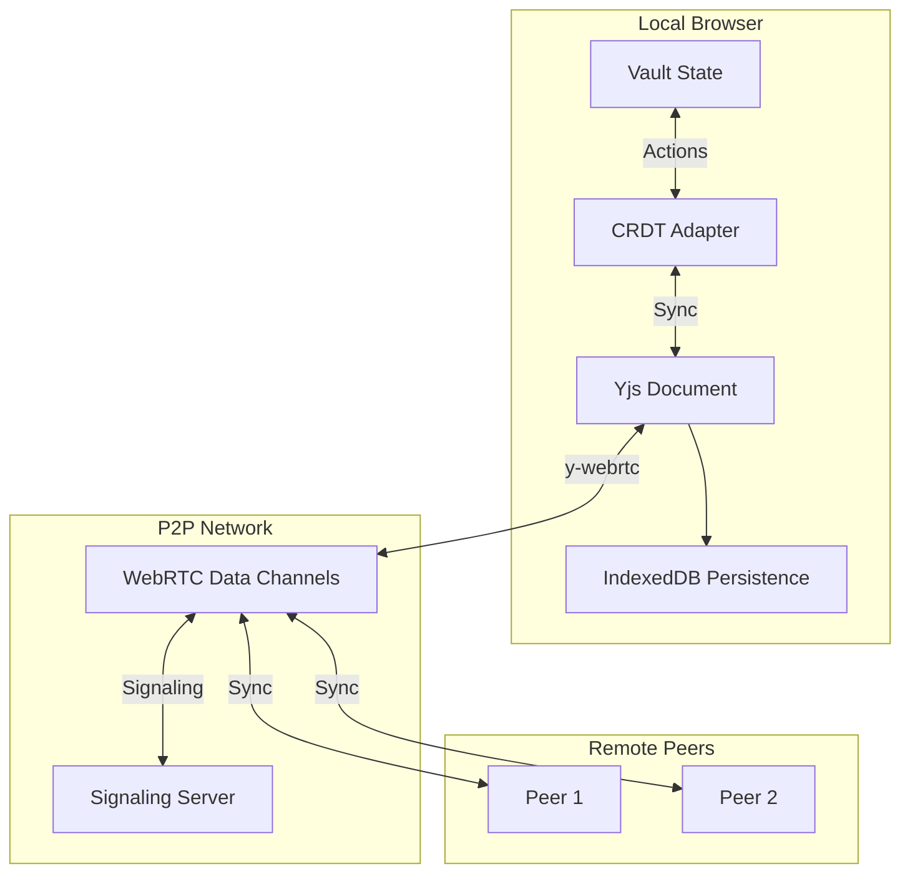
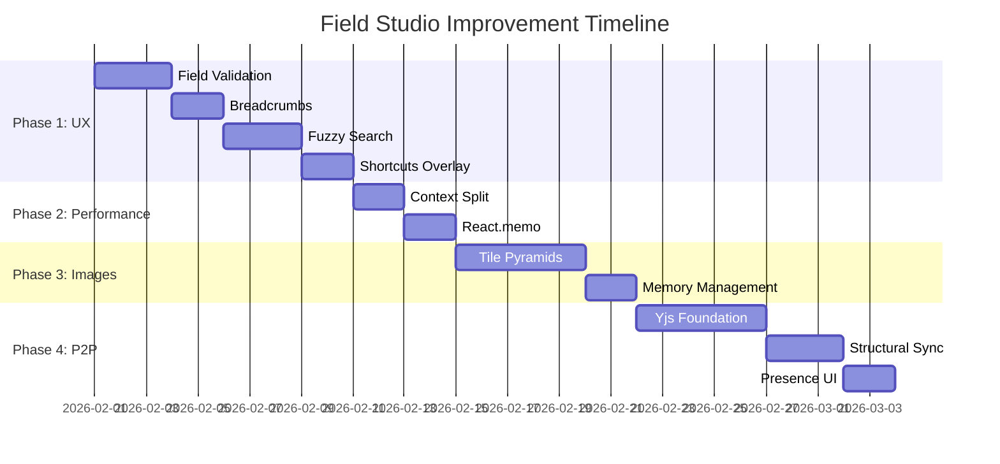

# Field Studio: Comprehensive Improvement Implementation Plan

## Executive Summary

Based on analysis of 5 scoping documents, this plan prioritizes improvements across UX, performance, image processing, and collaboration capabilities. The implementation is structured in 4 phases to deliver immediate user value while building toward advanced features.

**Total Estimated Duration:** 6-8 weeks  
**Risk Level:** Low to Medium  
**Dependencies:** Minimal (all browser-based)

---

## Phase Overview

```mermaid
flowchart LR
    subgraph Phase1["Phase 1: Critical UX"]
        A1[Field Validation]
        A2[Breadcrumbs]
        A3[Fuzzy Search]
        A4[Shortcuts Overlay]
    end
    
    subgraph Phase2["Phase 2: Performance"]
        B1[Context Split]
        B2[React.memo]
        B3[Selectors]
    end
    
    subgraph Phase3["Phase 3: Image Pipeline"]
        C1[Tile Pyramids]
        C2[Memory Mgmt]
        C3[Deep Zoom]
    end
    
    subgraph Phase4["Phase 4: P2P Sync"]
        D1[Yjs Foundation]
        D2[Structural Sync]
        D3[Annotations]
    end
    
    Phase1 --> Phase2 --> Phase3 --> Phase4
```



---

## Phase 1: Critical UX Improvements (Weeks 1-2)

### 1.1 Inspector Field-Level Validation

**Current Problem:** Validation issues are shown in a separate panel at the top of the Inspector, with no indication of which specific field has the problem.

**Implementation:**

```typescript
// components/ValidatedInput.tsx - New component
interface ValidatedInputProps {
  value: string;
  onChange: (value: string) => void;
  validation?: {
    status: 'pristine' | 'valid' | 'invalid' | 'validating';
    message?: string;
    fix?: () => void;
    fixDescription?: string;
  };
  label: string;
  id: string;
}

export const ValidatedInput: React.FC<ValidatedInputProps> = ({
  value,
  onChange,
  validation,
  label,
  id
}) => {
  const borderColor = {
    pristine: 'border-slate-300',
    valid: 'border-green-500',
    invalid: 'border-red-500',
    validating: 'border-amber-400'
  }[validation?.status || 'pristine'];

  return (
    <div className="space-y-1">
      <label htmlFor={id} className="text-xs font-bold uppercase tracking-wider text-slate-500">
        {label}
      </label>
      <div className="relative">
        <input
          id={id}
          value={value}
          onChange={(e) => onChange(e.target.value)}
          className={`w-full px-3 py-2 border rounded-lg transition-colors ${borderColor}`}
          aria-invalid={validation?.status === 'invalid'}
          aria-describedby={validation?.message ? `${id}-error` : undefined}
        />
        {validation?.status === 'valid' && (
          <CheckIcon className="absolute right-3 top-1/2 -translate-y-1/2 text-green-500 w-4 h-4" />
        )}
        {validation?.status === 'invalid' && (
          <ExclamationIcon className="absolute right-3 top-1/2 -translate-y-1/2 text-red-500 w-4 h-4" />
        )}
      </div>
      {validation?.message && (
        <div id={`${id}-error`} className="flex items-center gap-2 text-sm text-red-600">
          <span>{validation.message}</span>
          {validation.fix && (
            <button
              onClick={validation.fix}
              className="text-xs px-2 py-0.5 bg-red-100 rounded hover:bg-red-200"
              title={validation.fixDescription}
            >
              Fix
            </button>
          )}
        </div>
      )}
    </div>
  );
};
```

**Files to Modify:**
- `components/Inspector.tsx` - Integrate ValidatedInput
- `services/validator.ts` - Add field-level issue mapping
- `components/ValidatedInput.tsx` - New component

**Validation States:**
1. **Pristine** - Default state, no validation shown
2. **Focused** - Blue border, no validation yet
3. **Validating** - Spinner indicator (for async validation)
4. **Valid** - Green checkmark, brief animation (2s)
5. **Invalid** - Red border, error message, fix button

**Acceptance Criteria:**
- [ ] Each input field shows validation state
- [ ] Error messages appear below the field
- [ ] "Fix" buttons work for auto-fixable issues
- [ ] Success state fades after 2 seconds
- [ ] Screen reader announces validation changes

---

### 1.2 Breadcrumb Navigation in CollectionsView

**Current Problem:** Users lose context of their location in the hierarchy. No way to navigate up levels quickly.

**Implementation:**

```typescript
// components/Breadcrumb.tsx - New component
interface BreadcrumbSegment {
  id: string;
  label: string;
  type: 'Collection' | 'Manifest' | 'Canvas';
  isCurrent: boolean;
}

interface BreadcrumbProps {
  path: BreadcrumbSegment[];
  onNavigate: (id: string) => void;
  maxVisible?: number;
}

export const Breadcrumb: React.FC<BreadcrumbProps> = ({
  path,
  onNavigate,
  maxVisible = 4
}) => {
  // Truncate middle segments if path is long
  const visibleSegments = path.length > maxVisible
    ? [
        path[0],
        { id: 'ellipsis', label: '...', type: 'Collection', isCurrent: false },
        ...path.slice(-(maxVisible - 2))
      ]
    : path;

  return (
    <nav aria-label="Breadcrumb" className="flex items-center gap-1 text-sm">
      {visibleSegments.map((segment, index) => (
        <React.Fragment key={segment.id}>
          {index > 0 && (
            <ChevronRightIcon className="w-4 h-4 text-slate-400" />
          )}
          {segment.id === 'ellipsis' ? (
            <DropdownMenu>
              <DropdownMenuTrigger className="text-slate-500 hover:text-slate-700">
                ...
              </DropdownMenuTrigger>
              <DropdownMenuContent>
                {path.slice(1, -2).map(s => (
                  <DropdownMenuItem key={s.id} onClick={() => onNavigate(s.id)}>
                    <TypeIcon type={s.type} className="w-4 h-4 mr-2" />
                    {s.label}
                  </DropdownMenuItem>
                ))}
              </DropdownMenuContent>
            </DropdownMenu>
          ) : segment.isCurrent ? (
            <span className="font-semibold text-slate-900" aria-current="page">
              {segment.label}
            </span>
          ) : (
            <button
              onClick={() => onNavigate(segment.id)}
              className="text-slate-600 hover:text-slate-900 hover:underline flex items-center gap-1"
              title={`Go to ${segment.label}`}
            >
              <TypeIcon type={segment.type} className="w-4 h-4" />
              <span className="max-w-[150px] truncate">{segment.label}</span>
            </button>
          )}
        </React.Fragment>
      ))}
    </nav>
  );
};

// Hook for building breadcrumb path
// hooks/useBreadcrumbPath.ts
export function useBreadcrumbPath(
  state: NormalizedState,
  currentId: string | null
): BreadcrumbSegment[] {
  return useMemo(() => {
    if (!currentId) return [];
    
    const path: BreadcrumbSegment[] = [];
    let current: string | null = currentId;
    
    while (current) {
      const entity = getEntity(state, current);
      if (!entity) break;
      
      path.unshift({
        id: current,
        label: new LanguageString(entity.label).get() || 'Untitled',
        type: entity.type as BreadcrumbSegment['type'],
        isCurrent: current === currentId
      });
      
      // Get parent
      current = state.reverseRefs[current] || null;
    }
    
    // Add root if not already included
    if (path.length === 0 || path[0].id !== state.rootId) {
      const root = state.rootId ? getEntity(state, state.rootId) : null;
      if (root) {
        path.unshift({
          id: state.rootId!,
          label: new LanguageString(root.label).get() || 'Archive',
          type: 'Collection',
          isCurrent: false
        });
      }
    }
    
    return path;
  }, [state, currentId]);
}
```

**Files to Modify:**
- `components/views/CollectionsView.tsx` - Add Breadcrumb to header
- `components/Breadcrumb.tsx` - New component
- `hooks/useBreadcrumbPath.ts` - New hook

**Visual Specification:**
- Always visible at top of Structure panel
- Truncate with ellipsis dropdown when path exceeds 4 segments
- Type icons: Folder (Collection), Document (Manifest), Image (Canvas)
- Hover shows full label in tooltip
- Current segment is bold with accent color
- Keyboard navigable (Tab through segments)

**Acceptance Criteria:**
- [ ] Breadcrumb appears in CollectionsView header
- [ ] Clicking segment navigates to that level
- [ ] Long paths truncate with dropdown for hidden segments
- [ ] Type icons display correctly
- [ ] Keyboard accessible

---

### 1.3 Command Palette Fuzzy Search & History

**Current Problem:** Simple `includes()` matching misses typos and partial matches. No command history or learning.

**Implementation:**

```typescript
// utils/fuzzyMatch.ts - New utility
interface FuzzyMatchResult {
  score: number;
  matches: Array<{ start: number; end: number }>;
}

export function fuzzyMatch(text: string, pattern: string): FuzzyMatchResult | null {
  const t = text.toLowerCase();
  const p = pattern.toLowerCase();
  
  let score = 0;
  let matches: Array<{ start: number; end: number }> = [];
  let tIdx = 0;
  let pIdx = 0;
  let consecutive = 0;
  
  while (tIdx < t.length && pIdx < p.length) {
    if (t[tIdx] === p[pIdx]) {
      const start = tIdx;
      consecutive++;
      
      // Bonus for consecutive matches
      score += 10 + consecutive * 5;
      
      // Bonus for word boundaries
      if (tIdx === 0 || t[tIdx - 1] === ' ') score += 15;
      
      pIdx++;
      
      // Find end of match
      while (tIdx < t.length && pIdx < p.length && t[tIdx + 1] === p[pIdx]) {
        tIdx++;
        pIdx++;
        consecutive++;
      }
      
      matches.push({ start, end: tIdx });
    } else {
      consecutive = 0;
      // Small penalty for skipped characters
      score -= 1;
    }
    tIdx++;
  }
  
  if (pIdx < p.length) return null; // Didn't match all pattern chars
  
  // Exact match bonus
  if (t === p) score += 100;
  // Prefix match bonus
  else if (t.startsWith(p)) score += 50;
  
  return { score: Math.max(0, score), matches };
}

// hooks/useCommandHistory.ts - New hook
const COMMAND_HISTORY_KEY = 'field-studio:command-history';
const MAX_HISTORY = 10;

interface CommandHistoryEntry {
  commandId: string;
  usedAt: number;
  useCount: number;
}

export function useCommandHistory() {
  const [history, setHistory] = useState<CommandHistoryEntry[]>(() => {
    const stored = localStorage.getItem(COMMAND_HISTORY_KEY);
    return stored ? JSON.parse(stored) : [];
  });
  
  const recordCommand = useCallback((commandId: string) => {
    setHistory(prev => {
      const existing = prev.find(h => h.commandId === commandId);
      let next: CommandHistoryEntry[];
      
      if (existing) {
        next = prev.map(h => 
          h.commandId === commandId
            ? { ...h, usedAt: Date.now(), useCount: h.useCount + 1 }
            : h
        );
      } else {
        next = [
          { commandId, usedAt: Date.now(), useCount: 1 },
          ...prev
        ].slice(0, MAX_HISTORY);
      }
      
      localStorage.setItem(COMMAND_HISTORY_KEY, JSON.stringify(next));
      return next;
    });
  }, []);
  
  const getRecentCommands = useCallback((hours: number = 24) => {
    const cutoff = Date.now() - hours * 60 * 60 * 1000;
    return history
      .filter(h => h.usedAt > cutoff)
      .sort((a, b) => b.usedAt - a.usedAt);
  }, [history]);
  
  const getFrequentCommands = useCallback((limit: number = 5) => {
    return [...history]
      .sort((a, b) => b.useCount - a.useCount)
      .slice(0, limit);
  }, [history]);
  
  return { history, recordCommand, getRecentCommands, getFrequentCommands };
}

// Enhanced Command Palette
// components/CommandPalette.tsx
export const CommandPalette: React.FC = () => {
  const [query, setQuery] = useState('');
  const { recordCommand, getRecentCommands, getFrequentCommands } = useCommandHistory();
  
  const scoredCommands = useMemo(() => {
    if (!query.trim()) {
      // Show recent and frequent when no query
      const recent = getRecentCommands();
      const frequent = getFrequentCommands();
      
      return [
        { section: 'Recent', commands: recent.map(r => commands.find(c => c.id === r.commandId)).filter(Boolean) },
        { section: 'Frequent', commands: frequent.map(f => commands.find(c => c.id === f.commandId)).filter(Boolean) },
        { section: 'All', commands }
      ];
    }
    
    // Score and filter with fuzzy matching
    const scored = commands
      .map(cmd => {
        const match = fuzzyMatch(cmd.label, query);
        return match ? { cmd, ...match } : null;
      })
      .filter(Boolean)
      .sort((a, b) => b!.score - a!.score);
    
    return [{ section: 'Results', commands: scored.map(s => s!.cmd) }];
  }, [query, commands, getRecentCommands, getFrequentCommands]);
  
  const handleExecute = (command: Command) => {
    recordCommand(command.id);
    command.execute();
    onClose();
  };
  
  return (
    <Dialog open={isOpen} onOpenChange={onClose}>
      <DialogContent className="max-w-2xl p-0">
        <div className="border-b px-4 py-3">
          <input
            value={query}
            onChange={(e) => setQuery(e.target.value)}
            placeholder="Search commands..."
            className="w-full text-lg outline-none"
            autoFocus
          />
        </div>
        <ScrollArea className="max-h-[400px]">
          {scoredCommands.map(({ section, commands }) => (
            commands.length > 0 && (
              <div key={section} className="py-2">
                <div className="px-4 py-1 text-xs font-bold text-slate-500 uppercase">
                  {section}
                </div>
                {commands.map((cmd, idx) => (
                  <CommandItem
                    key={cmd.id}
                    command={cmd}
                    isSelected={selectedIndex === idx}
                    onClick={() => handleExecute(cmd)}
                    highlight={query ? fuzzyMatch(cmd.label, query)?.matches : undefined}
                  />
                ))}
              </div>
            )
          ))}
        </ScrollArea>
      </DialogContent>
    </Dialog>
  );
};
```

**Files to Modify:**
- `components/CommandPalette.tsx` - Integrate fuzzy search and history
- `utils/fuzzyMatch.ts` - New utility
- `hooks/useCommandHistory.ts` - New hook

**Scoring Algorithm:**
1. Exact match: +100 points
2. Prefix match: +50 points
3. Word boundary match: +15 points
4. Consecutive matches: +10 base, +5 per consecutive
5. Character skip penalty: -1 per skipped

**Command Ordering:**
1. Recent commands (last 24 hours)
2. Frequent commands (by usage count)
3. Exact matches
4. Prefix matches
5. Substring matches
6. Fuzzy matches

**Acceptance Criteria:**
- [ ] Fuzzy matching finds commands with typos
- [ ] Recent commands shown when palette opens
- [ ] Command usage is tracked and persisted
- [ ] Matched characters are highlighted
- [ ] Search is fast (< 50ms for 100 commands)

---

### 1.4 Global Keyboard Shortcuts Overlay (Cmd+?)

**Current Problem:** Only BoardView has shortcuts panel. No global shortcut discoverability.

**Implementation:**

```typescript
// constants/shortcuts.ts - Centralized shortcut definitions
export interface ShortcutDefinition {
  id: string;
  keys: string[]; // ['Cmd', 'Shift', 'P']
  description: string;
  context?: string; // 'global' | 'collections' | 'board' | 'viewer'
  action: () => void;
}

export const GLOBAL_SHORTCUTS: ShortcutCategory[] = [
  {
    name: 'Navigation',
    icon: 'navigation',
    shortcuts: [
      { id: 'cmd-palette', keys: ['Cmd', 'K'], description: 'Open Command Palette', context: 'global' },
      { id: 'goto-collections', keys: ['Cmd', '1'], description: 'Switch to Collections', context: 'global' },
      { id: 'goto-archive', keys: ['Cmd', '2'], description: 'Switch to Archive', context: 'global' },
      { id: 'goto-viewer', keys: ['Cmd', '3'], description: 'Switch to Viewer', context: 'global' },
    ]
  },
  {
    name: 'Editing',
    icon: 'edit',
    shortcuts: [
      { id: 'undo', keys: ['Cmd', 'Z'], description: 'Undo', context: 'global' },
      { id: 'redo', keys: ['Cmd', 'Shift', 'Z'], description: 'Redo', context: 'global' },
      { id: 'save', keys: ['Cmd', 'S'], description: 'Save', context: 'global' },
      { id: 'delete', keys: ['Delete'], description: 'Delete Selected', context: 'global' },
    ]
  },
  {
    name: 'Selection',
    icon: 'selection',
    shortcuts: [
      { id: 'select-all', keys: ['Cmd', 'A'], description: 'Select All', context: 'collections' },
      { id: 'deselect', keys: ['Escape'], description: 'Clear Selection', context: 'global' },
      { id: 'multi-select', keys: ['Cmd', 'Click'], description: 'Add to Selection', context: 'collections' },
      { id: 'range-select', keys: ['Shift', 'Click'], description: 'Select Range', context: 'collections' },
    ]
  }
];

// components/KeyboardShortcutsOverlay.tsx - Enhanced global overlay
interface KeyboardShortcutsOverlayProps {
  isOpen: boolean;
  onClose: () => void;
  currentContext?: string;
}

export const KeyboardShortcutsOverlay: React.FC<KeyboardShortcutsOverlayProps> = ({
  isOpen,
  onClose,
  currentContext = 'global'
}) => {
  const [searchQuery, setSearchQuery] = useState('');
  const [filterContext, setFilterContext] = useState<string | null>(null);
  
  const filteredShortcuts = useMemo(() => {
    return GLOBAL_SHORTCUTS.map(category => ({
      ...category,
      shortcuts: category.shortcuts.filter(s => {
        const matchesSearch = !searchQuery || 
          s.description.toLowerCase().includes(searchQuery.toLowerCase()) ||
          s.keys.join(' ').toLowerCase().includes(searchQuery.toLowerCase());
        const matchesContext = !filterContext || s.context === filterContext || s.context === 'global';
        return matchesSearch && matchesContext;
      })
    })).filter(c => c.shortcuts.length > 0);
  }, [searchQuery, filterContext]);
  
  const contexts = ['global', 'collections', 'board', 'viewer'];
  
  return (
    <Dialog open={isOpen} onOpenChange={onClose}>
      <DialogContent className="max-w-3xl max-h-[80vh] overflow-hidden flex flex-col">
        <DialogHeader>
          <DialogTitle className="flex items-center gap-2">
            <KeyboardIcon className="w-5 h-5" />
            Keyboard Shortcuts
          </DialogTitle>
        </DialogHeader>
        
        <div className="flex gap-4 mb-4">
          <div className="relative flex-1">
            <SearchIcon className="absolute left-3 top-1/2 -translate-y-1/2 w-4 h-4 text-slate-400" />
            <input
              value={searchQuery}
              onChange={(e) => setSearchQuery(e.target.value)}
              placeholder="Search shortcuts..."
              className="w-full pl-10 pr-4 py-2 border rounded-lg"
              autoFocus
            />
          </div>
          <select
            value={filterContext || ''}
            onChange={(e) => setFilterContext(e.target.value || null)}
            className="px-3 py-2 border rounded-lg"
          >
            <option value="">All Contexts</option>
            {contexts.map(c => (
              <option key={c} value={c}>{c.charAt(0).toUpperCase() + c.slice(1)}</option>
            ))}
          </select>
          <button
            onClick={() => window.print()}
            className="px-4 py-2 bg-slate-100 rounded-lg hover:bg-slate-200 flex items-center gap-2"
          >
            <PrinterIcon className="w-4 h-4" />
            Print
          </button>
        </div>
        
        <ScrollArea className="flex-1">
          <div className="space-y-6">
            {filteredShortcuts.map(category => (
              <div key={category.name}>
                <h3 className="text-sm font-bold text-slate-500 uppercase mb-2 flex items-center gap-2">
                  <Icon name={category.icon} className="w-4 h-4" />
                  {category.name}
                </h3>
                <div className="space-y-1">
                  {category.shortcuts.map(shortcut => (
                    <div
                      key={shortcut.id}
                      className="flex items-center justify-between py-2 px-3 rounded hover:bg-slate-50"
                    >
                      <span className="text-slate-700">{shortcut.description}</span>
                      <div className="flex items-center gap-1">
                        {shortcut.keys.map((key, idx) => (
                          <React.Fragment key={idx}>
                            <kbd className="px-2 py-1 bg-slate-100 border rounded text-xs font-mono">
                              {key === 'Cmd' ? (isMac ? '⌘' : 'Ctrl') : key}
                            </kbd>
                            {idx < shortcut.keys.length - 1 && (
                              <span className="text-slate-400">+</span>
                            )}
                          </React.Fragment>
                        ))}
                        {shortcut.context && shortcut.context !== 'global' && (
                          <span className="ml-2 text-xs text-slate-400">
                            ({shortcut.context})
                          </span>
                        )}
                      </div>
                    </div>
                  ))}
                </div>
              </div>
            ))}
          </div>
        </ScrollArea>
        
        <DialogFooter className="text-xs text-slate-500">
          Press <kbd className="px-1 bg-slate-100 rounded">?</kbd> anytime to open this overlay
        </DialogFooter>
      </DialogContent>
    </Dialog>
  );
};

// Integration in App.tsx
// Add to existing keyboard handler
useEffect(() => {
  const handleKeyDown = (e: KeyboardEvent) => {
    // Global shortcuts overlay
    if ((e.metaKey || e.ctrlKey) && e.key === '?') {
      e.preventDefault();
      setShowShortcutsOverlay(true);
      return;
    }
    
    // ... existing keyboard handlers
  };
  
  window.addEventListener('keydown', handleKeyDown);
  return () => window.removeEventListener('keydown', handleKeyDown);
}, []);
```

**Files to Modify:**
- `constants/shortcuts.ts` - New centralized shortcut definitions
- `components/KeyboardShortcutsOverlay.tsx` - Enhance existing component
- `App.tsx` - Register global handler

**Features:**
- Searchable shortcut list
- Context filtering (global, collections, board, viewer)
- Print-friendly cheat sheet
- Platform-aware key display (⌘ vs Ctrl)
- Triggerable via Cmd+? or from Help menu

**Acceptance Criteria:**
- [ ] Cmd+? opens overlay from any view
- [ ] Search filters shortcuts in real-time
- [ ] Context filter shows relevant shortcuts
- [ ] Print button generates cheat sheet
- [ ] Works with screen readers

---

## Phase 2: Performance Optimizations (Week 3)

### 2.1 Split Context into State/Dispatch

**Problem:** Currently, any state change re-renders ALL `useVault()` consumers, even those that only dispatch actions.

**Implementation:**

```typescript
// hooks/useIIIFEntity.tsx - Split contexts
// BEFORE: Single context
interface VaultContextValue {
  state: NormalizedState;
  dispatch: (action: Action) => boolean;
  undo: () => void;
  redo: () => void;
}

// AFTER: Separate contexts
interface VaultStateContextValue {
  state: NormalizedState;
}

interface VaultDispatchContextValue {
  dispatch: (action: Action) => boolean;
  undo: () => void;
  redo: () => void;
  canUndo: boolean;
  canRedo: boolean;
}

const VaultStateContext = createContext<VaultStateContextValue | null>(null);
const VaultDispatchContext = createContext<VaultDispatchContextValue | null>(null);

export const VaultProvider: React.FC<VaultProviderProps> = ({ children }) => {
  const [state, setState] = useState<NormalizedState>(createEmptyState());
  const dispatcherRef = useRef(new ActionDispatcher(state));
  
  // Dispatch functions are stable - never change
  const dispatchValue = useMemo(() => ({
    dispatch: (action: Action) => {
      const success = dispatcherRef.current.dispatch(action);
      if (success) {
        setState(dispatcherRef.current.getState());
      }
      return success;
    },
    undo: () => {
      dispatcherRef.current.undo();
      setState(dispatcherRef.current.getState());
    },
    redo: () => {
      dispatcherRef.current.redo();
      setState(dispatcherRef.current.getState());
    },
    get canUndo() { return dispatcherRef.current.getHistoryStatus().canUndo; },
    get canRedo() { return dispatcherRef.current.getHistoryStatus().canRedo; }
  }), []);
  
  const stateValue = useMemo(() => ({ state }), [state]);
  
  return (
    <VaultDispatchContext.Provider value={dispatchValue}>
      <VaultStateContext.Provider value={stateValue}>
        {children}
      </VaultStateContext.Provider>
    </VaultDispatchContext.Provider>
  );
};

// Optimized hooks
export function useVaultState(): NormalizedState {
  const ctx = useContext(VaultStateContext);
  if (!ctx) throw new Error('Must be used within VaultProvider');
  return ctx.state;
}

export function useVaultDispatch(): VaultDispatchContextValue {
  const ctx = useContext(VaultDispatchContext);
  if (!ctx) throw new Error('Must be used within VaultProvider');
  return ctx;
}

// For components that need both (backwards compatible)
export function useVault(): VaultContextValue {
  const state = useVaultState();
  const dispatch = useVaultDispatch();
  return { state, ...dispatch };
}
```

**Migration Strategy:**
1. Create new split contexts
2. Update `useVault()` to use both (maintain compatibility)
3. Gradually migrate components:
   - `useVaultState()` for read-only components
   - `useVaultDispatch()` for action-only components
   - `useVault()` for components that need both
4. Remove old unified context after migration

**Files to Modify:**
- `hooks/useIIIFEntity.tsx` - Split contexts
- All components using `useVault()` - Audit and optimize

**Expected Impact:**
- Components that only dispatch actions will never re-render from state changes
- 30-50% reduction in unnecessary re-renders

---

### 2.2 Add React.memo to Heavy Components

**Implementation:**

```typescript
// components/Sidebar.tsx
export const Sidebar = React.memo(function Sidebar({ 
  root, 
  selectedId, 
  onSelect,
  fieldMode 
}: SidebarProps) {
  // ... existing implementation
}, (prev, next) => {
  // Custom comparison
  return prev.root?.id === next.root?.id &&
         prev.selectedId === next.selectedId &&
         prev.fieldMode === next.fieldMode;
});

// components/VirtualTreeList.tsx - Memoize list items
const MemoizedTreeItem = React.memo(TreeItem, (prev, next) => {
  return prev.entityId === next.entityId &&
         prev.isSelected === next.isSelected &&
         prev.isExpanded === next.isExpanded &&
         prev.depth === next.depth;
});

// components/Viewer.tsx
export const Viewer = React.memo(function Viewer({ 
  canvasId,
  manifestId,
  options 
}: ViewerProps) {
  // ... existing implementation
}, (prev, next) => {
  return prev.canvasId === next.canvasId &&
         prev.manifestId === next.manifestId &&
         JSON.stringify(prev.options) === JSON.stringify(next.options);
});

// components/Inspector.tsx - Memoize sections
const MetadataSection = React.memo(function MetadataSection({
  metadata,
  onChange
}: MetadataSectionProps) {
  // ... implementation
}, (prev, next) => {
  return JSON.stringify(prev.metadata) === JSON.stringify(next.metadata);
});
```

**Components to Memoize (in order of impact):**
1. `Sidebar` - Tree rendering
2. `VirtualTreeList` - List items
3. `Viewer` - OpenSeadragon instance
4. `Inspector` - Form sections
5. `CollectionsView` - Structure canvas
6. `ArchiveView` - Grid items

---

### 2.3 Memoized Selectors for Derived State

```typescript
// hooks/useVaultSelectors.ts - New file
import { useMemo } from 'react';
import { useVaultState } from './useIIIFEntity';

export function useEntity(entityId: string | null) {
  const { state } = useVaultState();
  return useMemo(() => {
    if (!entityId) return null;
    return getEntity(state, entityId);
  }, [state, entityId]);
}

export function useEntityLabel(entityId: string | null): string {
  const entity = useEntity(entityId);
  return useMemo(() => {
    if (!entity?.label) return 'Untitled';
    return new LanguageString(entity.label).get() || 'Untitled';
  }, [entity?.label]);
}

export function useEntityChildren(entityId: string | null): string[] {
  const { state } = useVaultState();
  return useMemo(() => {
    if (!entityId) return [];
    return getChildIds(state, entityId);
  }, [state, entityId]);
}

export function useEntityAncestors(entityId: string | null): string[] {
  const { state } = useVaultState();
  return useMemo(() => {
    if (!entityId) return [];
    return getAncestors(state, entityId);
  }, [state, entityId]);
}

export function useEntityTree(rootId: string | null) {
  const { state } = useVaultState();
  return useMemo(() => {
    if (!rootId) return null;
    return buildEntityTree(state, rootId);
  }, [state, rootId]);
}
```

**Acceptance Criteria:**
- [ ] Split contexts prevent action-only components from re-rendering
- [ ] Heavy components use React.memo
- [ ] Selectors memoize derived state
- [ ] React DevTools Profiler shows reduced re-render count

---

## Phase 3: Image Pipeline Enhancements (Weeks 4-5)

### 3.1 IIIF Tile Pyramid Generation

**Current:** Only 3 derivatives (thumb, small, medium)  
**Target:** Full IIIF-compliant tile pyramid for deep zoom

**Implementation:**

```typescript
// services/imagePipeline/tileCalculator.ts
export interface TilePyramidConfig {
  tileSize: number;
  overlap: number;
  format: 'jpg' | 'png';
  maxTiles: number;
}

export interface TilePyramidResult {
  levels: number;
  tiles: Map<string, Blob>;
  descriptor: {
    width: number;
    height: number;
    tileSize: number;
    overlap: number;
    format: string;
  };
}

export function calculateTilePyramid(
  width: number,
  height: number,
  config: TilePyramidConfig
): { levelCount: number; totalTiles: number } {
  const maxDimension = Math.max(width, height);
  const levelCount = Math.ceil(Math.log2(maxDimension / config.tileSize)) + 1;
  
  let totalTiles = 0;
  for (let level = 0; level < levelCount; level++) {
    const scale = Math.pow(2, levelCount - level - 1);
    const levelWidth = Math.ceil(width / scale);
    const levelHeight = Math.ceil(height / scale);
    const tilesX = Math.ceil(levelWidth / config.tileSize);
    const tilesY = Math.ceil(levelHeight / config.tileSize);
    totalTiles += tilesX * tilesY;
  }
  
  return { levelCount, totalTiles };
}

// services/imagePipeline/canvasPipeline.ts
export class CanvasTilePipeline {
  private config: TilePyramidConfig = {
    tileSize: 512,
    overlap: 0,
    format: 'jpg',
    maxTiles: 10000
  };
  
  async generateTilePyramid(
    file: Blob,
    assetId: string
  ): Promise<TilePyramidResult | null> {
    const bitmap = await createImageBitmap(file);
    const { width, height } = bitmap;
    
    // Check if we can fit in memory
    const { levelCount, totalTiles } = calculateTilePyramid(width, height, this.config);
    
    if (totalTiles > this.config.maxTiles) {
      console.warn(`Too many tiles (${totalTiles}), falling back to derivatives only`);
      return null;
    }
    
    const tiles = new Map<string, Blob>();
    
    // Generate each level
    for (let level = 0; level < levelCount; level++) {
      const scale = Math.pow(2, levelCount - level - 1);
      const levelWidth = Math.floor(width / scale);
      const levelHeight = Math.floor(height / scale);
      
      // Create scaled canvas for this level
      const levelCanvas = new OffscreenCanvas(levelWidth, levelHeight);
      const ctx = levelCanvas.getContext('2d');
      if (!ctx) continue;
      
      ctx.drawImage(bitmap, 0, 0, levelWidth, levelHeight);
      
      // Slice into tiles
      const tilesX = Math.ceil(levelWidth / this.config.tileSize);
      const tilesY = Math.ceil(levelHeight / this.config.tileSize);
      
      for (let y = 0; y < tilesY; y++) {
        for (let x = 0; x < tilesX; x++) {
          const tileCanvas = new OffscreenCanvas(
            this.config.tileSize,
            this.config.tileSize
          );
          const tileCtx = tileCanvas.getContext('2d');
          if (!tileCtx) continue;
          
          tileCtx.drawImage(
            levelCanvas,
            x * this.config.tileSize,
            y * this.config.tileSize,
            this.config.tileSize,
            this.config.tileSize,
            0,
            0,
            this.config.tileSize,
            this.config.tileSize
          );
          
          const blob = await tileCanvas.convertToBlob({
            type: 'image/jpeg',
            quality: 0.85
          });
          
          tiles.set(`${level}/${x}_${y}.jpg`, blob);
        }
      }
    }
    
    bitmap.close();
    
    return {
      levels: levelCount,
      tiles,
      descriptor: {
        width,
        height,
        tileSize: this.config.tileSize,
        overlap: this.config.overlap,
        format: this.config.format
      }
    };
  }
}

// Storage for tiles
// services/storage.ts - Add tile store
export interface TileStorage {
  tiles: {
    key: string; // {assetId}/{level}/{x}_{y}.jpg
    value: Blob;
  };
  tileManifests: {
    key: string; // {assetId}_manifest
    value: {
      levels: number;
      tileSize: number;
      width: number;
      height: number;
      format: string;
    };
  };
}

// Service Worker tile serving
// public/sw.js
async function handleTileRequest(request, assetId, level, x, y) {
  const tileKey = `${assetId}/${level}/${x}_${y}.jpg`;
  
  // Try cache first
  const cached = await getFromCache(tileKey);
  if (cached) return cached;
  
  // Try IndexedDB
  const tile = await getTileFromDB(tileKey);
  if (tile) {
    const response = new Response(tile, {
      headers: {
        'Content-Type': 'image/jpeg',
        'Cache-Control': 'public, max-age=31536000'
      }
    });
    await addToCache(request, response);
    return response;
  }
  
  // Generate on-the-fly as fallback
  return generateTileOnDemand(assetId, level, x, y);
}
```

**Files to Modify:**
- `services/tileWorker.ts` - Add tile pyramid generation
- `services/storage.ts` - Add tile storage
- `public/sw.js` - Serve tiles
- `services/imageSourceResolver.ts` - Support tile URLs

**Memory Management:**
- Maximum 10,000 tiles per image
- Process tiles in batches
- Use `bitmap.close()` to free memory
- Cancel processing if user navigates away

**Acceptance Criteria:**
- [ ] Tile pyramids generate for images under size threshold
- [ ] Service Worker serves tiles efficiently
- [ ] Deep zoom works with OpenSeadragon
- [ ] Memory stays under 512MB during processing
- [ ] Falls back to derivatives for large images

---

## Phase 4: P2P Collaboration Layer (Weeks 6-8)

### 4.1 Yjs Foundation

**Architecture:**



**Implementation:**

```typescript
// services/sync/crdtAdapter.ts
import * as Y from 'yjs';
import { WebrtcProvider } from 'y-webrtc';
import { IndexeddbPersistence } from 'y-indexeddb';

export class VaultCrdtAdapter {
  private ydoc: Y.Doc;
  private provider: WebrtcProvider;
  private persistence: IndexeddbPersistence;
  private entities: Y.Map<Y.Map<unknown>>;
  private references: Y.Map<Y.Array<string>>;
  
  constructor(
    private vault: Vault,
    private roomId: string,
    private userId: string,
    private options: {
      password?: string;
      signalingUrls?: string[];
    } = {}
  ) {
    this.ydoc = new Y.Doc();
    
    // Local persistence
    this.persistence = new IndexeddbPersistence(
      `field-studio-sync-${roomId}`,
      this.ydoc
    );
    
    // P2P network
    this.provider = new WebrtcProvider(
      `field-studio-${roomId}`,
      this.ydoc,
      {
        signaling: options.signalingUrls || ['wss://signaling.yjs.dev'],
        password: options.password,
        maxConns: 10,
      }
    );
    
    // CRDT structures
    this.entities = this.ydoc.getMap('entities');
    this.references = this.ydoc.getMap('references');
    
    this.setupSync();
  }
  
  private setupSync() {
    // Vault → CRDT (local changes)
    this.vault.subscribe((state) => {
      this.syncToCrdt(state);
    });
    
    // CRDT → Vault (remote changes)
    this.ydoc.on('update', (update, origin) => {
      if (origin !== this.userId) {
        this.syncFromCrdt();
      }
    });
    
    // Presence awareness
    this.provider.awareness.on('change', () => {
      const states = this.provider.awareness.getStates();
      // Update presence UI
    });
  }
  
  private syncToCrdt(state: NormalizedState) {
    this.ydoc.transact(() => {
      // Sync entities
      for (const [type, entities] of Object.entries(state.entities)) {
        let typeMap = this.entities.get(type);
        if (!typeMap) {
          typeMap = new Y.Map();
          this.entities.set(type, typeMap);
        }
        
        for (const [id, entity] of Object.entries(entities)) {
          const existing = typeMap.get(id);
          if (!existing || !this.isEqual(existing, entity)) {
            typeMap.set(id, entity);
          }
        }
      }
      
      // Sync references
      for (const [parentId, childIds] of Object.entries(state.references)) {
        const existing = this.references.get(parentId);
        if (!existing || !this.arraysEqual(existing.toArray(), childIds)) {
          this.references.set(parentId, Y.Array.from(childIds));
        }
      }
    }, this.userId);
  }
  
  private syncFromCrdt() {
    const state = this.vault.getState();
    
    // Apply remote changes without adding to history
    // This requires extending the ActionDispatcher
    
    for (const [type, typeMap] of this.entities.entries()) {
      for (const [id, entity] of typeMap.entries()) {
        const existing = getEntity(state, id);
        if (!existing || !this.isEqual(existing, entity)) {
          this.vault.applyRemoteUpdate(type, id, entity);
        }
      }
    }
  }
  
  getConnectedPeers(): string[] {
    return Array.from(this.provider.awareness.getStates().keys())
      .filter(id => id !== this.userId);
  }
  
  setLocalState(state: { name: string; color: string; cursor?: unknown }) {
    this.provider.awareness.setLocalState({ ...state, userId: this.userId });
  }
  
  destroy() {
    this.provider.destroy();
    this.persistence.destroy();
    this.ydoc.destroy();
  }
}

// services/sync/syncProvider.ts
export class SyncProvider {
  private adapter: VaultCrdtAdapter | null = null;
  private isSyncing = false;
  
  constructor(
    private vault: Vault,
    private dispatcher: ActionDispatcher
  ) {}
  
  async connect(roomId: string, password?: string): Promise<void> {
    if (this.adapter) {
      await this.disconnect();
    }
    
    const userId = generateUserId();
    
    this.adapter = new VaultCrdtAdapter(
      this.vault,
      roomId,
      userId,
      { password }
    );
    
    // Wrap dispatcher to broadcast actions
    const originalDispatch = this.dispatcher.dispatch.bind(this.dispatcher);
    this.dispatcher.dispatch = (action: Action) => {
      const result = originalDispatch(action);
      if (result && this.adapter) {
        this.broadcastAction(action);
      }
      return result;
    };
    
    this.isSyncing = true;
  }
  
  async disconnect(): Promise<void> {
    if (this.adapter) {
      this.adapter.destroy();
      this.adapter = null;
    }
    this.isSyncing = false;
  }
  
  private broadcastAction(action: Action) {
    // Actions are synced through the CRDT state, not directly
    // This ensures consistency
  }
  
  getSyncStatus(): {
    isConnected: boolean;
    peerCount: number;
    status: 'connected' | 'disconnected' | 'error';
  } {
    return {
      isConnected: this.isSyncing,
      peerCount: this.adapter?.getConnectedPeers().length || 0,
      status: this.isSyncing ? 'connected' : 'disconnected'
    };
  }
}

// UI Component
// components/CollaborationPanel.tsx
export const CollaborationPanel: React.FC = () => {
  const [roomId, setRoomId] = useState('');
  const [password, setPassword] = useState('');
  const [isConnected, setIsConnected] = useState(false);
  const [peers, setPeers] = useState<Array<{ id: string; name: string; color: string }>>([]);
  
  const handleConnect = async () => {
    await syncProvider.connect(roomId, password);
    setIsConnected(true);
  };
  
  const handleDisconnect = async () => {
    await syncProvider.disconnect();
    setIsConnected(false);
  };
  
  return (
    <div className="p-4 border rounded-lg">
      <h3 className="font-bold mb-4">Collaboration</h3>
      
      {!isConnected ? (
        <div className="space-y-3">
          <input
            value={roomId}
            onChange={(e) => setRoomId(e.target.value)}
            placeholder="Room ID"
            className="w-full px-3 py-2 border rounded"
          />
          <input
            type="password"
            value={password}
            onChange={(e) => setPassword(e.target.value)}
            placeholder="Password (optional)"
            className="w-full px-3 py-2 border rounded"
          />
          <button
            onClick={handleConnect}
            disabled={!roomId}
            className="w-full px-4 py-2 bg-blue-600 text-white rounded disabled:opacity-50"
          >
            Connect
          </button>
        </div>
      ) : (
        <div className="space-y-3">
          <div className="text-sm text-green-600 font-medium">
            ● Connected to {roomId}
          </div>
          
          <div className="space-y-1">
            <div className="text-xs font-bold text-slate-500 uppercase">
              Online ({peers.length + 1})
            </div>
            {peers.map(peer => (
              <div key={peer.id} className="flex items-center gap-2">
                <span
                  className="w-2 h-2 rounded-full"
                  style={{ backgroundColor: peer.color }}
                />
                <span className="text-sm">{peer.name}</span>
              </div>
            ))}
            <div className="flex items-center gap-2 text-slate-400">
              <span className="w-2 h-2 rounded-full bg-slate-400" />
              <span className="text-sm">You</span>
            </div>
          </div>
          
          <button
            onClick={handleDisconnect}
            className="w-full px-4 py-2 border rounded hover:bg-slate-50"
          >
            Disconnect
          </button>
        </div>
      )}
    </div>
  );
};
```

**Files to Create:**
- `services/sync/crdtAdapter.ts`
- `services/sync/syncProvider.ts`
- `services/sync/types.ts`
- `components/CollaborationPanel.tsx`

**Dependencies to Add:**
```json
{
  "yjs": "^13.6.0",
  "y-webrtc": "^10.3.0",
  "y-indexeddb": "^9.0.0",
  "lib0": "^0.2.0"
}
```

**Limitations:**
- Max 10 concurrent peers (WebRTC mesh limitation)
- File assets not synced (metadata only in v1)
- Requires signaling server (yjs.dev or self-hosted)

**Acceptance Criteria:**
- [ ] Two users can edit same manifest simultaneously
- [ ] Changes sync within 1 second on same network
- [ ] Offline edits sync on reconnection
- [ ] Local undo/redo still works
- [ ] Presence indicators show who's online

---

## Implementation Timeline



---

## Success Metrics

| Metric | Current | Target | Phase |
|--------|---------|--------|-------|
| User task completion time | Baseline | -30% | Phase 1 |
| Re-render count (DevTools) | 100+ | <20 | Phase 2 |
| Image zoom levels | 3 | 10+ | Phase 3 |
| Collaboration latency | N/A | <1s | Phase 4 |
| Lighthouse Performance | 70 | 90+ | Phase 2 |

---

## Risk Mitigation

| Risk | Probability | Impact | Mitigation |
|------|-------------|--------|------------|
| Yjs bundle size increase | High | Medium | Lazy load sync module |
| Tile generation memory | Medium | High | Batch processing, limits |
| Context split breaking changes | Medium | High | Gradual migration, tests |
| Browser compatibility | Low | High | Feature detection, fallbacks |

---

## Next Steps

1. **Review this plan** for alignment with product priorities
2. **Create feature branches** for each phase
3. **Set up monitoring** for performance metrics
4. **Schedule user testing** for Phase 1 UX improvements
5. **Begin Phase 1 implementation** (Critical UX)
