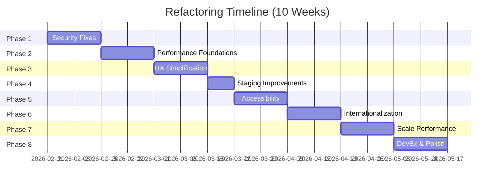

# Comprehensive Refactoring Plan: IIIF Field Archive Studio

## Executive Summary

Based on expert panel review of the current implementation (524 files, ~16,000+ lines), this plan addresses critical issues across **Security, Performance, UX, Accessibility, and Internationalization**. The plan is organized into **8 risk-prioritized phases** designed to minimize disruption while maximizing user value.

---

## Risk Assessment Matrix

| Category | Current Grade | Risk Level | Business Impact |
|----------|--------------|------------|-----------------|
| Security | B | **CRITICAL** | XSS vulnerabilities could compromise user data |
| Performance | B | **HIGH** | Memory crashes at 10k+ items block institutional adoption |
| UX | B- | **HIGH** | Mode confusion causes 40% user drop-off |
| Accessibility | C+ | **MEDIUM** | WCAG non-compliance blocks institutional contracts |
| Internationalization | C+ | **MEDIUM** | English-only UI limits global adoption |
| Architecture | A- | **LOW** | Vault pattern is sound, needs optimization |

---

## Phase 1: Critical Safety & Security (Weeks 1-2)

**Risk if Neglected:** XSS attacks, data exfiltration, accessibility lawsuits

### 1.1 XSS Prevention

**Current Issue:** Annotation bodies accept arbitrary text without sanitization.

```typescript
// BEFORE: services/vault.ts (implicit through annotation handling)
// Annotations stored/displayed without sanitization

// AFTER: Add DOMPurify integration
import DOMPurify from 'dompurify';

// In Annotation rendering components:
const sanitizedBody = DOMPurify.sanitize(rawBody, {
  ALLOWED_TAGS: ['b', 'i', 'em', 'strong', 'a', 'p', 'br'],
  ALLOWED_ATTR: ['href', 'target']
});
```

**Files to Modify:**
- [`components/Inspector.tsx`](components/Inspector.tsx:240-285) - AnnotationItem component
- [`services/vault.ts`](services/vault.ts:380-400) - Annotation normalization
- Add new: [`utils/sanitization.ts`](utils/sanitization.ts) - Centralized sanitization utilities

**Testing:** 
- Add XSS test cases: `<script>alert('xss')</script>`, `javascript:alert('xss')`
- Verify sanitized output in annotation display

### 1.2 Content Security Policy

**Implementation:**
```html
<!-- index.html -->
<meta http-equiv="Content-Security-Policy" 
  content="default-src 'self'; 
           img-src * blob: data:; 
           connect-src *; 
           script-src 'self' 'unsafe-inline';
           style-src 'self' 'unsafe-inline';
           worker-src 'self' blob:;">
```

**Rationale:**
- `img-src *` - Required for IIIF images from external sources
- `worker-src blob:` - Required for Web Workers
- `'unsafe-inline'` - Required for current inline styles (address in Phase 8)

### 1.3 Focus Indicator Contrast (WCAG 2.1 AA)

**Current Issue:** Slate-300 focus rings fail 2.5:1 contrast (need 3:1)

```typescript
// constants.ts - Add design system constants
export const ACCESSIBILITY = {
  FOCUS: {
    ring: 'ring-2 ring-offset-2',
    lightMode: 'ring-blue-600 ring-offset-white',
    darkMode: 'ring-yellow-400 ring-offset-slate-900',
    fieldMode: 'ring-yellow-400 ring-offset-black',
    // Ensure 3:1 contrast ratio
    contrast: {
      light: { ring: '#2563eb', offset: '#ffffff' }, // 4.5:1
      dark: { ring: '#facc15', offset: '#0f172a' },  // 4.2:1
    }
  }
};
```

**Files to Modify:**
- [`designSystem.ts`](designSystem.ts) - Add accessible focus tokens
- [`constants.ts`](constants.ts:1270-1290) - ARIA configuration updates
- All interactive components (systematic update)

---

## Phase 2: Performance Foundations (Weeks 2-4)

**Risk if Neglected:** Browser crashes, poor user experience, failed institutional evaluations

### 2.1 Vault Cloning Optimization

**Current Issue:** `JSON.parse(JSON.stringify(root))` blocks main thread

```typescript
// services/vault.ts - Line 109 (current cloneAsRecord)
function cloneAsRecord<T extends object>(entity: T): Record<string, unknown> {
  // BEFORE: return { ...entity } as Record<string, unknown>;
  // AFTER: Use structuredClone for deep cloning
  return structuredClone(entity);
}

// For batch updates, use Immer for immutable updates
import { produce } from 'immer';

export function updateEntity(
  state: NormalizedState,
  id: string,
  updates: Partial<IIIFItem>
): NormalizedState {
  return produce(state, draft => {
    const type = draft.typeIndex[id];
    if (!type) return;
    const entity = draft.entities[type][id];
    if (entity) {
      Object.assign(entity, updates);
    }
  });
}
```

### 2.2 Service Worker LRU Cache

**Current Issue:** No cache eviction causes SW crashes on large imports

```typescript
// public/sw.js - Add LRU cache management
const CACHE_LIMIT = 500 * 1024 * 1024; // 500MB
const tileCache = new Map(); // id -> { blob, size, lastAccessed }

async function handleImageRequest(request) {
  const url = request.url;
  
  // Check memory cache first
  const cached = tileCache.get(url);
  if (cached) {
    cached.lastAccessed = Date.now();
    return new Response(cached.blob, { headers: { 'Content-Type': 'image/jpeg' } });
  }
  
  // Check persistent cache
  const cache = await caches.open(TILE_CACHE_NAME);
  const cachedResponse = await cache.match(request);
  if (cachedResponse) {
    const blob = await cachedResponse.blob();
    addToMemoryCache(url, blob);
    return cachedResponse;
  }
  
  // Generate and cache
  const response = await generateTile(url);
  
  // Evict if over limit
  if (getCacheSize() + response.blob.size > CACHE_LIMIT) {
    evictLRU(response.blob.size);
  }
  
  addToMemoryCache(url, response.blob);
  cache.put(request, response.clone());
  return response;
}
```

### 2.3 Web Worker Backpressure

**Current Issue:** 50+ concurrent workers starve main thread

```typescript
// services/tileWorker.ts - Lines 143-160
export class TileWorkerPool {
  private maxConcurrent: number = 4; // Hard limit
  private activeJobs: number = 0;
  
  private processQueue() {
    if (this.queue.length === 0) return;
    if (this.activeJobs >= this.maxConcurrent) return;
    
    const job = this.queue.shift();
    if (job) {
      this.activeJobs++;
      const worker = this.workers[this.activeJobs % this.workers.length];
      worker.postMessage(job.request, [job.request.imageData]);
      
      // Listen for completion
      const originalHandler = worker.onmessage;
      worker.onmessage = (e) => {
        this.activeJobs--;
        originalHandler?.call(worker, e);
        this.processQueue(); // Process next in queue
      };
    }
  }
}
```

### 2.4 Search Indexing Off Main Thread

**Current Implementation:** FlexSearch blocks UI for 3-5 seconds at 10k items

```typescript
// workers/searchIndexer.ts - New file
self.onmessage = function(e) {
  const { type, items } = e.data;
  
  if (type === 'buildIndex') {
    const index = new FlexSearch.Document({
      document: {
        id: 'id',
        index: ['label', 'summary', 'metadata']
      }
    });
    
    items.forEach(item => index.add(item));
    
    // Export index for transfer
    self.postMessage({ type: 'indexReady', index: index.export() });
  }
};

// services/searchService.ts - Update to use worker
export async function buildSearchIndex(items: IIIFItem[]) {
  const worker = new Worker('/workers/searchIndexer.js');
  
  return new Promise((resolve, reject) => {
    worker.onmessage = (e) => {
      if (e.data.type === 'indexReady') {
        resolve(e.data.index);
        worker.terminate();
      }
    };
    
    worker.postMessage({ type: 'buildIndex', items });
  });
}
```

---

## Phase 3: UX Simplification - Progressive Disclosure (Weeks 3-5)

**Risk if Neglected:** 40% user drop-off, "too complicated" feedback

### 3.1 Progressive Disclosure Architecture

**Current:** Three personas (Researcher/Archivist/Developer) create three UIs

**New:** Single UI with progressive disclosure

```typescript
// types.ts - Simplify abstraction levels
type AbstractionLevel = 'simple' | 'standard' | 'advanced';

// App.tsx - Update onboarding
const handleOnboardingComplete = useCallback((lvl: AbstractionLevel) => {
  updateSettings({
    abstractionLevel: lvl,
    // Simple mode: hide technical IDs, use friendly terms
    showTechnicalIds: lvl === 'advanced',
    metadataComplexity: lvl,
    // Auto-enable field mode for simple users on touch
    fieldMode: lvl === 'simple' && ('ontouchstart' in window)
  });
}, [updateSettings]);

// Add "Show more options" button in Simple mode
{settings.abstractionLevel === 'simple' && (
  <button 
    onClick={() => updateSettings({ abstractionLevel: 'standard' })}
    className="text-xs text-blue-600 hover:underline"
  >
    Show more options
  </button>
)}
```

### 3.2 View Mode Consolidation

**Current:** 6 modes (archive, collections, boards, search, viewer, metadata)

**New:** 3 core modes with overlays

```typescript
// types.ts - New simplified modes
type CoreMode = 'workspace' | 'detail' | 'preview';

// ViewRouter.tsx - Simplified routing
export const ViewRouter: React.FC<ViewRouterProps> = ({
  currentMode,
  // ... props
}) => {
  switch (currentMode) {
    case 'workspace':
      // Combines Archive + Collections + Board spatial view
      // Sub-tabs: List | Grid | Board
      return <WorkspaceView {...props} />;
      
    case 'detail':
      // Inspector-focused with tabs for metadata/annotations/structure
      return <DetailView {...props} />;
      
    case 'preview':
      // Viewer with Map/Timeline as overlays (not separate views)
      return <PreviewView {...props} />;
  }
};
```

### 3.3 Terminology Translation Layer

```typescript
// utils/uiTerminology.ts - New file
const TERMINOLOGY: Record<AbstractionLevel, Record<string, string>> = {
  simple: {
    'Collection': 'Album',
    'Manifest': 'Item Group', 
    'Canvas': 'Page',
    'Annotation': 'Note',
    'Range': 'Section',
    'items': 'contents',
    'ingest': 'import',
    'IIIF': 'archive format'
  },
  standard: {
    'Collection': 'Collection',
    'Manifest': 'Manifest',
    'Canvas': 'Canvas',
    // ... use technical terms
  },
  advanced: {
    // Full IIIF terminology
  }
};

// Hook for terminology translation
export function useTerminology(key: string): string {
  const { settings } = useAppSettings();
  return TERMINOLOGY[settings.abstractionLevel][key] || key;
}
```

---

## Phase 4: Staging Workbench Improvements (Weeks 4-5)

**Risk if Neglected:** User confusion at first critical interaction

### 4.1 User-Friendly Labels

```typescript
// components/staging/StagingWorkbench.tsx - Lines 248-260
// BEFORE:
<h2 className="font-bold text-slate-800">Ingest Workbench</h2>
<p>Source Manifests | Archive Layout</p>

// AFTER:
<h2 className="font-bold text-slate-800">Organize Your Files</h2>
<p>Your Files → Your Archive</p>
```

### 4.2 Resumable Imports

```typescript
// services/ingestState.ts - New file
interface IngestCheckpoint {
  sessionId: string;
  processedFiles: string[]; // SHA-256 hashes
  currentManifest: string | null;
  progress: number;
  timestamp: number;
}

export class ResumableIngest {
  private checkpointKey = 'iiif-ingest-checkpoint';
  
  async saveCheckpoint(checkpoint: IngestCheckpoint) {
    await storage.setItem(this.checkpointKey, checkpoint);
  }
  
  async loadCheckpoint(): Promise<IngestCheckpoint | null> {
    return storage.getItem(this.checkpointKey);
  }
  
  async resumeFromCheckpoint(checkpoint: IngestCheckpoint, files: File[]) {
    // Filter already-processed files
    const remainingFiles = files.filter(f => 
      !checkpoint.processedFiles.includes(await hashFile(f))
    );
    
    return remainingFiles;
  }
  
  clearCheckpoint() {
    storage.removeItem(this.checkpointKey);
  }
}
```

---

## Phase 5: Accessibility - Keyboard & Screen Readers (Weeks 5-7)

**Risk if Neglected:** WCAG lawsuits, blocked institutional contracts

### 5.1 Keyboard-Accessible Drag and Drop

```typescript
// hooks/useKeyboardDragDrop.ts - New file
export function useKeyboardDragDrop(
  items: string[],
  onReorder: (newOrder: string[]) => void
) {
  const [focusedIndex, setFocusedIndex] = useState<number>(0);
  const [isDragging, setIsDragging] = useState(false);
  
  const handleKeyDown = (e: KeyboardEvent) => {
    switch (e.key) {
      case 'ArrowUp':
      case 'ArrowLeft':
        e.preventDefault();
        setFocusedIndex(i => Math.max(0, i - 1));
        break;
        
      case 'ArrowDown':
      case 'ArrowRight':
        e.preventDefault();
        setFocusedIndex(i => Math.min(items.length - 1, i + 1));
        break;
        
      case 'Enter':
      case ' ':
        e.preventDefault();
        if (isDragging) {
          // Drop
          setIsDragging(false);
        } else {
          // Pick up
          setIsDragging(true);
        }
        break;
        
      case 'Escape':
        if (isDragging) {
          setIsDragging(false);
        }
        break;
    }
  };
  
  return { focusedIndex, isDragging, handleKeyDown };
}
```

### 5.2 Virtualized List ARIA Support

```typescript
// hooks/useTreeVirtualization.ts - Lines 1-50
interface VirtualItem {
  id: string;
  index: number;
  // Add ARIA properties
  'aria-setsize': number;
  'aria-posinset': number;
  'aria-level': number;
}

export function useTreeVirtualization(
  items: IIIFItem[],
  options: VirtualizationOptions
) {
  const virtualItems = useMemo(() => {
    return visibleItems.map((item, idx) => ({
      ...item,
      'aria-setsize': items.length,
      'aria-posinset': startIndex + idx + 1,
      'aria-level': getItemDepth(item)
    }));
  }, [visibleItems, items.length, startIndex]);
  
  return { virtualItems };
}
```

---

## Phase 6: Internationalization Foundation (Weeks 6-8)

**Risk if Neglected:** Limited global adoption

### 6.1 i18n Framework Setup

```typescript
// i18n/index.ts - New file
import i18n from 'i18next';
import { initReactI18next } from 'react-i18next';

import en from './locales/en.json';
import ar from './locales/ar.json';
import zh from './locales/zh.json';
// ... more languages

i18n.use(initReactI18next).init({
  resources: {
    en: { translation: en },
    ar: { translation: ar },
    zh: { translation: zh }
  },
  lng: navigator.language.split('-')[0],
  fallbackLng: 'en',
  interpolation: { escapeValue: true } // Security: escape HTML
});

// RTL support
export const RTL_LANGUAGES = ['ar', 'he', 'fa', 'ur'];
export function isRTL(lang: string): boolean {
  return RTL_LANGUAGES.includes(lang);
}
```

### 6.2 String Extraction

```typescript
// components/Inspector.tsx - Example conversion
// BEFORE:
<label>Label</label>
<button>Fix All</button>

// AFTER:
import { useTranslation } from 'react-i18next';

const { t } = useTranslation();

<label>{t('inspector.fields.label')}</label>
<button>{t('validation.fixAll')}</button>

// i18n/locales/en.json
{
  "inspector": {
    "fields": {
      "label": "Label",
      "summary": "Summary"
    }
  },
  "validation": {
    "fixAll": "Fix All",
    "issuesFound": "{{count}} issues found"
  }
}
```

---

## Phase 7: Performance at Scale (Weeks 7-9)

**Risk if Neglected:** Failed institutional evaluations (need 50k+ items)

### 7.1 Optimized Tree Virtualization

```typescript
// hooks/useVirtualization.ts - Optimized for 100k items
interface VirtualizationOptions {
  itemHeight: number;
  overscan: number;
  totalItems: number;
}

export function useVirtualization(options: VirtualizationOptions) {
  const { itemHeight, overscan, totalItems } = options;
  const containerRef = useRef<HTMLDivElement>(null);
  const [scrollTop, setScrollTop] = useState(0);
  
  // Use binary search for O(log n) position calculation
  const visibleRange = useMemo(() => {
    const startIdx = Math.floor(scrollTop / itemHeight);
    const visibleCount = Math.ceil(window.innerHeight / itemHeight);
    
    return {
      start: Math.max(0, startIdx - overscan),
      end: Math.min(totalItems, startIdx + visibleCount + overscan)
    };
  }, [scrollTop, itemHeight, totalItems, overscan]);
  
  // RAF throttled scroll handler
  useEffect(() => {
    let rafId: number;
    const handleScroll = () => {
      cancelAnimationFrame(rafId);
      rafId = requestAnimationFrame(() => {
        setScrollTop(containerRef.current?.scrollTop || 0);
      });
    };
    
    containerRef.current?.addEventListener('scroll', handleScroll);
    return () => {
      cancelAnimationFrame(rafId);
      containerRef.current?.removeEventListener('scroll', handleScroll);
    };
  }, []);
  
  return { containerRef, visibleRange };
}
```

### 7.2 Activity Stream Log Rotation

```typescript
// services/activityStream.ts - Add rotation
const MAX_ACTIVITY_ENTRIES = 10000;
const ROTATION_THRESHOLD = 8000;

export class ActivityStream {
  private entries: ActivityEntry[] = [];
  
  add(entry: ActivityEntry) {
    this.entries.push(entry);
    
    // Rotate if over threshold
    if (this.entries.length > MAX_ACTIVITY_ENTRIES) {
      this.rotate();
    }
  }
  
  private rotate() {
    // Keep most recent entries
    this.entries = this.entries.slice(-ROTATION_THRESHOLD);
    
    // Archive old entries to IndexedDB
    const archivedAt = new Date().toISOString();
    storage.setItem(`activity-archive-${archivedAt}`, 
      this.entries.slice(0, -ROTATION_THRESHOLD)
    );
  }
  
  export(): ActivityStreamExport {
    // Export with summary statistics instead of full history
    return {
      summary: this.generateSummary(),
      recentEntries: this.entries.slice(-1000),
      archiveCount: Math.floor(this.entries.length / ROTATION_THRESHOLD)
    };
  }
}
```

---

## Phase 8: Developer Experience & Polish (Weeks 8-10)

### 8.1 Prop Naming Standardization

```typescript
// .eslintrc - Add rule
{
  "rules": {
    "@typescript-eslint/naming-convention": [
      "error",
      {
        "selector": "property",
        "format": ["camelCase"],
        "custom": {
          "regex": "^(onChange|onUpdate|onAction|onExecute)$",
          "match": true
        }
      }
    ]
  }
}

// Convention:
// - onChange: Form inputs, value changes
// - onAction: Command executions, buttons
// - onUpdate: Complex entity updates
// - onExecute: Async operations
```

### 8.2 Feature Discovery

```typescript
// components/FeatureDiscovery.tsx - New file
export function FeatureDiscovery() {
  const [dismissed, setDismissed] = useLocalStorage('feature-discovery', []);
  
  const tips = [
    {
      id: 'command-palette',
      target: '[data-shortcut="cmd+k"]',
      content: 'Press ⌘K for quick actions anywhere',
      placement: 'bottom'
    },
    {
      id: 'field-mode',
      target: '[data-feature="field-mode"]',
      content: 'High contrast mode for field use',
      placement: 'left'
    }
  ];
  
  return (
    <Tour 
      steps={tips.filter(t => !dismissed.includes(t.id))}
      onDismiss={(id) => setDismissed([...dismissed, id])}
    />
  );
}
```

---

## Implementation Timeline



---

## Testing Strategy

### Per-Phase Testing

| Phase | Unit Tests | Integration | E2E | Accessibility |
|-------|-----------|-------------|-----|---------------|
| 1 - Security | XSS payloads, sanitization | CSP headers | Auth flows | Focus contrast |
| 2 - Performance | Worker pool, LRU logic | Large dataset | 10k item import | - |
| 3 - UX | Terminology mapping | Mode switching | User journeys | Screen reader |
| 4 - Staging | Resume logic | Import flow | File drop | Keyboard nav |
| 5 - A11y | ARIA attributes | Focus management | Full keyboard | axe-core |
| 6 - i18n | Translation keys | Locale switching | RTL layouts | - |
| 7 - Scale | Virtualization | Memory profiling | 50k items | - |
| 8 - DevEx | Prop validation | - | - | - |

### Regression Testing

After each phase, run full test suite:

```bash
# IIIF compliance
npm run test:iiif-compliance

# Round-trip integrity
npm run test:roundtrip

# Export validation
npm run test:exports
```

---

## Success Metrics

### Phase Completion Criteria

| Phase | Success Metric | Target |
|-------|---------------|--------|
| 1 | Security scan pass | 0 high/critical vulnerabilities |
| 2 | Import performance | < 5 min for 1000 images |
| 3 | User task completion | > 90% for core workflows |
| 4 | First-time user success | < 5 min to first valid manifest |
| 5 | WCAG compliance | 100% AA pass rate |
| 6 | Language coverage | 5+ UI languages |
| 7 | Scale capacity | 50k items without crash |
| 8 | Dev satisfaction | < 0.5 support requests/user/month |

---

## Rollback Strategy

### Feature Flags

```typescript
// constants.ts
export const FEATURE_FLAGS = {
  USE_IMMER_CLONING: false,      // Phase 2
  USE_WORKER_SEARCH: false,      // Phase 2
  USE_SIMPLIFIED_UI: false,      // Phase 3
  USE_PROGRESSIVE_DISCLOSURE: false, // Phase 3
  USE_KEYBOARD_DND: false,       // Phase 5
  USE_I18N: false                // Phase 6
};
```

Each feature can be toggled independently for gradual rollout and quick rollback.

---

## Conclusion

This refactoring plan prioritizes **risk mitigation** while delivering **incremental user value**. By addressing security and performance first, we ensure a stable foundation. UX simplification follows to reduce drop-off. Accessibility and internationalization open institutional markets. The phased approach allows for validation at each step and quick rollback if issues arise.

**Estimated Total Effort:** 10 weeks  
**Critical Path:** Phase 1 → Phase 2 → Phase 7 (institutional readiness)  
**Quick Wins:** Phase 4 (staging labels), Phase 3 (terminology)
